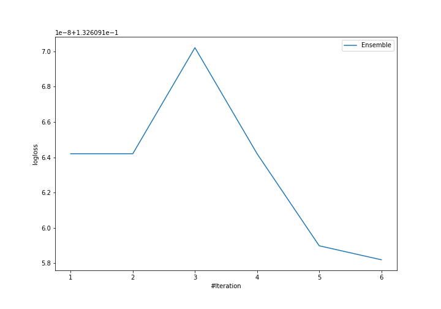
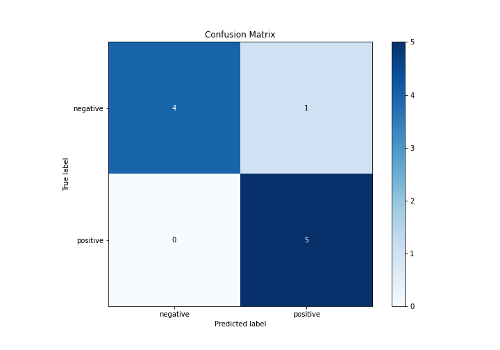
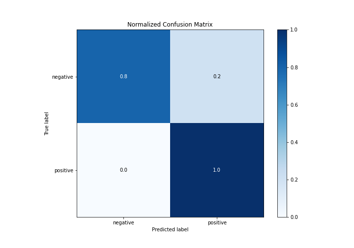
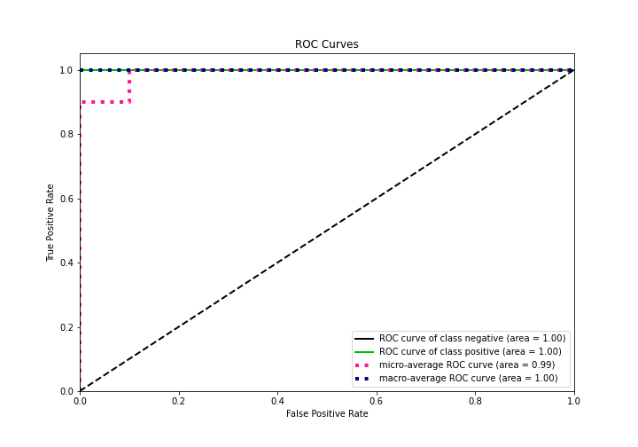
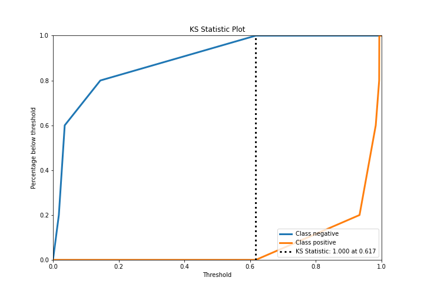
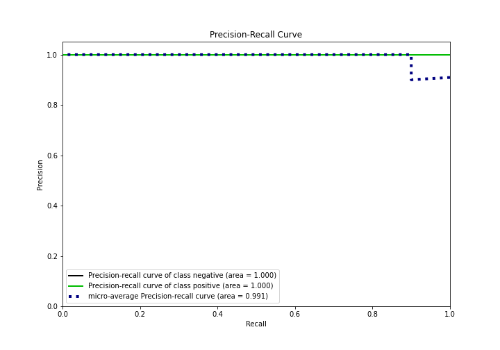
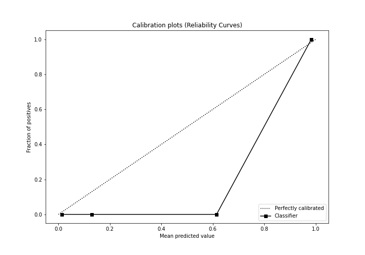
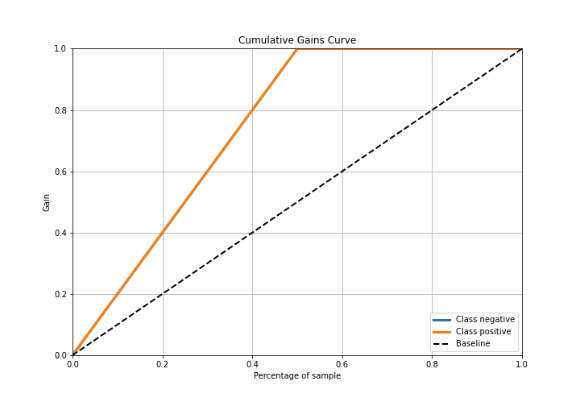
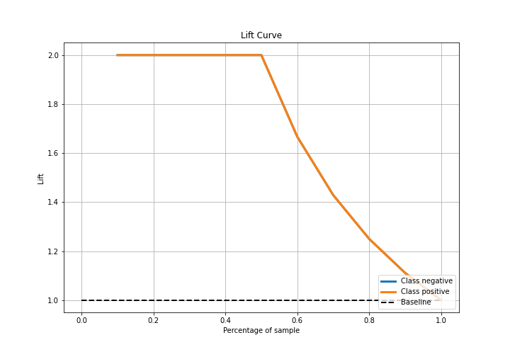

# Summary of Ensemble

[<< Go back](../README.md)

## Ensemble structure
| Model             |   Weight |
|:------------------|---------:|
| 4_Default_Xgboost |        6 |

## Metric details
|           |    score |   threshold |
|:----------|---------:|------------:|
| logloss   | 0.132609 | nan         |
| auc       | 1        | nan         |
| f1        | 0.909091 |   0.563118  |
| accuracy  | 0.9      |   0.563118  |
| precision | 1        |   0.962946  |
| recall    | 1        |   0.0160085 |
| mcc       | 0.816497 |   0.563118  |

## Confusion matrix (at threshold=0.563118)
|                     |   Predicted as negative |   Predicted as positive |
|:--------------------|------------------------:|------------------------:|
| Labeled as negative |                       4 |                       1 |
| Labeled as positive |                       0 |                       5 |

## Learning curves

## Confusion Matrix

## Normalized Confusion Matrix

## ROC Curve

## Kolmogorov-Smirnov Statistic

## Precision-Recall Curve

## Calibration Curve

## Cumulative Gains Curve

## Lift Curve

[<< Go back](../README.md)
