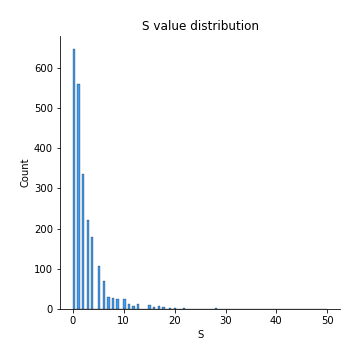
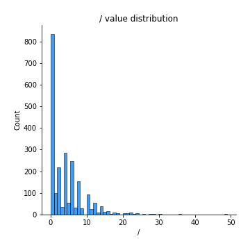
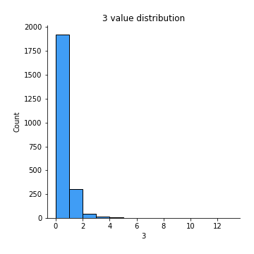
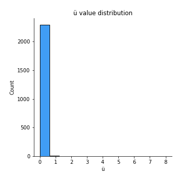

# Exploratory Data Analysis

[<< Go back](../README.md)
## Feature : target
- **Feature type** : discrete
- **Missing** : 0.0%
- **Unique** : 2
- **Count** :2300.0
- **Mean** :0.5026086956521739
- **Std** :0.5001019242900266
- **Min** :0.0
- **25%th Percentile** : 0.0
- **50%th Percentile** : 1.0
- **75%th Percentile** : 1.0
- **Max** :1.0

## Feature : I
- **Feature type** : continous
- **Missing** : 0.0%
- **Unique** : 32
- **Count** :2300.0
- **Mean** :5.366086956521739
- **Std** :4.71749793527191
- **Min** :0.0
- **25%th Percentile** : 2.0
- **50%th Percentile** : 4.0
- **75%th Percentile** : 7.0
- **Max** :33.0

## Feature :  
- **Feature type** : continous
- **Missing** : 0.0%
- **Unique** : 574
- **Count** :2300.0
- **Mean** :231.02913043478262
- **Std** :173.61958766658248
- **Min** :7.0
- **25%th Percentile** : 127.0
- **50%th Percentile** : 174.0
- **75%th Percentile** : 273.0
- **Max** :1521.0

## Feature : t
- **Feature type** : continous
- **Missing** : 0.0%
- **Unique** : 312
- **Count** :2300.0
- **Mean** :91.55608695652174
- **Std** :70.71025294530308
- **Min** :2.0
- **25%th Percentile** : 48.0
- **50%th Percentile** : 69.0
- **75%th Percentile** : 107.0
- **Max** :664.0

## Feature : h
- **Feature type** : continous
- **Missing** : 0.0%
- **Unique** : 208
- **Count** :2300.0
- **Mean** :53.9704347826087
- **Std** :43.055301893315
- **Min** :2.0
- **25%th Percentile** : 28.0
- **50%th Percentile** : 40.0
- **75%th Percentile** : 64.0
- **Max** :375.0

## Feature : o
- **Feature type** : continous
- **Missing** : 0.0%
- **Unique** : 272
- **Count** :2300.0
- **Mean** :75.28478260869565
- **Std** :57.85598981785686
- **Min** :1.0
- **25%th Percentile** : 40.0
- **50%th Percentile** : 57.0
- **75%th Percentile** : 89.0
- **Max** :540.0

## Feature : u
- **Feature type** : continous
- **Missing** : 0.0%
- **Unique** : 125
- **Count** :2300.0
- **Mean** :27.02391304347826
- **Std** :21.2989214754361
- **Min** :0.0
- **25%th Percentile** : 14.0
- **50%th Percentile** : 20.0
- **75%th Percentile** : 33.0
- **Max** :165.0

## Feature : g
- **Feature type** : continous
- **Missing** : 0.0%
- **Unique** : 97
- **Count** :2300.0
- **Mean** :20.32608695652174
- **Std** :16.891118642282112
- **Min** :0.0
- **25%th Percentile** : 10.0
- **50%th Percentile** : 15.0
- **75%th Percentile** : 24.0
- **Max** :133.0

## Feature : i
- **Feature type** : continous
- **Missing** : 0.0%
- **Unique** : 260
- **Count** :2300.0
- **Mean** :73.39260869565217
- **Std** :57.3924869037783
- **Min** :1.0
- **25%th Percentile** : 39.0
- **50%th Percentile** : 55.0
- **75%th Percentile** : 86.0
- **Max** :465.0

## Feature : s
- **Feature type** : continous
- **Missing** : 0.0%
- **Unique** : 250
- **Count** :2300.0
- **Mean** :66.66043478260869
- **Std** :52.61080107302639
- **Min** :4.0
- **25%th Percentile** : 34.0
- **50%th Percentile** : 49.0
- **75%th Percentile** : 79.0
- **Max** :425.0

## Feature : w
- **Feature type** : continous
- **Missing** : 0.0%
- **Unique** : 84
- **Count** :2300.0
- **Mean** :18.947391304347825
- **Std** :14.479855580673394
- **Min** :0.0
- **25%th Percentile** : 10.0
- **50%th Percentile** : 15.0
- **75%th Percentile** : 23.0
- **Max** :133.0

## Feature : a
- **Feature type** : continous
- **Missing** : 0.0%
- **Unique** : 287
- **Count** :2300.0
- **Mean** :79.92739130434782
- **Std** :63.05189862420074
- **Min** :0.0
- **25%th Percentile** : 41.0
- **50%th Percentile** : 59.0
- **75%th Percentile** : 95.0
- **Max** :547.0

## Feature : n
- **Feature type** : continous
- **Missing** : 0.0%
- **Unique** : 252
- **Count** :2300.0
- **Mean** :66.7395652173913
- **Std** :54.143603457603255
- **Min** :0.0
- **25%th Percentile** : 34.0
- **50%th Percentile** : 50.0
- **75%th Percentile** : 79.0
- **Max** :487.0

## Feature : d
- **Feature type** : continous
- **Missing** : 0.0%
- **Unique** : 151
- **Count** :2300.0
- **Mean** :34.59652173913044
- **Std** :27.368695364212495
- **Min** :0.0
- **25%th Percentile** : 18.0
- **50%th Percentile** : 26.0
- **75%th Percentile** : 42.0
- **Max** :249.0

## Feature : e
- **Feature type** : continous
- **Missing** : 0.0%
- **Unique** : 380
- **Count** :2300.0
- **Mean** :121.2195652173913
- **Std** :95.63638664918011
- **Min** :1.0
- **25%th Percentile** : 63.0
- **50%th Percentile** : 89.0
- **75%th Percentile** : 144.0
- **Max** :788.0

## Feature : r
- **Feature type** : continous
- **Missing** : 0.0%
- **Unique** : 228
- **Count** :2300.0
- **Mean** :60.167391304347824
- **Std** :49.34079830836494
- **Min** :2.0
- **25%th Percentile** : 30.0
- **50%th Percentile** : 44.0
- **75%th Percentile** : 72.25
- **Max** :410.0

## Feature : f
- **Feature type** : continous
- **Missing** : 0.0%
- **Unique** : 103
- **Count** :2300.0
- **Mean** :21.650434782608695
- **Std** :17.437303954134453
- **Min** :0.0
- **25%th Percentile** : 10.75
- **50%th Percentile** : 16.0
- **75%th Percentile** : 26.0
- **Max** :131.0

## Feature : l
- **Feature type** : continous
- **Missing** : 0.0%
- **Unique** : 190
- **Count** :2300.0
- **Mean** :44.213913043478264
- **Std** :35.41001224015025
- **Min** :0.0
- **25%th Percentile** : 22.0
- **50%th Percentile** : 33.0
- **75%th Percentile** : 53.0
- **Max** :320.0

## Feature : y
- **Feature type** : continous
- **Missing** : 0.0%
- **Unique** : 96
- **Count** :2300.0
- **Mean** :20.73086956521739
- **Std** :15.852495481426015
- **Min** :0.0
- **25%th Percentile** : 11.0
- **50%th Percentile** : 16.0
- **75%th Percentile** : 25.0
- **Max** :122.0

## Feature : p
- **Feature type** : continous
- **Missing** : 0.0%
- **Unique** : 89
- **Count** :2300.0
- **Mean** :16.62391304347826
- **Std** :14.601353187700289
- **Min** :0.0
- **25%th Percentile** : 8.0
- **50%th Percentile** : 12.0
- **75%th Percentile** : 21.0
- **Max** :133.0

## Feature : m
- **Feature type** : continous
- **Missing** : 0.0%
- **Unique** : 114
- **Count** :2300.0
- **Mean** :26.44
- **Std** :20.14711789032484
- **Min** :1.0
- **25%th Percentile** : 14.0
- **50%th Percentile** : 21.0
- **75%th Percentile** : 32.0
- **Max** :148.0

## Feature : k
- **Feature type** : continous
- **Missing** : 0.0%
- **Unique** : 52
- **Count** :2300.0
- **Mean** :8.398695652173913
- **Std** :7.5661903377770665
- **Min** :0.0
- **25%th Percentile** : 4.0
- **50%th Percentile** : 6.0
- **75%th Percentile** : 11.0
- **Max** :61.0

## Feature : ,
- **Feature type** : continous
- **Missing** : 0.0%
- **Unique** : 69
- **Count** :2300.0
- **Mean** :10.773478260869565
- **Std** :10.485910557259139
- **Min** :0.0
- **25%th Percentile** : 4.0
- **50%th Percentile** : 8.0
- **75%th Percentile** : 14.0
- **Max** :79.0

## Feature : c
- **Feature type** : continous
- **Missing** : 0.0%
- **Unique** : 129
- **Count** :2300.0
- **Mean** :26.97695652173913
- **Std** :22.907987543639518
- **Min** :0.0
- **25%th Percentile** : 13.0
- **50%th Percentile** : 20.0
- **75%th Percentile** : 33.0
- **Max** :190.0

## Feature : -
- **Feature type** : continous
- **Missing** : 0.0%
- **Unique** : 34
- **Count** :2300.0
- **Mean** :2.6908695652173913
- **Std** :5.184344564226175
- **Min** :0.0
- **25%th Percentile** : 0.0
- **50%th Percentile** : 1.0
- **75%th Percentile** : 3.0
- **Max** :145.0

## Feature : .
- **Feature type** : continous
- **Missing** : 0.0%
- **Unique** : 63
- **Count** :2300.0
- **Mean** :12.89913043478261
- **Std** :9.354424749893669
- **Min** :0.0
- **25%th Percentile** : 7.0
- **50%th Percentile** : 10.0
- **75%th Percentile** : 16.0
- **Max** :94.0

## Feature : T
- **Feature type** : continous
- **Missing** : 0.0%
- **Unique** : 30
- **Count** :2300.0
- **Mean** :4.337826086956522
- **Std** :4.053283061914937
- **Min** :0.0
- **25%th Percentile** : 2.0
- **50%th Percentile** : 3.0
- **75%th Percentile** : 5.0
- **Max** :52.0

## Feature : b
- **Feature type** : continous
- **Missing** : 0.0%
- **Unique** : 95
- **Count** :2300.0
- **Mean** :18.705652173913045
- **Std** :15.54982907365809
- **Min** :0.0
- **25%th Percentile** : 9.0
- **50%th Percentile** : 14.0
- **75%th Percentile** : 23.0
- **Max** :146.0

## Feature : (
- **Feature type** : continous
- **Missing** : 0.0%
- **Unique** : 20
- **Count** :2300.0
- **Mean** :1.3817391304347826
- **Std** :2.1890662148973243
- **Min** :0.0
- **25%th Percentile** : 0.0
- **50%th Percentile** : 1.0
- **75%th Percentile** : 2.0
- **Max** :28.0

## Feature : v
- **Feature type** : continous
- **Missing** : 0.0%
- **Unique** : 66
- **Count** :2300.0
- **Mean** :12.386521739130435
- **Std** :9.868279553927517
- **Min** :0.0
- **25%th Percentile** : 6.0
- **50%th Percentile** : 10.0
- **75%th Percentile** : 15.0
- **Max** :85.0

## Feature : )
- **Feature type** : continous
- **Missing** : 0.0%
- **Unique** : 20
- **Count** :2300.0
- **Mean** :1.4052173913043478
- **Std** :2.2119468210491218
- **Min** :0.0
- **25%th Percentile** : 0.0
- **50%th Percentile** : 1.0
- **75%th Percentile** : 2.0
- **Max** :28.0

.png)
## Feature : W
- **Feature type** : continous
- **Missing** : 0.0%
- **Unique** : 18
- **Count** :2300.0
- **Mean** :1.3608695652173912
- **Std** :1.9777446239798848
- **Min** :0.0
- **25%th Percentile** : 0.0
- **50%th Percentile** : 1.0
- **75%th Percentile** : 2.0
- **Max** :18.0

## Feature : z
- **Feature type** : continous
- **Missing** : 0.0%
- **Unique** : 21
- **Count** :2300.0
- **Mean** :0.8391304347826087
- **Std** :1.8153660326444254
- **Min** :0.0
- **25%th Percentile** : 0.0
- **50%th Percentile** : 0.0
- **75%th Percentile** : 1.0
- **Max** :28.0

## Feature : M
- **Feature type** : continous
- **Missing** : 0.0%
- **Unique** : 22
- **Count** :2300.0
- **Mean** :1.6352173913043477
- **Std** :2.4801032853325746
- **Min** :0.0
- **25%th Percentile** : 0.0
- **50%th Percentile** : 1.0
- **75%th Percentile** : 2.0
- **Max** :27.0

## Feature : P
- **Feature type** : continous
- **Missing** : 0.0%
- **Unique** : 18
- **Count** :2300.0
- **Mean** :0.9952173913043478
- **Std** :2.120033011563603
- **Min** :0.0
- **25%th Percentile** : 0.0
- **50%th Percentile** : 0.0
- **75%th Percentile** : 1.0
- **Max** :55.0

## Feature : 2
- **Feature type** : continous
- **Missing** : 0.0%
- **Unique** : 9
- **Count** :2300.0
- **Mean** :0.3204347826086957
- **Std** :0.8197325986990434
- **Min** :0.0
- **25%th Percentile** : 0.0
- **50%th Percentile** : 0.0
- **75%th Percentile** : 0.0
- **Max** :14.0

## Feature : :
- **Feature type** : continous
- **Missing** : 0.0%
- **Unique** : 10
- **Count** :2300.0
- **Mean** :0.4017391304347826
- **Std** :1.192770932849509
- **Min** :0.0
- **25%th Percentile** : 0.0
- **50%th Percentile** : 0.0
- **75%th Percentile** : 0.0
- **Max** :37.0

## Feature : R
- **Feature type** : continous
- **Missing** : 0.0%
- **Unique** : 23
- **Count** :2300.0
- **Mean** :1.22
- **Std** :2.3798377390489978
- **Min** :0.0
- **25%th Percentile** : 0.0
- **50%th Percentile** : 0.0
- **75%th Percentile** : 2.0
- **Max** :29.0

## Feature : A
- **Feature type** : continous
- **Missing** : 0.0%
- **Unique** : 28
- **Count** :2300.0
- **Mean** :2.6295652173913044
- **Std** :3.402554471477145
- **Min** :0.0
- **25%th Percentile** : 1.0
- **50%th Percentile** : 2.0
- **75%th Percentile** : 3.0
- **Max** :45.0

## Feature : <
- **Feature type** : continous
- **Missing** : 0.0%
- **Unique** : 22
- **Count** :2300.0
- **Mean** :4.038260869565217
- **Std** :5.263505921129465
- **Min** :0.0
- **25%th Percentile** : 0.0
- **50%th Percentile** : 2.0
- **75%th Percentile** : 6.0
- **Max** :48.0

## Feature : /
- **Feature type** : continous
- **Missing** : 0.0%
- **Unique** : 37
- **Count** :2300.0
- **Mean** :4.276086956521739
- **Std** :5.404703893541589
- **Min** :0.0
- **25%th Percentile** : 0.0
- **50%th Percentile** : 2.5
- **75%th Percentile** : 6.0
- **Max** :49.0

## Feature : >
- **Feature type** : continous
- **Missing** : 0.0%
- **Unique** : 24
- **Count** :2300.0
- **Mean** :4.043478260869565
- **Std** :5.264870081013295
- **Min** :0.0
- **25%th Percentile** : 0.0
- **50%th Percentile** : 2.0
- **75%th Percentile** : 6.0
- **Max** :48.0

## Feature : '
- **Feature type** : continous
- **Missing** : 0.0%
- **Unique** : 44
- **Count** :2300.0
- **Mean** :5.36
- **Std** :6.072775978946888
- **Min** :0.0
- **25%th Percentile** : 2.0
- **50%th Percentile** : 4.0
- **75%th Percentile** : 7.0
- **Max** :65.0

## Feature : ?
- **Feature type** : continous
- **Missing** : 0.0%
- **Unique** : 13
- **Count** :2300.0
- **Mean** :0.6313043478260869
- **Std** :1.4150354754123144
- **Min** :0.0
- **25%th Percentile** : 0.0
- **50%th Percentile** : 0.0
- **75%th Percentile** : 1.0
- **Max** :15.0

## Feature : S
- **Feature type** : continous
- **Missing** : 0.0%
- **Unique** : 28
- **Count** :2300.0
- **Mean** :2.4656521739130435
- **Std** :3.4809046312198832
- **Min** :0.0
- **25%th Percentile** : 0.0
- **50%th Percentile** : 1.0
- **75%th Percentile** : 3.0
- **Max** :50.0

## Feature : J
- **Feature type** : continous
- **Missing** : 0.0%
- **Unique** : 19
- **Count** :2300.0
- **Mean** :0.8352173913043478
- **Std** :1.7758893882544304
- **Min** :0.0
- **25%th Percentile** : 0.0
- **50%th Percentile** : 0.0
- **75%th Percentile** : 1.0
- **Max** :26.0

## Feature : "
- **Feature type** : continous
- **Missing** : 0.0%
- **Unique** : 30
- **Count** :2300.0
- **Mean** :2.7291304347826086
- **Std** :4.840395136850685
- **Min** :0.0
- **25%th Percentile** : 0.0
- **50%th Percentile** : 0.0
- **75%th Percentile** : 4.0
- **Max** :70.0

## Feature : x
- **Feature type** : continous
- **Missing** : 0.0%
- **Unique** : 17
- **Count** :2300.0
- **Mean** :1.6908695652173913
- **Std** :2.1398686772816267
- **Min** :0.0
- **25%th Percentile** : 0.0
- **50%th Percentile** : 1.0
- **75%th Percentile** : 2.0
- **Max** :20.0

## Feature : j
- **Feature type** : continous
- **Missing** : 0.0%
- **Unique** : 17
- **Count** :2300.0
- **Mean** :1.4447826086956521
- **Std** :1.8393489627903543
- **Min** :0.0
- **25%th Percentile** : 0.0
- **50%th Percentile** : 1.0
- **75%th Percentile** : 2.0
- **Max** :17.0

## Feature : D
- **Feature type** : continous
- **Missing** : 0.0%
- **Unique** : 18
- **Count** :2300.0
- **Mean** :1.5969565217391304
- **Std** :2.3678081233735386
- **Min** :0.0
- **25%th Percentile** : 0.0
- **50%th Percentile** : 1.0
- **75%th Percentile** : 2.0
- **Max** :18.0

## Feature : 1
- **Feature type** : continous
- **Missing** : 0.0%
- **Unique** : 16
- **Count** :2300.0
- **Mean** :0.7243478260869565
- **Std** :1.802231051937257
- **Min** :0.0
- **25%th Percentile** : 0.0
- **50%th Percentile** : 0.0
- **75%th Percentile** : 1.0
- **Max** :56.0

## Feature : 5
- **Feature type** : continous
- **Missing** : 0.0%
- **Unique** : 11
- **Count** :2300.0
- **Mean** :0.22608695652173913
- **Std** :0.713516670122205
- **Min** :0.0
- **25%th Percentile** : 0.0
- **50%th Percentile** : 0.0
- **75%th Percentile** : 0.0
- **Max** :13.0

## Feature : L
- **Feature type** : continous
- **Missing** : 0.0%
- **Unique** : 18
- **Count** :2300.0
- **Mean** :1.1008695652173912
- **Std** :1.9181374017930464
- **Min** :0.0
- **25%th Percentile** : 0.0
- **50%th Percentile** : 0.0
- **75%th Percentile** : 2.0
- **Max** :25.0

## Feature : B
- **Feature type** : continous
- **Missing** : 0.0%
- **Unique** : 22
- **Count** :2300.0
- **Mean** :1.84
- **Std** :2.670633558084261
- **Min** :0.0
- **25%th Percentile** : 0.0
- **50%th Percentile** : 1.0
- **75%th Percentile** : 2.0
- **Max** :34.0

## Feature : V
- **Feature type** : continous
- **Missing** : 0.0%
- **Unique** : 17
- **Count** :2300.0
- **Mean** :0.6421739130434783
- **Std** :1.3724609409931576
- **Min** :0.0
- **25%th Percentile** : 0.0
- **50%th Percentile** : 0.0
- **75%th Percentile** : 1.0
- **Max** :19.0

## Feature : G
- **Feature type** : continous
- **Missing** : 0.0%
- **Unique** : 20
- **Count** :2300.0
- **Mean** :0.9930434782608696
- **Std** :1.9637746601631934
- **Min** :0.0
- **25%th Percentile** : 0.0
- **50%th Percentile** : 0.0
- **75%th Percentile** : 1.0
- **Max** :27.0

## Feature : Y
- **Feature type** : continous
- **Missing** : 0.0%
- **Unique** : 10
- **Count** :2300.0
- **Mean** :0.4160869565217391
- **Std** :0.8899430321800055
- **Min** :0.0
- **25%th Percentile** : 0.0
- **50%th Percentile** : 0.0
- **75%th Percentile** : 1.0
- **Max** :9.0

## Feature : O
- **Feature type** : continous
- **Missing** : 0.0%
- **Unique** : 21
- **Count** :2300.0
- **Mean** :1.0639130434782609
- **Std** :1.9118918599004022
- **Min** :0.0
- **25%th Percentile** : 0.0
- **50%th Percentile** : 0.0
- **75%th Percentile** : 1.0
- **Max** :25.0

## Feature : 0
- **Feature type** : continous
- **Missing** : 0.0%
- **Unique** : 16
- **Count** :2300.0
- **Mean** :0.782608695652174
- **Std** :1.5242428860716022
- **Min** :0.0
- **25%th Percentile** : 0.0
- **50%th Percentile** : 0.0
- **75%th Percentile** : 1.0
- **Max** :18.0

## Feature : q
- **Feature type** : continous
- **Missing** : 0.0%
- **Unique** : 11
- **Count** :2300.0
- **Mean** :0.7243478260869565
- **Std** :1.1766978740500533
- **Min** :0.0
- **25%th Percentile** : 0.0
- **50%th Percentile** : 0.0
- **75%th Percentile** : 1.0
- **Max** :16.0

## Feature : &
- **Feature type** : continous
- **Missing** : 0.0%
- **Unique** : 15
- **Count** :2300.0
- **Mean** :0.1865217391304348
- **Std** :1.5884782760686416
- **Min** :0.0
- **25%th Percentile** : 0.0
- **50%th Percentile** : 0.0
- **75%th Percentile** : 0.0
- **Max** :33.0

## Feature : 7
- **Feature type** : continous
- **Missing** : 0.0%
- **Unique** : 6
- **Count** :2300.0
- **Mean** :0.16869565217391305
- **Std** :0.522043899865629
- **Min** :0.0
- **25%th Percentile** : 0.0
- **50%th Percentile** : 0.0
- **75%th Percentile** : 0.0
- **Max** :5.0

## Feature : 8
- **Feature type** : continous
- **Missing** : 0.0%
- **Unique** : 8
- **Count** :2300.0
- **Mean** :0.16869565217391305
- **Std** :0.5408683137524788
- **Min** :0.0
- **25%th Percentile** : 0.0
- **50%th Percentile** : 0.0
- **75%th Percentile** : 0.0
- **Max** :9.0

## Feature : 9
- **Feature type** : continous
- **Missing** : 0.0%
- **Unique** : 13
- **Count** :2300.0
- **Mean** :0.39565217391304347
- **Std** :1.377750958666237
- **Min** :0.0
- **25%th Percentile** : 0.0
- **50%th Percentile** : 0.0
- **75%th Percentile** : 0.0
- **Max** :42.0

## Feature : H
- **Feature type** : continous
- **Missing** : 0.0%
- **Unique** : 23
- **Count** :2300.0
- **Mean** :1.5969565217391304
- **Std** :2.5471097400165283
- **Min** :0.0
- **25%th Percentile** : 0.0
- **50%th Percentile** : 1.0
- **75%th Percentile** : 2.0
- **Max** :30.0

## Feature : E
- **Feature type** : continous
- **Missing** : 0.0%
- **Unique** : 27
- **Count** :2300.0
- **Mean** :1.228695652173913
- **Std** :2.647124227438587
- **Min** :0.0
- **25%th Percentile** : 0.0
- **50%th Percentile** : 0.0
- **75%th Percentile** : 1.0
- **Max** :35.0

## Feature : +
- **Feature type** : continous
- **Missing** : 0.0%
- **Unique** : 5
- **Count** :2300.0
- **Mean** :0.017826086956521738
- **Std** :0.2846432948828839
- **Min** :0.0
- **25%th Percentile** : 0.0
- **50%th Percentile** : 0.0
- **75%th Percentile** : 0.0
- **Max** :12.0

## Feature : K
- **Feature type** : continous
- **Missing** : 0.0%
- **Unique** : 13
- **Count** :2300.0
- **Mean** :0.5439130434782609
- **Std** :1.2251114733185997
- **Min** :0.0
- **25%th Percentile** : 0.0
- **50%th Percentile** : 0.0
- **75%th Percentile** : 1.0
- **Max** :15.0

## Feature : F
- **Feature type** : continous
- **Missing** : 0.0%
- **Unique** : 15
- **Count** :2300.0
- **Mean** :1.0021739130434784
- **Std** :1.7209641948874987
- **Min** :0.0
- **25%th Percentile** : 0.0
- **50%th Percentile** : 0.0
- **75%th Percentile** : 1.0
- **Max** :22.0

## Feature : C
- **Feature type** : continous
- **Missing** : 0.0%
- **Unique** : 23
- **Count** :2300.0
- **Mean** :1.617391304347826
- **Std** :2.621663715746685
- **Min** :0.0
- **25%th Percentile** : 0.0
- **50%th Percentile** : 1.0
- **75%th Percentile** : 2.0
- **Max** :26.0

## Feature : U
- **Feature type** : continous
- **Missing** : 0.0%
- **Unique** : 12
- **Count** :2300.0
- **Mean** :0.3730434782608696
- **Std** :0.9962803146045198
- **Min** :0.0
- **25%th Percentile** : 0.0
- **50%th Percentile** : 0.0
- **75%th Percentile** : 0.0
- **Max** :13.0

## Feature : !
- **Feature type** : continous
- **Missing** : 0.0%
- **Unique** : 19
- **Count** :2300.0
- **Mean** :0.9269565217391305
- **Std** :1.9805193821071718
- **Min** :0.0
- **25%th Percentile** : 0.0
- **50%th Percentile** : 0.0
- **75%th Percentile** : 1.0
- **Max** :28.0

## Feature : *
- **Feature type** : continous
- **Missing** : 0.0%
- **Unique** : 21
- **Count** :2300.0
- **Mean** :0.3026086956521739
- **Std** :1.6584611569864012
- **Min** :0.0
- **25%th Percentile** : 0.0
- **50%th Percentile** : 0.0
- **75%th Percentile** : 0.0
- **Max** :28.0

## Feature : N
- **Feature type** : continous
- **Missing** : 0.0%
- **Unique** : 19
- **Count** :2300.0
- **Mean** :1.0560869565217392
- **Std** :1.9121375533374319
- **Min** :0.0
- **25%th Percentile** : 0.0
- **50%th Percentile** : 0.0
- **75%th Percentile** : 1.0
- **Max** :31.0

## Feature : ;
- **Feature type** : continous
- **Missing** : 0.0%
- **Unique** : 11
- **Count** :2300.0
- **Mean** :0.2634782608695652
- **Std** :0.8770259399297924
- **Min** :0.0
- **25%th Percentile** : 0.0
- **50%th Percentile** : 0.0
- **75%th Percentile** : 0.0
- **Max** :15.0

## Feature : 4
- **Feature type** : continous
- **Missing** : 0.0%
- **Unique** : 9
- **Count** :2300.0
- **Mean** :0.19304347826086957
- **Std** :0.9653160173398238
- **Min** :0.0
- **25%th Percentile** : 0.0
- **50%th Percentile** : 0.0
- **75%th Percentile** : 0.0
- **Max** :37.0

## Feature : à
- **Feature type** : continous
- **Missing** : 0.0%
- **Unique** : 2
- **Count** :2300.0
- **Mean** :0.002173913043478261
- **Std** :0.04658466143095026
- **Min** :0.0
- **25%th Percentile** : 0.0
- **50%th Percentile** : 0.0
- **75%th Percentile** : 0.0
- **Max** :1.0

## Feature : è
- **Feature type** : continous
- **Missing** : 0.0%
- **Unique** : 3
- **Count** :2300.0
- **Mean** :0.0017391304347826088
- **Std** :0.05105687486277267
- **Min** :0.0
- **25%th Percentile** : 0.0
- **50%th Percentile** : 0.0
- **75%th Percentile** : 0.0
- **Max** :2.0

## Feature : $
- **Feature type** : continous
- **Missing** : 0.0%
- **Unique** : 6
- **Count** :2300.0
- **Mean** :0.03434782608695652
- **Std** :0.3232921949208015
- **Min** :0.0
- **25%th Percentile** : 0.0
- **50%th Percentile** : 0.0
- **75%th Percentile** : 0.0
- **Max** :11.0

## Feature : 3
- **Feature type** : continous
- **Missing** : 0.0%
- **Unique** : 9
- **Count** :2300.0
- **Mean** :0.2273913043478261
- **Std** :0.6648034398748628
- **Min** :0.0
- **25%th Percentile** : 0.0
- **50%th Percentile** : 0.0
- **75%th Percentile** : 0.0
- **Max** :13.0

## Feature : %
- **Feature type** : continous
- **Missing** : 0.0%
- **Unique** : 3
- **Count** :2300.0
- **Mean** :0.016956521739130436
- **Std** :0.14500333072350396
- **Min** :0.0
- **25%th Percentile** : 0.0
- **50%th Percentile** : 0.0
- **75%th Percentile** : 0.0
- **Max** :2.0

## Feature : Z
- **Feature type** : continous
- **Missing** : 0.0%
- **Unique** : 8
- **Count** :2300.0
- **Mean** :0.09695652173913044
- **Std** :0.4897286426066806
- **Min** :0.0
- **25%th Percentile** : 0.0
- **50%th Percentile** : 0.0
- **75%th Percentile** : 0.0
- **Max** :7.0

## Feature : é
- **Feature type** : continous
- **Missing** : 0.0%
- **Unique** : 7
- **Count** :2300.0
- **Mean** :0.06391304347826086
- **Std** :0.41691339909378183
- **Min** :0.0
- **25%th Percentile** : 0.0
- **50%th Percentile** : 0.0
- **75%th Percentile** : 0.0
- **Max** :13.0

## Feature : =
- **Feature type** : continous
- **Missing** : 0.0%
- **Unique** : 3
- **Count** :2300.0
- **Mean** :0.00391304347826087
- **Std** :0.0690606286222838
- **Min** :0.0
- **25%th Percentile** : 0.0
- **50%th Percentile** : 0.0
- **75%th Percentile** : 0.0
- **Max** :2.0

## Feature : X
- **Feature type** : continous
- **Missing** : 0.0%
- **Unique** : 6
- **Count** :2300.0
- **Mean** :0.04565217391304348
- **Std** :0.32591859791352346
- **Min** :0.0
- **25%th Percentile** : 0.0
- **50%th Percentile** : 0.0
- **75%th Percentile** : 0.0
- **Max** :7.0

## Feature : 6
- **Feature type** : continous
- **Missing** : 0.0%
- **Unique** : 6
- **Count** :2300.0
- **Mean** :0.1426086956521739
- **Std** :0.4923178209347594
- **Min** :0.0
- **25%th Percentile** : 0.0
- **50%th Percentile** : 0.0
- **75%th Percentile** : 0.0
- **Max** :9.0

## Feature : Q
- **Feature type** : continous
- **Missing** : 0.0%
- **Unique** : 5
- **Count** :2300.0
- **Mean** :0.04739130434782609
- **Std** :0.27655554579740643
- **Min** :0.0
- **25%th Percentile** : 0.0
- **50%th Percentile** : 0.0
- **75%th Percentile** : 0.0
- **Max** :5.0

## Feature : û
- **Feature type** : continous
- **Missing** : 0.0%
- **Unique** : 2
- **Count** :2300.0
- **Mean** :0.0004347826086956522
- **Std** :0.020851441405707237
- **Min** :0.0
- **25%th Percentile** : 0.0
- **50%th Percentile** : 0.0
- **75%th Percentile** : 0.0
- **Max** :1.0

## Feature : `
- **Feature type** : continous
- **Missing** : 0.0%
- **Unique** : 10
- **Count** :2300.0
- **Mean** :0.05347826086956522
- **Std** :0.7351316334157185
- **Min** :0.0
- **25%th Percentile** : 0.0
- **50%th Percentile** : 0.0
- **75%th Percentile** : 0.0
- **Max** :20.0

## Feature : ü
- **Feature type** : continous
- **Missing** : 0.0%
- **Unique** : 3
- **Count** :2300.0
- **Mean** :0.005652173913043478
- **Std** :0.17315047844516276
- **Min** :0.0
- **25%th Percentile** : 0.0
- **50%th Percentile** : 0.0
- **75%th Percentile** : 0.0
- **Max** :8.0

