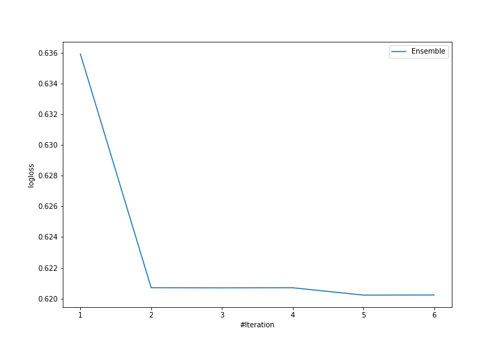
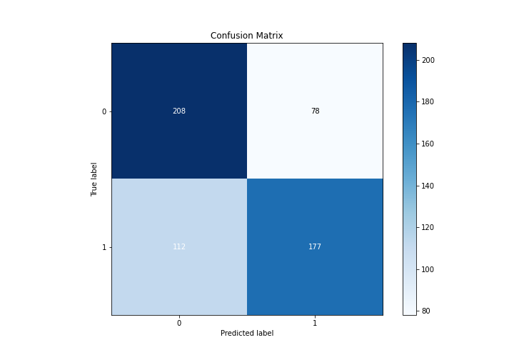
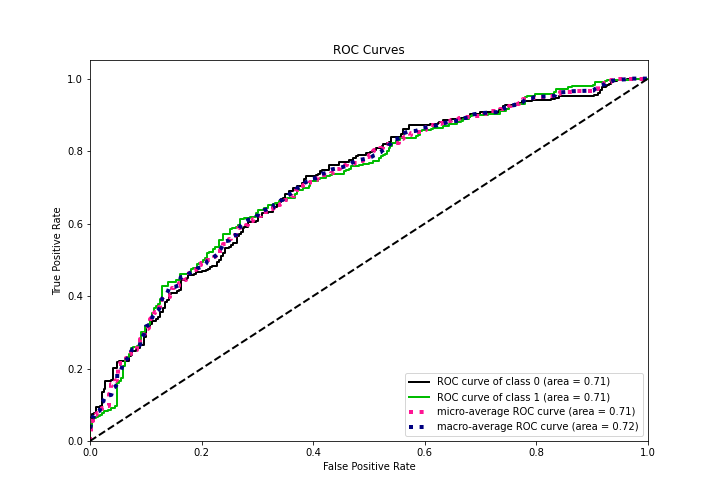
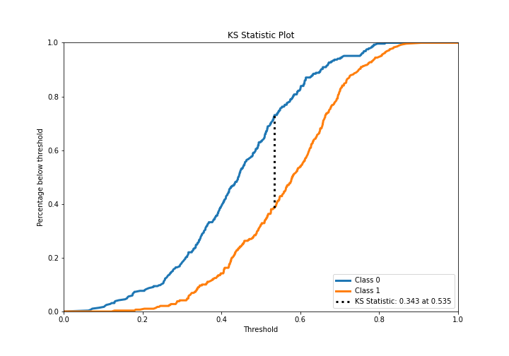
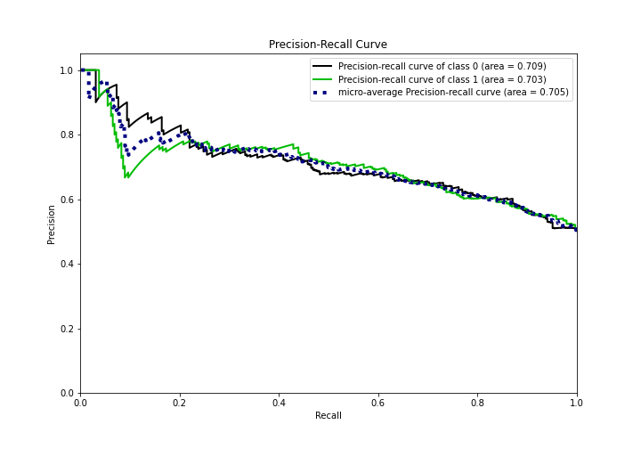
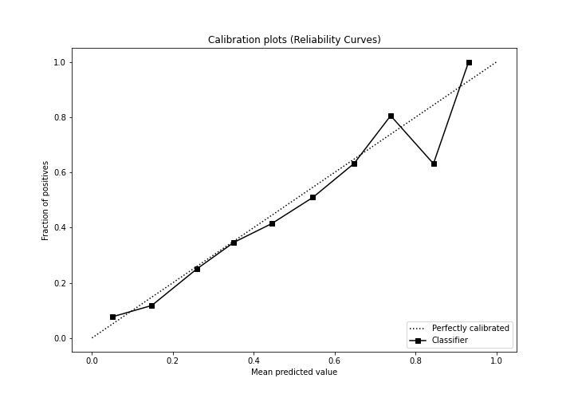
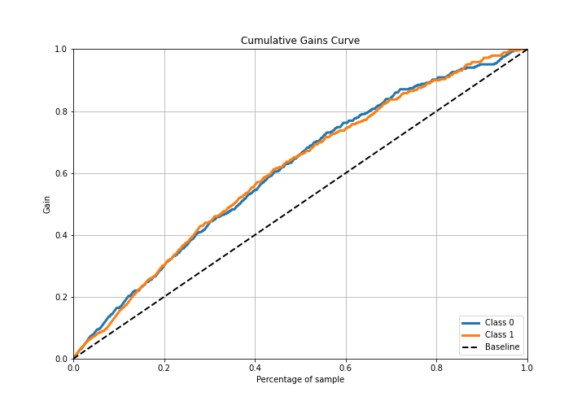
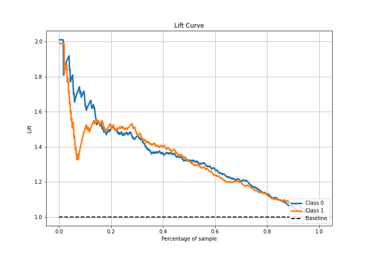

# Summary of Ensemble

[<< Go back](../README.md)

## Ensemble structure
| Model             |   Weight |
|:------------------|---------:|
| 3_Linear          |        3 |
| 4_Default_Xgboost |        2 |

## Metric details
|           |    score |   threshold |
|:----------|---------:|------------:|
| logloss   | 0.620223 | nan         |
| auc       | 0.714739 | nan         |
| f1        | 0.697422 |   0.371134  |
| accuracy  | 0.669565 |   0.534362  |
| precision | 0.780488 |   0.687489  |
| recall    | 1        |   0.0565435 |
| mcc       | 0.341917 |   0.534362  |

## Confusion matrix (at threshold=0.534362)
|              |   Predicted as 0 |   Predicted as 1 |
|:-------------|-----------------:|-----------------:|
| Labeled as 0 |              208 |               78 |
| Labeled as 1 |              112 |              177 |

## Learning curves

## Confusion Matrix

## Normalized Confusion Matrix

## ROC Curve

## Kolmogorov-Smirnov Statistic

## Precision-Recall Curve

## Calibration Curve

## Cumulative Gains Curve

## Lift Curve

[<< Go back](../README.md)
