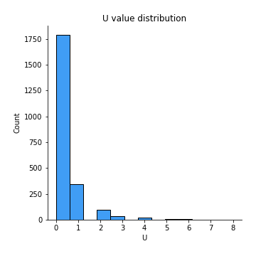

# Exploratory Data Analysis

[<< Go back](../README.md)
## Feature : target
- **Feature type** : discrete
- **Missing** : 0.0%
- **Unique** : 2
- **Count** :2300.0
- **Mean** :0.5139130434782608
- **Std** :0.4999150787425799
- **Min** :0.0
- **25%th Percentile** : 0.0
- **50%th Percentile** : 1.0
- **75%th Percentile** : 1.0
- **Max** :1.0

## Feature : I
- **Feature type** : continous
- **Missing** : 0.0%
- **Unique** : 34
- **Count** :2300.0
- **Mean** :5.436521739130435
- **Std** :4.823989105402742
- **Min** :0.0
- **25%th Percentile** : 2.0
- **50%th Percentile** : 4.0
- **75%th Percentile** : 7.0
- **Max** :36.0

## Feature :  
- **Feature type** : continous
- **Missing** : 0.0%
- **Unique** : 583
- **Count** :2300.0
- **Mean** :236.9791304347826
- **Std** :175.08532810477257
- **Min** :16.0
- **25%th Percentile** : 128.0
- **50%th Percentile** : 176.0
- **75%th Percentile** : 294.0
- **Max** :1276.0

## Feature : t
- **Feature type** : continous
- **Missing** : 0.0%
- **Unique** : 305
- **Count** :2300.0
- **Mean** :93.98434782608696
- **Std** :71.39051831644102
- **Min** :6.0
- **25%th Percentile** : 50.0
- **50%th Percentile** : 70.0
- **75%th Percentile** : 116.0
- **Max** :519.0

## Feature : h
- **Feature type** : continous
- **Missing** : 0.0%
- **Unique** : 216
- **Count** :2300.0
- **Mean** :55.681739130434785
- **Std** :43.944243970016544
- **Min** :1.0
- **25%th Percentile** : 29.0
- **50%th Percentile** : 41.0
- **75%th Percentile** : 69.0
- **Max** :335.0

## Feature : o
- **Feature type** : continous
- **Missing** : 0.0%
- **Unique** : 272
- **Count** :2300.0
- **Mean** :77.27521739130435
- **Std** :58.1029324192514
- **Min** :4.0
- **25%th Percentile** : 41.0
- **50%th Percentile** : 58.0
- **75%th Percentile** : 95.0
- **Max** :430.0

## Feature : u
- **Feature type** : continous
- **Missing** : 0.0%
- **Unique** : 117
- **Count** :2300.0
- **Mean** :27.708695652173912
- **Std** :21.197725161369195
- **Min** :1.0
- **25%th Percentile** : 14.0
- **50%th Percentile** : 21.0
- **75%th Percentile** : 34.0
- **Max** :131.0

## Feature : g
- **Feature type** : continous
- **Missing** : 0.0%
- **Unique** : 94
- **Count** :2300.0
- **Mean** :20.87
- **Std** :16.654252546472517
- **Min** :0.0
- **25%th Percentile** : 10.0
- **50%th Percentile** : 16.0
- **75%th Percentile** : 26.0
- **Max** :111.0

## Feature : i
- **Feature type** : continous
- **Missing** : 0.0%
- **Unique** : 266
- **Count** :2300.0
- **Mean** :75.34521739130435
- **Std** :57.87877830795684
- **Min** :6.0
- **25%th Percentile** : 40.0
- **50%th Percentile** : 56.0
- **75%th Percentile** : 92.0
- **Max** :424.0

## Feature : s
- **Feature type** : continous
- **Missing** : 0.0%
- **Unique** : 250
- **Count** :2300.0
- **Mean** :68.93260869565218
- **Std** :53.63085104405262
- **Min** :2.0
- **25%th Percentile** : 35.0
- **50%th Percentile** : 50.0
- **75%th Percentile** : 85.0
- **Max** :426.0

## Feature : w
- **Feature type** : continous
- **Missing** : 0.0%
- **Unique** : 90
- **Count** :2300.0
- **Mean** :19.240434782608695
- **Std** :14.852442847291927
- **Min** :0.0
- **25%th Percentile** : 10.0
- **50%th Percentile** : 15.0
- **75%th Percentile** : 24.0
- **Max** :118.0

## Feature : a
- **Feature type** : continous
- **Missing** : 0.0%
- **Unique** : 284
- **Count** :2300.0
- **Mean** :82.12826086956522
- **Std** :63.43773910997767
- **Min** :4.0
- **25%th Percentile** : 42.0
- **50%th Percentile** : 60.0
- **75%th Percentile** : 100.0
- **Max** :481.0

## Feature : n
- **Feature type** : continous
- **Missing** : 0.0%
- **Unique** : 252
- **Count** :2300.0
- **Mean** :68.3691304347826
- **Std** :54.48090122817873
- **Min** :5.0
- **25%th Percentile** : 35.0
- **50%th Percentile** : 49.5
- **75%th Percentile** : 84.0
- **Max** :389.0

## Feature : d
- **Feature type** : continous
- **Missing** : 0.0%
- **Unique** : 149
- **Count** :2300.0
- **Mean** :35.22826086956522
- **Std** :27.00721765725879
- **Min** :1.0
- **25%th Percentile** : 18.0
- **50%th Percentile** : 27.0
- **75%th Percentile** : 43.0
- **Max** :186.0

## Feature : e
- **Feature type** : continous
- **Missing** : 0.0%
- **Unique** : 387
- **Count** :2300.0
- **Mean** :124.35130434782609
- **Std** :96.85533610183438
- **Min** :7.0
- **25%th Percentile** : 64.75
- **50%th Percentile** : 91.0
- **75%th Percentile** : 153.0
- **Max** :741.0

## Feature : r
- **Feature type** : continous
- **Missing** : 0.0%
- **Unique** : 241
- **Count** :2300.0
- **Mean** :61.963478260869564
- **Std** :49.88128984093838
- **Min** :3.0
- **25%th Percentile** : 31.0
- **50%th Percentile** : 44.5
- **75%th Percentile** : 76.25
- **Max** :374.0

## Feature : f
- **Feature type** : continous
- **Missing** : 0.0%
- **Unique** : 108
- **Count** :2300.0
- **Mean** :22.382173913043477
- **Std** :18.215889955192747
- **Min** :0.0
- **25%th Percentile** : 11.0
- **50%th Percentile** : 17.0
- **75%th Percentile** : 28.0
- **Max** :140.0

## Feature : l
- **Feature type** : continous
- **Missing** : 0.0%
- **Unique** : 176
- **Count** :2300.0
- **Mean** :45.47782608695652
- **Std** :35.6094754358104
- **Min** :1.0
- **25%th Percentile** : 23.0
- **50%th Percentile** : 34.0
- **75%th Percentile** : 55.0
- **Max** :247.0

## Feature : y
- **Feature type** : continous
- **Missing** : 0.0%
- **Unique** : 93
- **Count** :2300.0
- **Mean** :21.406521739130437
- **Std** :16.141432618129
- **Min** :0.0
- **25%th Percentile** : 11.0
- **50%th Percentile** : 16.0
- **75%th Percentile** : 27.0
- **Max** :110.0

## Feature : p
- **Feature type** : continous
- **Missing** : 0.0%
- **Unique** : 88
- **Count** :2300.0
- **Mean** :17.009565217391305
- **Std** :14.460183510657693
- **Min** :0.0
- **25%th Percentile** : 8.0
- **50%th Percentile** : 13.0
- **75%th Percentile** : 21.0
- **Max** :113.0

## Feature : m
- **Feature type** : continous
- **Missing** : 0.0%
- **Unique** : 119
- **Count** :2300.0
- **Mean** :27.24086956521739
- **Std** :21.091719154762618
- **Min** :1.0
- **25%th Percentile** : 14.0
- **50%th Percentile** : 21.0
- **75%th Percentile** : 33.0
- **Max** :165.0

## Feature : k
- **Feature type** : continous
- **Missing** : 0.0%
- **Unique** : 51
- **Count** :2300.0
- **Mean** :8.656086956521738
- **Std** :7.634910000133426
- **Min** :0.0
- **25%th Percentile** : 4.0
- **50%th Percentile** : 7.0
- **75%th Percentile** : 11.0
- **Max** :58.0

## Feature : ,
- **Feature type** : continous
- **Missing** : 0.0%
- **Unique** : 67
- **Count** :2300.0
- **Mean** :11.241739130434782
- **Std** :10.675440283532652
- **Min** :0.0
- **25%th Percentile** : 4.0
- **50%th Percentile** : 8.0
- **75%th Percentile** : 14.0
- **Max** :100.0

## Feature : c
- **Feature type** : continous
- **Missing** : 0.0%
- **Unique** : 133
- **Count** :2300.0
- **Mean** :27.92478260869565
- **Std** :23.404976991520414
- **Min** :0.0
- **25%th Percentile** : 13.0
- **50%th Percentile** : 21.0
- **75%th Percentile** : 34.0
- **Max** :176.0

## Feature : -
- **Feature type** : continous
- **Missing** : 0.0%
- **Unique** : 29
- **Count** :2300.0
- **Mean** :2.6134782608695653
- **Std** :3.8047943802174244
- **Min** :0.0
- **25%th Percentile** : 0.0
- **50%th Percentile** : 1.0
- **75%th Percentile** : 4.0
- **Max** :35.0

## Feature : .
- **Feature type** : continous
- **Missing** : 0.0%
- **Unique** : 63
- **Count** :2300.0
- **Mean** :13.148260869565217
- **Std** :9.487209930164736
- **Min** :0.0
- **25%th Percentile** : 7.0
- **50%th Percentile** : 10.0
- **75%th Percentile** : 17.0
- **Max** :88.0

## Feature : T
- **Feature type** : continous
- **Missing** : 0.0%
- **Unique** : 32
- **Count** :2300.0
- **Mean** :4.527391304347826
- **Std** :4.218750701400611
- **Min** :0.0
- **25%th Percentile** : 2.0
- **50%th Percentile** : 3.0
- **75%th Percentile** : 6.0
- **Max** :45.0

## Feature : b
- **Feature type** : continous
- **Missing** : 0.0%
- **Unique** : 93
- **Count** :2300.0
- **Mean** :19.373478260869565
- **Std** :15.776524675230226
- **Min** :0.0
- **25%th Percentile** : 9.0
- **50%th Percentile** : 15.0
- **75%th Percentile** : 25.0
- **Max** :169.0

## Feature : (
- **Feature type** : continous
- **Missing** : 0.0%
- **Unique** : 20
- **Count** :2300.0
- **Mean** :1.4965217391304348
- **Std** :2.4056780171118395
- **Min** :0.0
- **25%th Percentile** : 0.0
- **50%th Percentile** : 1.0
- **75%th Percentile** : 2.0
- **Max** :33.0

## Feature : v
- **Feature type** : continous
- **Missing** : 0.0%
- **Unique** : 63
- **Count** :2300.0
- **Mean** :12.732173913043479
- **Std** :10.020705383199054
- **Min** :0.0
- **25%th Percentile** : 6.0
- **50%th Percentile** : 10.0
- **75%th Percentile** : 16.0
- **Max** :74.0

## Feature : )
- **Feature type** : continous
- **Missing** : 0.0%
- **Unique** : 20
- **Count** :2300.0
- **Mean** :1.5152173913043478
- **Std** :2.4041854354901138
- **Min** :0.0
- **25%th Percentile** : 0.0
- **50%th Percentile** : 1.0
- **75%th Percentile** : 2.0
- **Max** :32.0

.png)
## Feature : W
- **Feature type** : continous
- **Missing** : 0.0%
- **Unique** : 19
- **Count** :2300.0
- **Mean** :1.4395652173913043
- **Std** :2.127166353740167
- **Min** :0.0
- **25%th Percentile** : 0.0
- **50%th Percentile** : 1.0
- **75%th Percentile** : 2.0
- **Max** :27.0

## Feature : z
- **Feature type** : continous
- **Missing** : 0.0%
- **Unique** : 13
- **Count** :2300.0
- **Mean** :0.8343478260869566
- **Std** :1.5545589581857089
- **Min** :0.0
- **25%th Percentile** : 0.0
- **50%th Percentile** : 0.0
- **75%th Percentile** : 1.0
- **Max** :28.0

## Feature : M
- **Feature type** : continous
- **Missing** : 0.0%
- **Unique** : 22
- **Count** :2300.0
- **Mean** :1.7256521739130435
- **Std** :2.4537378187274013
- **Min** :0.0
- **25%th Percentile** : 0.0
- **50%th Percentile** : 1.0
- **75%th Percentile** : 2.0
- **Max** :29.0

## Feature : P
- **Feature type** : continous
- **Missing** : 0.0%
- **Unique** : 18
- **Count** :2300.0
- **Mean** :1.0352173913043479
- **Std** :2.0987109893954465
- **Min** :0.0
- **25%th Percentile** : 0.0
- **50%th Percentile** : 0.0
- **75%th Percentile** : 1.0
- **Max** :55.0

## Feature : 2
- **Feature type** : continous
- **Missing** : 0.0%
- **Unique** : 10
- **Count** :2300.0
- **Mean** :0.33652173913043476
- **Std** :0.8496173111641288
- **Min** :0.0
- **25%th Percentile** : 0.0
- **50%th Percentile** : 0.0
- **75%th Percentile** : 0.0
- **Max** :13.0

## Feature : :
- **Feature type** : continous
- **Missing** : 0.0%
- **Unique** : 11
- **Count** :2300.0
- **Mean** :0.38913043478260867
- **Std** :0.934275150544301
- **Min** :0.0
- **25%th Percentile** : 0.0
- **50%th Percentile** : 0.0
- **75%th Percentile** : 0.0
- **Max** :13.0

## Feature : R
- **Feature type** : continous
- **Missing** : 0.0%
- **Unique** : 21
- **Count** :2300.0
- **Mean** :1.2556521739130435
- **Std** :2.2683859514185314
- **Min** :0.0
- **25%th Percentile** : 0.0
- **50%th Percentile** : 0.0
- **75%th Percentile** : 2.0
- **Max** :29.0

## Feature : A
- **Feature type** : continous
- **Missing** : 0.0%
- **Unique** : 28
- **Count** :2300.0
- **Mean** :2.6769565217391302
- **Std** :3.3396258444708704
- **Min** :0.0
- **25%th Percentile** : 1.0
- **50%th Percentile** : 2.0
- **75%th Percentile** : 4.0
- **Max** :35.0

## Feature : <
- **Feature type** : continous
- **Missing** : 0.0%
- **Unique** : 22
- **Count** :2300.0
- **Mean** :4.264782608695652
- **Std** :5.708587557097099
- **Min** :0.0
- **25%th Percentile** : 0.0
- **50%th Percentile** : 2.0
- **75%th Percentile** : 6.0
- **Max** :118.0

## Feature : /
- **Feature type** : continous
- **Missing** : 0.0%
- **Unique** : 38
- **Count** :2300.0
- **Mean** :4.557391304347826
- **Std** :5.949308276078927
- **Min** :0.0
- **25%th Percentile** : 0.0
- **50%th Percentile** : 3.5
- **75%th Percentile** : 7.0
- **Max** :118.0

## Feature : >
- **Feature type** : continous
- **Missing** : 0.0%
- **Unique** : 25
- **Count** :2300.0
- **Mean** :4.2669565217391305
- **Std** :5.709971920854927
- **Min** :0.0
- **25%th Percentile** : 0.0
- **50%th Percentile** : 2.0
- **75%th Percentile** : 6.0
- **Max** :118.0

## Feature : '
- **Feature type** : continous
- **Missing** : 0.0%
- **Unique** : 39
- **Count** :2300.0
- **Mean** :5.400869565217391
- **Std** :5.730362888565939
- **Min** :0.0
- **25%th Percentile** : 2.0
- **50%th Percentile** : 4.0
- **75%th Percentile** : 7.0
- **Max** :53.0

## Feature : ?
- **Feature type** : continous
- **Missing** : 0.0%
- **Unique** : 15
- **Count** :2300.0
- **Mean** :0.648695652173913
- **Std** :1.453071335401729
- **Min** :0.0
- **25%th Percentile** : 0.0
- **50%th Percentile** : 0.0
- **75%th Percentile** : 1.0
- **Max** :16.0

## Feature : S
- **Feature type** : continous
- **Missing** : 0.0%
- **Unique** : 26
- **Count** :2300.0
- **Mean** :2.5169565217391305
- **Std** :3.3779173556262103
- **Min** :0.0
- **25%th Percentile** : 0.0
- **50%th Percentile** : 1.0
- **75%th Percentile** : 3.0
- **Max** :37.0

## Feature : J
- **Feature type** : continous
- **Missing** : 0.0%
- **Unique** : 17
- **Count** :2300.0
- **Mean** :0.8665217391304347
- **Std** :1.6951203121063354
- **Min** :0.0
- **25%th Percentile** : 0.0
- **50%th Percentile** : 0.0
- **75%th Percentile** : 1.0
- **Max** :20.0

## Feature : "
- **Feature type** : continous
- **Missing** : 0.0%
- **Unique** : 31
- **Count** :2300.0
- **Mean** :2.716521739130435
- **Std** :4.81502885795757
- **Min** :0.0
- **25%th Percentile** : 0.0
- **50%th Percentile** : 0.0
- **75%th Percentile** : 4.0
- **Max** :50.0

## Feature : x
- **Feature type** : continous
- **Missing** : 0.0%
- **Unique** : 17
- **Count** :2300.0
- **Mean** :1.7078260869565218
- **Std** :2.1153819648194787
- **Min** :0.0
- **25%th Percentile** : 0.0
- **50%th Percentile** : 1.0
- **75%th Percentile** : 2.0
- **Max** :16.0

## Feature : j
- **Feature type** : continous
- **Missing** : 0.0%
- **Unique** : 15
- **Count** :2300.0
- **Mean** :1.5034782608695652
- **Std** :1.7968814720942585
- **Min** :0.0
- **25%th Percentile** : 0.0
- **50%th Percentile** : 1.0
- **75%th Percentile** : 2.0
- **Max** :19.0

## Feature : D
- **Feature type** : continous
- **Missing** : 0.0%
- **Unique** : 22
- **Count** :2300.0
- **Mean** :1.6017391304347826
- **Std** :2.436777177239873
- **Min** :0.0
- **25%th Percentile** : 0.0
- **50%th Percentile** : 1.0
- **75%th Percentile** : 2.0
- **Max** :31.0

## Feature : 1
- **Feature type** : continous
- **Missing** : 0.0%
- **Unique** : 16
- **Count** :2300.0
- **Mean** :0.77
- **Std** :1.5567180319129554
- **Min** :0.0
- **25%th Percentile** : 0.0
- **50%th Percentile** : 0.0
- **75%th Percentile** : 1.0
- **Max** :30.0

## Feature : 5
- **Feature type** : continous
- **Missing** : 0.0%
- **Unique** : 9
- **Count** :2300.0
- **Mean** :0.23695652173913043
- **Std** :0.6647328870087358
- **Min** :0.0
- **25%th Percentile** : 0.0
- **50%th Percentile** : 0.0
- **75%th Percentile** : 0.0
- **Max** :11.0

## Feature : L
- **Feature type** : continous
- **Missing** : 0.0%
- **Unique** : 21
- **Count** :2300.0
- **Mean** :1.1943478260869564
- **Std** :2.1899893363878538
- **Min** :0.0
- **25%th Percentile** : 0.0
- **50%th Percentile** : 0.0
- **75%th Percentile** : 2.0
- **Max** :25.0

## Feature : B
- **Feature type** : continous
- **Missing** : 0.0%
- **Unique** : 19
- **Count** :2300.0
- **Mean** :1.7865217391304349
- **Std** :2.437400887349387
- **Min** :0.0
- **25%th Percentile** : 0.0
- **50%th Percentile** : 1.0
- **75%th Percentile** : 2.0
- **Max** :20.0

## Feature : V
- **Feature type** : continous
- **Missing** : 0.0%
- **Unique** : 13
- **Count** :2300.0
- **Mean** :0.6091304347826086
- **Std** :1.2675232398234721
- **Min** :0.0
- **25%th Percentile** : 0.0
- **50%th Percentile** : 0.0
- **75%th Percentile** : 1.0
- **Max** :12.0

## Feature : G
- **Feature type** : continous
- **Missing** : 0.0%
- **Unique** : 18
- **Count** :2300.0
- **Mean** :0.9421739130434783
- **Std** :1.7688657648738875
- **Min** :0.0
- **25%th Percentile** : 0.0
- **50%th Percentile** : 0.0
- **75%th Percentile** : 1.0
- **Max** :20.0

## Feature : Y
- **Feature type** : continous
- **Missing** : 0.0%
- **Unique** : 11
- **Count** :2300.0
- **Mean** :0.43782608695652175
- **Std** :0.8936753096778344
- **Min** :0.0
- **25%th Percentile** : 0.0
- **50%th Percentile** : 0.0
- **75%th Percentile** : 1.0
- **Max** :10.0

## Feature : O
- **Feature type** : continous
- **Missing** : 0.0%
- **Unique** : 20
- **Count** :2300.0
- **Mean** :1.117391304347826
- **Std** :1.9580534168013677
- **Min** :0.0
- **25%th Percentile** : 0.0
- **50%th Percentile** : 0.0
- **75%th Percentile** : 1.0
- **Max** :26.0

## Feature : 0
- **Feature type** : continous
- **Missing** : 0.0%
- **Unique** : 17
- **Count** :2300.0
- **Mean** :0.7760869565217391
- **Std** :1.6000332726271616
- **Min** :0.0
- **25%th Percentile** : 0.0
- **50%th Percentile** : 0.0
- **75%th Percentile** : 1.0
- **Max** :26.0

## Feature : q
- **Feature type** : continous
- **Missing** : 0.0%
- **Unique** : 12
- **Count** :2300.0
- **Mean** :0.7730434782608696
- **Std** :1.2238617663621743
- **Min** :0.0
- **25%th Percentile** : 0.0
- **50%th Percentile** : 0.0
- **75%th Percentile** : 1.0
- **Max** :13.0

## Feature : &
- **Feature type** : continous
- **Missing** : 0.0%
- **Unique** : 9
- **Count** :2300.0
- **Mean** :0.10478260869565217
- **Std** :0.5786349039113695
- **Min** :0.0
- **25%th Percentile** : 0.0
- **50%th Percentile** : 0.0
- **75%th Percentile** : 0.0
- **Max** :11.0

## Feature : 7
- **Feature type** : continous
- **Missing** : 0.0%
- **Unique** : 8
- **Count** :2300.0
- **Mean** :0.17739130434782607
- **Std** :0.5978154910889083
- **Min** :0.0
- **25%th Percentile** : 0.0
- **50%th Percentile** : 0.0
- **75%th Percentile** : 0.0
- **Max** :9.0

## Feature : 8
- **Feature type** : continous
- **Missing** : 0.0%
- **Unique** : 9
- **Count** :2300.0
- **Mean** :0.19608695652173913
- **Std** :0.6396241769149189
- **Min** :0.0
- **25%th Percentile** : 0.0
- **50%th Percentile** : 0.0
- **75%th Percentile** : 0.0
- **Max** :9.0

## Feature : 9
- **Feature type** : continous
- **Missing** : 0.0%
- **Unique** : 14
- **Count** :2300.0
- **Mean** :0.4234782608695652
- **Std** :1.2794647664927716
- **Min** :0.0
- **25%th Percentile** : 0.0
- **50%th Percentile** : 0.0
- **75%th Percentile** : 0.0
- **Max** :31.0

## Feature : H
- **Feature type** : continous
- **Missing** : 0.0%
- **Unique** : 22
- **Count** :2300.0
- **Mean** :1.59
- **Std** :2.432236917845868
- **Min** :0.0
- **25%th Percentile** : 0.0
- **50%th Percentile** : 1.0
- **75%th Percentile** : 2.0
- **Max** :29.0

## Feature : E
- **Feature type** : continous
- **Missing** : 0.0%
- **Unique** : 25
- **Count** :2300.0
- **Mean** :1.3113043478260868
- **Std** :2.692853468523421
- **Min** :0.0
- **25%th Percentile** : 0.0
- **50%th Percentile** : 0.0
- **75%th Percentile** : 1.0
- **Max** :33.0

## Feature : +
- **Feature type** : continous
- **Missing** : 0.0%
- **Unique** : 4
- **Count** :2300.0
- **Mean** :0.009565217391304347
- **Std** :0.11383153615915965
- **Min** :0.0
- **25%th Percentile** : 0.0
- **50%th Percentile** : 0.0
- **75%th Percentile** : 0.0
- **Max** :3.0

## Feature : K
- **Feature type** : continous
- **Missing** : 0.0%
- **Unique** : 16
- **Count** :2300.0
- **Mean** :0.6178260869565217
- **Std** :1.397983561586686
- **Min** :0.0
- **25%th Percentile** : 0.0
- **50%th Percentile** : 0.0
- **75%th Percentile** : 1.0
- **Max** :21.0

## Feature : F
- **Feature type** : continous
- **Missing** : 0.0%
- **Unique** : 18
- **Count** :2300.0
- **Mean** :0.9917391304347826
- **Std** :1.7638833551063111
- **Min** :0.0
- **25%th Percentile** : 0.0
- **50%th Percentile** : 0.0
- **75%th Percentile** : 1.0
- **Max** :20.0

## Feature : C
- **Feature type** : continous
- **Missing** : 0.0%
- **Unique** : 21
- **Count** :2300.0
- **Mean** :1.5165217391304349
- **Std** :2.2894477922688514
- **Min** :0.0
- **25%th Percentile** : 0.0
- **50%th Percentile** : 1.0
- **75%th Percentile** : 2.0
- **Max** :24.0

## Feature : U
- **Feature type** : continous
- **Missing** : 0.0%
- **Unique** : 9
- **Count** :2300.0
- **Mean** :0.3521739130434783
- **Std** :0.8385915641189182
- **Min** :0.0
- **25%th Percentile** : 0.0
- **50%th Percentile** : 0.0
- **75%th Percentile** : 0.0
- **Max** :8.0

## Feature : !
- **Feature type** : continous
- **Missing** : 0.0%
- **Unique** : 25
- **Count** :2300.0
- **Mean** :1.0339130434782609
- **Std** :2.9754216300774714
- **Min** :0.0
- **25%th Percentile** : 0.0
- **50%th Percentile** : 0.0
- **75%th Percentile** : 1.0
- **Max** :61.0

## Feature : *
- **Feature type** : continous
- **Missing** : 0.0%
- **Unique** : 18
- **Count** :2300.0
- **Mean** :0.3091304347826087
- **Std** :1.8585481081770847
- **Min** :0.0
- **25%th Percentile** : 0.0
- **50%th Percentile** : 0.0
- **75%th Percentile** : 0.0
- **Max** :52.0

## Feature : N
- **Feature type** : continous
- **Missing** : 0.0%
- **Unique** : 17
- **Count** :2300.0
- **Mean** :1.0582608695652174
- **Std** :1.8248910951409947
- **Min** :0.0
- **25%th Percentile** : 0.0
- **50%th Percentile** : 0.0
- **75%th Percentile** : 1.0
- **Max** :21.0

## Feature : ;
- **Feature type** : continous
- **Missing** : 0.0%
- **Unique** : 12
- **Count** :2300.0
- **Mean** :0.29304347826086957
- **Std** :0.966711869193312
- **Min** :0.0
- **25%th Percentile** : 0.0
- **50%th Percentile** : 0.0
- **75%th Percentile** : 0.0
- **Max** :12.0

## Feature : 4
- **Feature type** : continous
- **Missing** : 0.0%
- **Unique** : 8
- **Count** :2300.0
- **Mean** :0.1591304347826087
- **Std** :0.5741109816542368
- **Min** :0.0
- **25%th Percentile** : 0.0
- **50%th Percentile** : 0.0
- **75%th Percentile** : 0.0
- **Max** :13.0

## Feature : à
- **Feature type** : continous
- **Missing** : 0.0%
- **Unique** : 3
- **Count** :2300.0
- **Mean** :0.0017391304347826088
- **Std** :0.05105687486277156
- **Min** :0.0
- **25%th Percentile** : 0.0
- **50%th Percentile** : 0.0
- **75%th Percentile** : 0.0
- **Max** :2.0

## Feature : è
- **Feature type** : continous
- **Missing** : 0.0%
- **Unique** : 3
- **Count** :2300.0
- **Mean** :0.002173913043478261
- **Std** :0.08596389592549344
- **Min** :0.0
- **25%th Percentile** : 0.0
- **50%th Percentile** : 0.0
- **75%th Percentile** : 0.0
- **Max** :4.0

## Feature : $
- **Feature type** : continous
- **Missing** : 0.0%
- **Unique** : 6
- **Count** :2300.0
- **Mean** :0.027391304347826086
- **Std** :0.33711563928765964
- **Min** :0.0
- **25%th Percentile** : 0.0
- **50%th Percentile** : 0.0
- **75%th Percentile** : 0.0
- **Max** :11.0

## Feature : 3
- **Feature type** : continous
- **Missing** : 0.0%
- **Unique** : 8
- **Count** :2300.0
- **Mean** :0.25130434782608696
- **Std** :0.7375901201067191
- **Min** :0.0
- **25%th Percentile** : 0.0
- **50%th Percentile** : 0.0
- **75%th Percentile** : 0.0
- **Max** :16.0

## Feature : %
- **Feature type** : continous
- **Missing** : 0.0%
- **Unique** : 3
- **Count** :2300.0
- **Mean** :0.01608695652173913
- **Std** :0.13897778589097817
- **Min** :0.0
- **25%th Percentile** : 0.0
- **50%th Percentile** : 0.0
- **75%th Percentile** : 0.0
- **Max** :2.0

## Feature : Z
- **Feature type** : continous
- **Missing** : 0.0%
- **Unique** : 10
- **Count** :2300.0
- **Mean** :0.11521739130434783
- **Std** :0.7024679638508543
- **Min** :0.0
- **25%th Percentile** : 0.0
- **50%th Percentile** : 0.0
- **75%th Percentile** : 0.0
- **Max** :18.0

## Feature : é
- **Feature type** : continous
- **Missing** : 0.0%
- **Unique** : 6
- **Count** :2300.0
- **Mean** :0.05391304347826087
- **Std** :0.28391317510793507
- **Min** :0.0
- **25%th Percentile** : 0.0
- **50%th Percentile** : 0.0
- **75%th Percentile** : 0.0
- **Max** :5.0

## Feature : =
- **Feature type** : continous
- **Missing** : 0.0%
- **Unique** : 3
- **Count** :2300.0
- **Mean** :0.004782608695652174
- **Std** :0.08585823234289931
- **Min** :0.0
- **25%th Percentile** : 0.0
- **50%th Percentile** : 0.0
- **75%th Percentile** : 0.0
- **Max** :3.0

## Feature : X
- **Feature type** : continous
- **Missing** : 0.0%
- **Unique** : 6
- **Count** :2300.0
- **Mean** :0.0408695652173913
- **Std** :0.34658481734049335
- **Min** :0.0
- **25%th Percentile** : 0.0
- **50%th Percentile** : 0.0
- **75%th Percentile** : 0.0
- **Max** :8.0

## Feature : 6
- **Feature type** : continous
- **Missing** : 0.0%
- **Unique** : 7
- **Count** :2300.0
- **Mean** :0.13869565217391305
- **Std** :0.5328512384778127
- **Min** :0.0
- **25%th Percentile** : 0.0
- **50%th Percentile** : 0.0
- **75%th Percentile** : 0.0
- **Max** :13.0

## Feature : Q
- **Feature type** : continous
- **Missing** : 0.0%
- **Unique** : 4
- **Count** :2300.0
- **Mean** :0.050434782608695654
- **Std** :0.24865848437535126
- **Min** :0.0
- **25%th Percentile** : 0.0
- **50%th Percentile** : 0.0
- **75%th Percentile** : 0.0
- **Max** :3.0

## Feature : û
- **Feature type** : continous
- **Missing** : 0.0%
- **Unique** : 1
- **Count** :2300.0
- **Mean** :0.0
- **Std** :0.0
- **Min** :0.0
- **25%th Percentile** : 0.0
- **50%th Percentile** : 0.0
- **75%th Percentile** : 0.0
- **Max** :0.0

## Feature : `
- **Feature type** : continous
- **Missing** : 0.0%
- **Unique** : 10
- **Count** :2300.0
- **Mean** :0.04043478260869565
- **Std** :0.5585507427610937
- **Min** :0.0
- **25%th Percentile** : 0.0
- **50%th Percentile** : 0.0
- **75%th Percentile** : 0.0
- **Max** :12.0

## Feature : ü
- **Feature type** : continous
- **Missing** : 0.0%
- **Unique** : 3
- **Count** :2300.0
- **Mean** :0.0017391304347826088
- **Std** :0.05105687486277256
- **Min** :0.0
- **25%th Percentile** : 0.0
- **50%th Percentile** : 0.0
- **75%th Percentile** : 0.0
- **Max** :2.0

