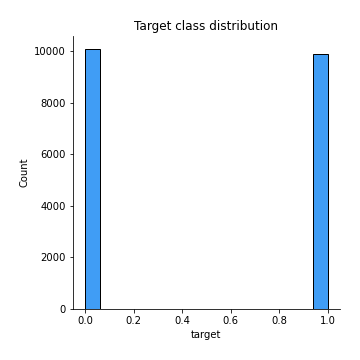

# Exploratory Data Analysis

[<< Go back](../README.md)
## Feature : target
- **Feature type** : discrete
- **Missing** : 0.0%
- **Unique** : 2
- **Count** :20000.0
- **Mean** :0.4955
- **Std** :0.49999224955236005
- **Min** :0.0
- **25%th Percentile** : 0.0
- **50%th Percentile** : 0.0
- **75%th Percentile** : 1.0
- **Max** :1.0

## Feature : sentence
- **Feature type** : text
- **Missing** : 0.0%
- **Unique** : 19941
- **Count** :20000
- **Unique** :19941
- **Top** :When i got this movie free from my job, along with three other similar movies.. I watched then with very low expectations. Now this movie isn't bad per se. You get what you pay for. It is a tale of love, betrayal, lies, sex, scandal, everything you want in a movie. Definitely not a Hollywood blockbuster, but for cheap thrills it is not that bad. I would probably never watch this movie again. In a nutshell this is the kind of movie that you would see either very late at night on a local television station that is just wanting to take up some time, or you would see it on a Sunday afternoon on a local television station that is trying to take up some time. Despite the bad acting, cliché lines, and sub par camera work. I didn't have the desire to turn off the movie and pretend like it never popped into my DVD player. The story has been done many times in many movies. This one is no different, no better, no worse.   Just your average movie.
- **Freq** :3

[<< Go back](../README.md)
