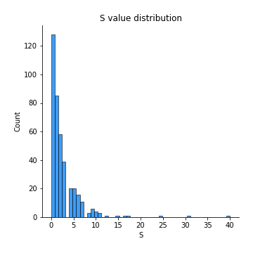
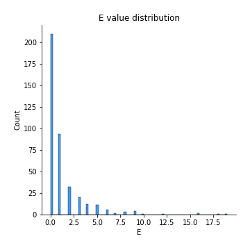
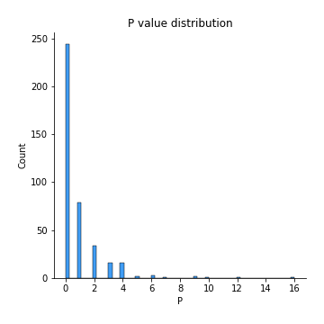
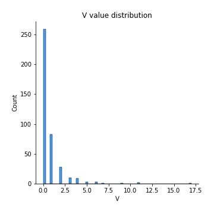
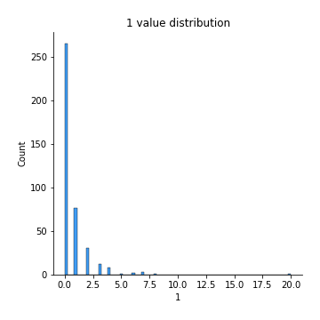
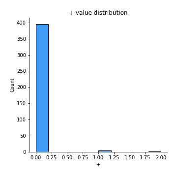
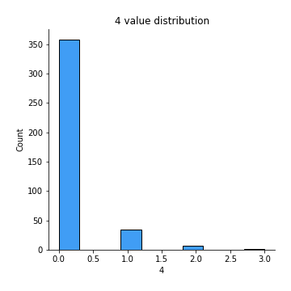
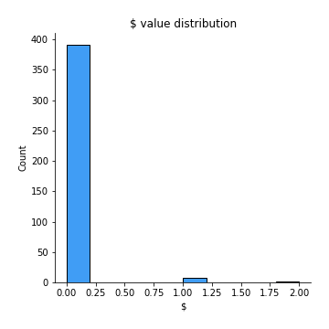

# Exploratory Data Analysis

[<< Go back](../README.md)
## Feature : target
- **Feature type** : discrete
- **Missing** : 0.0%
- **Unique** : 2
- **Count** :400.0
- **Mean** :0.525
- **Std** :0.49999999999999967
- **Min** :0.0
- **25%th Percentile** : 0.0
- **50%th Percentile** : 1.0
- **75%th Percentile** : 1.0
- **Max** :1.0

## Feature : I
- **Feature type** : continous
- **Missing** : 0.0%
- **Unique** : 26
- **Count** :400.0
- **Mean** :5.145
- **Std** :5.185189531366284
- **Min** :0.0
- **25%th Percentile** : 1.75
- **50%th Percentile** : 4.0
- **75%th Percentile** : 7.0
- **Max** :39.0

## Feature :  
- **Feature type** : continous
- **Missing** : 0.0%
- **Unique** : 247
- **Count** :400.0
- **Mean** :229.85
- **Std** :181.4118329460129
- **Min** :43.0
- **25%th Percentile** : 125.0
- **50%th Percentile** : 163.0
- **75%th Percentile** : 271.0
- **Max** :996.0

## Feature : t
- **Feature type** : continous
- **Missing** : 0.0%
- **Unique** : 163
- **Count** :400.0
- **Mean** :90.785
- **Std** :72.31765609765465
- **Min** :8.0
- **25%th Percentile** : 48.0
- **50%th Percentile** : 64.0
- **75%th Percentile** : 106.0
- **Max** :425.0

## Feature : h
- **Feature type** : continous
- **Missing** : 0.0%
- **Unique** : 119
- **Count** :400.0
- **Mean** :54.4
- **Std** :45.474386191555666
- **Min** :8.0
- **25%th Percentile** : 28.0
- **50%th Percentile** : 39.0
- **75%th Percentile** : 62.25
- **Max** :273.0

## Feature : o
- **Feature type** : continous
- **Missing** : 0.0%
- **Unique** : 145
- **Count** :400.0
- **Mean** :74.525
- **Std** :59.203056337483574
- **Min** :8.0
- **25%th Percentile** : 39.0
- **50%th Percentile** : 53.0
- **75%th Percentile** : 89.25
- **Max** :322.0

## Feature : u
- **Feature type** : continous
- **Missing** : 0.0%
- **Unique** : 81
- **Count** :400.0
- **Mean** :27.005
- **Std** :22.159367520809475
- **Min** :2.0
- **25%th Percentile** : 13.0
- **50%th Percentile** : 20.0
- **75%th Percentile** : 31.0
- **Max** :131.0

## Feature : g
- **Feature type** : continous
- **Missing** : 0.0%
- **Unique** : 65
- **Count** :400.0
- **Mean** :20.495
- **Std** :17.91038608809317
- **Min** :1.0
- **25%th Percentile** : 10.0
- **50%th Percentile** : 15.0
- **75%th Percentile** : 24.25
- **Max** :104.0

## Feature : i
- **Feature type** : continous
- **Missing** : 0.0%
- **Unique** : 143
- **Count** :400.0
- **Mean** :73.72
- **Std** :59.59875526445732
- **Min** :10.0
- **25%th Percentile** : 38.75
- **50%th Percentile** : 53.0
- **75%th Percentile** : 85.25
- **Max** :356.0

## Feature : s
- **Feature type** : continous
- **Missing** : 0.0%
- **Unique** : 136
- **Count** :400.0
- **Mean** :66.475
- **Std** :54.88291821486401
- **Min** :5.0
- **25%th Percentile** : 34.75
- **50%th Percentile** : 48.0
- **75%th Percentile** : 77.25
- **Max** :364.0

## Feature : w
- **Feature type** : continous
- **Missing** : 0.0%
- **Unique** : 62
- **Count** :400.0
- **Mean** :18.3675
- **Std** :14.937210059475715
- **Min** :0.0
- **25%th Percentile** : 9.0
- **50%th Percentile** : 14.0
- **75%th Percentile** : 22.0
- **Max** :90.0

## Feature : a
- **Feature type** : continous
- **Missing** : 0.0%
- **Unique** : 155
- **Count** :400.0
- **Mean** :78.8725
- **Std** :64.02925587393177
- **Min** :8.0
- **25%th Percentile** : 40.0
- **50%th Percentile** : 57.5
- **75%th Percentile** : 91.0
- **Max** :373.0

## Feature : n
- **Feature type** : continous
- **Missing** : 0.0%
- **Unique** : 140
- **Count** :400.0
- **Mean** :66.5825
- **Std** :53.609122720364645
- **Min** :5.0
- **25%th Percentile** : 35.0
- **50%th Percentile** : 48.0
- **75%th Percentile** : 80.0
- **Max** :304.0

## Feature : d
- **Feature type** : continous
- **Missing** : 0.0%
- **Unique** : 96
- **Count** :400.0
- **Mean** :33.91
- **Std** :26.477434474300054
- **Min** :2.0
- **25%th Percentile** : 17.0
- **50%th Percentile** : 25.0
- **75%th Percentile** : 40.25
- **Max** :141.0

## Feature : e
- **Feature type** : continous
- **Missing** : 0.0%
- **Unique** : 185
- **Count** :400.0
- **Mean** :120.505
- **Std** :96.75255872093324
- **Min** :15.0
- **25%th Percentile** : 65.0
- **50%th Percentile** : 86.0
- **75%th Percentile** : 145.0
- **Max** :589.0

## Feature : r
- **Feature type** : continous
- **Missing** : 0.0%
- **Unique** : 135
- **Count** :400.0
- **Mean** :60.09
- **Std** :50.908654743761886
- **Min** :6.0
- **25%th Percentile** : 30.0
- **50%th Percentile** : 41.5
- **75%th Percentile** : 71.25
- **Max** :276.0

## Feature : f
- **Feature type** : continous
- **Missing** : 0.0%
- **Unique** : 77
- **Count** :400.0
- **Mean** :21.8325
- **Std** :18.584210393230315
- **Min** :0.0
- **25%th Percentile** : 10.0
- **50%th Percentile** : 16.0
- **75%th Percentile** : 25.25
- **Max** :110.0

## Feature : l
- **Feature type** : continous
- **Missing** : 0.0%
- **Unique** : 108
- **Count** :400.0
- **Mean** :44.305
- **Std** :36.4870557608481
- **Min** :3.0
- **25%th Percentile** : 22.0
- **50%th Percentile** : 33.0
- **75%th Percentile** : 52.25
- **Max** :217.0

## Feature : y
- **Feature type** : continous
- **Missing** : 0.0%
- **Unique** : 62
- **Count** :400.0
- **Mean** :20.4175
- **Std** :15.844583326866157
- **Min** :1.0
- **25%th Percentile** : 10.0
- **50%th Percentile** : 15.5
- **75%th Percentile** : 25.0
- **Max** :85.0

## Feature : p
- **Feature type** : continous
- **Missing** : 0.0%
- **Unique** : 63
- **Count** :400.0
- **Mean** :16.3975
- **Std** :14.250867053602338
- **Min** :0.0
- **25%th Percentile** : 7.0
- **50%th Percentile** : 12.0
- **75%th Percentile** : 20.0
- **Max** :86.0

## Feature : m
- **Feature type** : continous
- **Missing** : 0.0%
- **Unique** : 82
- **Count** :400.0
- **Mean** :25.8875
- **Std** :21.09840516487569
- **Min** :2.0
- **25%th Percentile** : 13.0
- **50%th Percentile** : 19.0
- **75%th Percentile** : 31.0
- **Max** :125.0

## Feature : k
- **Feature type** : continous
- **Missing** : 0.0%
- **Unique** : 37
- **Count** :400.0
- **Mean** :8.3275
- **Std** :8.043132081733491
- **Min** :0.0
- **25%th Percentile** : 3.0
- **50%th Percentile** : 6.0
- **75%th Percentile** : 10.0
- **Max** :52.0

## Feature : ,
- **Feature type** : continous
- **Missing** : 0.0%
- **Unique** : 47
- **Count** :400.0
- **Mean** :11.025
- **Std** :11.06097817081465
- **Min** :0.0
- **25%th Percentile** : 4.0
- **50%th Percentile** : 8.0
- **75%th Percentile** : 14.0
- **Max** :66.0

## Feature : c
- **Feature type** : continous
- **Missing** : 0.0%
- **Unique** : 81
- **Count** :400.0
- **Mean** :26.8125
- **Std** :23.354784491547264
- **Min** :2.0
- **25%th Percentile** : 13.0
- **50%th Percentile** : 19.0
- **75%th Percentile** : 32.25
- **Max** :157.0

## Feature : -
- **Feature type** : continous
- **Missing** : 0.0%
- **Unique** : 23
- **Count** :400.0
- **Mean** :2.65
- **Std** :5.280360358326357
- **Min** :0.0
- **25%th Percentile** : 0.0
- **50%th Percentile** : 1.0
- **75%th Percentile** : 3.0
- **Max** :56.0

## Feature : .
- **Feature type** : continous
- **Missing** : 0.0%
- **Unique** : 49
- **Count** :400.0
- **Mean** :13.4575
- **Std** :11.445991462139856
- **Min** :0.0
- **25%th Percentile** : 7.0
- **50%th Percentile** : 10.0
- **75%th Percentile** : 16.0
- **Max** :81.0

## Feature : T
- **Feature type** : continous
- **Missing** : 0.0%
- **Unique** : 24
- **Count** :400.0
- **Mean** :4.455
- **Std** :4.2056144595595235
- **Min** :0.0
- **25%th Percentile** : 2.0
- **50%th Percentile** : 3.0
- **75%th Percentile** : 6.0
- **Max** :27.0

## Feature : b
- **Feature type** : continous
- **Missing** : 0.0%
- **Unique** : 67
- **Count** :400.0
- **Mean** :18.265
- **Std** :15.531349976103192
- **Min** :0.0
- **25%th Percentile** : 8.0
- **50%th Percentile** : 13.0
- **75%th Percentile** : 23.0
- **Max** :86.0

## Feature : (
- **Feature type** : continous
- **Missing** : 0.0%
- **Unique** : 14
- **Count** :400.0
- **Mean** :1.5175
- **Std** :2.307163031329347
- **Min** :0.0
- **25%th Percentile** : 0.0
- **50%th Percentile** : 1.0
- **75%th Percentile** : 2.0
- **Max** :15.0

## Feature : v
- **Feature type** : continous
- **Missing** : 0.0%
- **Unique** : 43
- **Count** :400.0
- **Mean** :12.29
- **Std** :9.389691996517977
- **Min** :0.0
- **25%th Percentile** : 6.0
- **50%th Percentile** : 10.0
- **75%th Percentile** : 15.25
- **Max** :59.0

## Feature : )
- **Feature type** : continous
- **Missing** : 0.0%
- **Unique** : 14
- **Count** :400.0
- **Mean** :1.5325
- **Std** :2.3015617994726902
- **Min** :0.0
- **25%th Percentile** : 0.0
- **50%th Percentile** : 1.0
- **75%th Percentile** : 2.0
- **Max** :15.0

.png)
## Feature : W
- **Feature type** : continous
- **Missing** : 0.0%
- **Unique** : 12
- **Count** :400.0
- **Mean** :1.3225
- **Std** :1.9769330820813285
- **Min** :0.0
- **25%th Percentile** : 0.0
- **50%th Percentile** : 1.0
- **75%th Percentile** : 2.0
- **Max** :11.0

## Feature : z
- **Feature type** : continous
- **Missing** : 0.0%
- **Unique** : 12
- **Count** :400.0
- **Mean** :0.9125
- **Std** :2.101400356582863
- **Min** :0.0
- **25%th Percentile** : 0.0
- **50%th Percentile** : 0.0
- **75%th Percentile** : 1.0
- **Max** :28.0

## Feature : M
- **Feature type** : continous
- **Missing** : 0.0%
- **Unique** : 14
- **Count** :400.0
- **Mean** :1.6325
- **Std** :2.5979447728168705
- **Min** :0.0
- **25%th Percentile** : 0.0
- **50%th Percentile** : 1.0
- **75%th Percentile** : 2.0
- **Max** :23.0

## Feature : P
- **Feature type** : continous
- **Missing** : 0.0%
- **Unique** : 12
- **Count** :400.0
- **Mean** :0.875
- **Std** :1.7180670493216823
- **Min** :0.0
- **25%th Percentile** : 0.0
- **50%th Percentile** : 0.0
- **75%th Percentile** : 1.0
- **Max** :16.0

## Feature : 2
- **Feature type** : continous
- **Missing** : 0.0%
- **Unique** : 8
- **Count** :400.0
- **Mean** :0.405
- **Std** :1.0434063167599807
- **Min** :0.0
- **25%th Percentile** : 0.0
- **50%th Percentile** : 0.0
- **75%th Percentile** : 0.0
- **Max** :10.0

## Feature : :
- **Feature type** : continous
- **Missing** : 0.0%
- **Unique** : 10
- **Count** :400.0
- **Mean** :0.4775
- **Std** :1.5590285999424767
- **Min** :0.0
- **25%th Percentile** : 0.0
- **50%th Percentile** : 0.0
- **75%th Percentile** : 0.0
- **Max** :23.0

## Feature : R
- **Feature type** : continous
- **Missing** : 0.0%
- **Unique** : 13
- **Count** :400.0
- **Mean** :1.1975
- **Std** :2.2850705938871223
- **Min** :0.0
- **25%th Percentile** : 0.0
- **50%th Percentile** : 0.0
- **75%th Percentile** : 1.0
- **Max** :22.0

## Feature : A
- **Feature type** : continous
- **Missing** : 0.0%
- **Unique** : 21
- **Count** :400.0
- **Mean** :2.6825
- **Std** :4.235746406366602
- **Min** :0.0
- **25%th Percentile** : 1.0
- **50%th Percentile** : 1.0
- **75%th Percentile** : 3.0
- **Max** :46.0

## Feature : <
- **Feature type** : continous
- **Missing** : 0.0%
- **Unique** : 14
- **Count** :400.0
- **Mean** :3.835
- **Std** :5.154531792024129
- **Min** :0.0
- **25%th Percentile** : 0.0
- **50%th Percentile** : 2.0
- **75%th Percentile** : 6.0
- **Max** :52.0

## Feature : /
- **Feature type** : continous
- **Missing** : 0.0%
- **Unique** : 24
- **Count** :400.0
- **Mean** :4.1625
- **Std** :5.804768047062739
- **Min** :0.0
- **25%th Percentile** : 0.0
- **50%th Percentile** : 2.0
- **75%th Percentile** : 6.0
- **Max** :70.0

## Feature : >
- **Feature type** : continous
- **Missing** : 0.0%
- **Unique** : 14
- **Count** :400.0
- **Mean** :3.835
- **Std** :5.154531792024129
- **Min** :0.0
- **25%th Percentile** : 0.0
- **50%th Percentile** : 2.0
- **75%th Percentile** : 6.0
- **Max** :52.0

## Feature : '
- **Feature type** : continous
- **Missing** : 0.0%
- **Unique** : 31
- **Count** :400.0
- **Mean** :5.5275
- **Std** :6.280753410899152
- **Min** :0.0
- **25%th Percentile** : 1.0
- **50%th Percentile** : 4.0
- **75%th Percentile** : 7.0
- **Max** :48.0

## Feature : ?
- **Feature type** : continous
- **Missing** : 0.0%
- **Unique** : 11
- **Count** :400.0
- **Mean** :0.645
- **Std** :1.514830610810535
- **Min** :0.0
- **25%th Percentile** : 0.0
- **50%th Percentile** : 0.0
- **75%th Percentile** : 1.0
- **Max** :13.0

## Feature : S
- **Feature type** : continous
- **Missing** : 0.0%
- **Unique** : 19
- **Count** :400.0
- **Mean** :2.4425
- **Std** :3.782520641849169
- **Min** :0.0
- **25%th Percentile** : 0.0
- **50%th Percentile** : 1.0
- **75%th Percentile** : 3.0
- **Max** :40.0

## Feature : J
- **Feature type** : continous
- **Missing** : 0.0%
- **Unique** : 10
- **Count** :400.0
- **Mean** :0.785
- **Std** :1.8580651266943242
- **Min** :0.0
- **25%th Percentile** : 0.0
- **50%th Percentile** : 0.0
- **75%th Percentile** : 1.0
- **Max** :27.0

## Feature : "
- **Feature type** : continous
- **Missing** : 0.0%
- **Unique** : 15
- **Count** :400.0
- **Mean** :2.5925
- **Std** :4.522452342255249
- **Min** :0.0
- **25%th Percentile** : 0.0
- **50%th Percentile** : 0.0
- **75%th Percentile** : 4.0
- **Max** :36.0

## Feature : x
- **Feature type** : continous
- **Missing** : 0.0%
- **Unique** : 12
- **Count** :400.0
- **Mean** :1.595
- **Std** :1.996481868092985
- **Min** :0.0
- **25%th Percentile** : 0.0
- **50%th Percentile** : 1.0
- **75%th Percentile** : 2.0
- **Max** :15.0

## Feature : j
- **Feature type** : continous
- **Missing** : 0.0%
- **Unique** : 12
- **Count** :400.0
- **Mean** :1.425
- **Std** :1.679710859472121
- **Min** :0.0
- **25%th Percentile** : 0.0
- **50%th Percentile** : 1.0
- **75%th Percentile** : 2.0
- **Max** :11.0

## Feature : D
- **Feature type** : continous
- **Missing** : 0.0%
- **Unique** : 16
- **Count** :400.0
- **Mean** :1.6575
- **Std** :2.865435490702664
- **Min** :0.0
- **25%th Percentile** : 0.0
- **50%th Percentile** : 1.0
- **75%th Percentile** : 2.0
- **Max** :29.0

## Feature : 1
- **Feature type** : continous
- **Missing** : 0.0%
- **Unique** : 10
- **Count** :400.0
- **Mean** :0.68
- **Std** :1.5503577079359425
- **Min** :0.0
- **25%th Percentile** : 0.0
- **50%th Percentile** : 0.0
- **75%th Percentile** : 1.0
- **Max** :20.0

## Feature : 5
- **Feature type** : continous
- **Missing** : 0.0%
- **Unique** : 5
- **Count** :400.0
- **Mean** :0.2375
- **Std** :0.6099375455928328
- **Min** :0.0
- **25%th Percentile** : 0.0
- **50%th Percentile** : 0.0
- **75%th Percentile** : 0.0
- **Max** :4.0

## Feature : L
- **Feature type** : continous
- **Missing** : 0.0%
- **Unique** : 14
- **Count** :400.0
- **Mean** :1.1775
- **Std** :2.146511712366907
- **Min** :0.0
- **25%th Percentile** : 0.0
- **50%th Percentile** : 0.0
- **75%th Percentile** : 1.0
- **Max** :17.0

## Feature : B
- **Feature type** : continous
- **Missing** : 0.0%
- **Unique** : 14
- **Count** :400.0
- **Mean** :1.7475
- **Std** :2.5267974817512537
- **Min** :0.0
- **25%th Percentile** : 0.0
- **50%th Percentile** : 1.0
- **75%th Percentile** : 2.0
- **Max** :26.0

## Feature : V
- **Feature type** : continous
- **Missing** : 0.0%
- **Unique** : 11
- **Count** :400.0
- **Mean** :0.7325
- **Std** :1.6286728302424398
- **Min** :0.0
- **25%th Percentile** : 0.0
- **50%th Percentile** : 0.0
- **75%th Percentile** : 1.0
- **Max** :17.0

## Feature : G
- **Feature type** : continous
- **Missing** : 0.0%
- **Unique** : 11
- **Count** :400.0
- **Mean** :0.8675
- **Std** :1.5299659275122326
- **Min** :0.0
- **25%th Percentile** : 0.0
- **50%th Percentile** : 0.0
- **75%th Percentile** : 1.0
- **Max** :12.0

## Feature : Y
- **Feature type** : continous
- **Missing** : 0.0%
- **Unique** : 10
- **Count** :400.0
- **Mean** :0.4925
- **Std** :1.6144534368477084
- **Min** :0.0
- **25%th Percentile** : 0.0
- **50%th Percentile** : 0.0
- **75%th Percentile** : 1.0
- **Max** :24.0

## Feature : O
- **Feature type** : continous
- **Missing** : 0.0%
- **Unique** : 14
- **Count** :400.0
- **Mean** :1.155
- **Std** :2.17088850294772
- **Min** :0.0
- **25%th Percentile** : 0.0
- **50%th Percentile** : 0.0
- **75%th Percentile** : 1.0
- **Max** :16.0

## Feature : 0
- **Feature type** : continous
- **Missing** : 0.0%
- **Unique** : 13
- **Count** :400.0
- **Mean** :0.8975
- **Std** :2.00049962431068
- **Min** :0.0
- **25%th Percentile** : 0.0
- **50%th Percentile** : 0.0
- **75%th Percentile** : 1.0
- **Max** :18.0

## Feature : q
- **Feature type** : continous
- **Missing** : 0.0%
- **Unique** : 10
- **Count** :400.0
- **Mean** :0.72
- **Std** :1.2248881080298637
- **Min** :0.0
- **25%th Percentile** : 0.0
- **50%th Percentile** : 0.0
- **75%th Percentile** : 1.0
- **Max** :10.0

## Feature : &
- **Feature type** : continous
- **Missing** : 0.0%
- **Unique** : 7
- **Count** :400.0
- **Mean** :0.265
- **Std** :2.2962920967254368
- **Min** :0.0
- **25%th Percentile** : 0.0
- **50%th Percentile** : 0.0
- **75%th Percentile** : 0.0
- **Max** :30.0

## Feature : 7
- **Feature type** : continous
- **Missing** : 0.0%
- **Unique** : 6
- **Count** :400.0
- **Mean** :0.1775
- **Std** :0.6573233107361218
- **Min** :0.0
- **25%th Percentile** : 0.0
- **50%th Percentile** : 0.0
- **75%th Percentile** : 0.0
- **Max** :6.0

## Feature : 8
- **Feature type** : continous
- **Missing** : 0.0%
- **Unique** : 4
- **Count** :400.0
- **Mean** :0.1525
- **Std** :0.4688211098944974
- **Min** :0.0
- **25%th Percentile** : 0.0
- **50%th Percentile** : 0.0
- **75%th Percentile** : 0.0
- **Max** :3.0

## Feature : 9
- **Feature type** : continous
- **Missing** : 0.0%
- **Unique** : 7
- **Count** :400.0
- **Mean** :0.36
- **Std** :0.9913915184512833
- **Min** :0.0
- **25%th Percentile** : 0.0
- **50%th Percentile** : 0.0
- **75%th Percentile** : 0.0
- **Max** :6.0

## Feature : H
- **Feature type** : continous
- **Missing** : 0.0%
- **Unique** : 15
- **Count** :400.0
- **Mean** :1.6175
- **Std** :2.591908316627828
- **Min** :0.0
- **25%th Percentile** : 0.0
- **50%th Percentile** : 1.0
- **75%th Percentile** : 2.0
- **Max** :22.0

## Feature : E
- **Feature type** : continous
- **Missing** : 0.0%
- **Unique** : 15
- **Count** :400.0
- **Mean** :1.305
- **Std** :2.4824143393843277
- **Min** :0.0
- **25%th Percentile** : 0.0
- **50%th Percentile** : 0.0
- **75%th Percentile** : 1.0
- **Max** :19.0

## Feature : +
- **Feature type** : continous
- **Missing** : 0.0%
- **Unique** : 3
- **Count** :400.0
- **Mean** :0.015
- **Std** :0.14079972089286558
- **Min** :0.0
- **25%th Percentile** : 0.0
- **50%th Percentile** : 0.0
- **75%th Percentile** : 0.0
- **Max** :2.0

## Feature : K
- **Feature type** : continous
- **Missing** : 0.0%
- **Unique** : 10
- **Count** :400.0
- **Mean** :0.6125
- **Std** :1.5109769615868114
- **Min** :0.0
- **25%th Percentile** : 0.0
- **50%th Percentile** : 0.0
- **75%th Percentile** : 1.0
- **Max** :18.0

## Feature : F
- **Feature type** : continous
- **Missing** : 0.0%
- **Unique** : 10
- **Count** :400.0
- **Mean** :0.83
- **Std** :1.4251940025351473
- **Min** :0.0
- **25%th Percentile** : 0.0
- **50%th Percentile** : 0.0
- **75%th Percentile** : 1.0
- **Max** :11.0

## Feature : C
- **Feature type** : continous
- **Missing** : 0.0%
- **Unique** : 15
- **Count** :400.0
- **Mean** :1.7125
- **Std** :2.514089370608876
- **Min** :0.0
- **25%th Percentile** : 0.0
- **50%th Percentile** : 1.0
- **75%th Percentile** : 3.0
- **Max** :20.0

## Feature : U
- **Feature type** : continous
- **Missing** : 0.0%
- **Unique** : 8
- **Count** :400.0
- **Mean** :0.3325
- **Std** :0.8739870613794278
- **Min** :0.0
- **25%th Percentile** : 0.0
- **50%th Percentile** : 0.0
- **75%th Percentile** : 0.0
- **Max** :7.0

## Feature : !
- **Feature type** : continous
- **Missing** : 0.0%
- **Unique** : 15
- **Count** :400.0
- **Mean** :0.9875
- **Std** :2.4985898278468137
- **Min** :0.0
- **25%th Percentile** : 0.0
- **50%th Percentile** : 0.0
- **75%th Percentile** : 1.0
- **Max** :24.0

## Feature : *
- **Feature type** : continous
- **Missing** : 0.0%
- **Unique** : 9
- **Count** :400.0
- **Mean** :0.2
- **Std** :1.1633501014942227
- **Min** :0.0
- **25%th Percentile** : 0.0
- **50%th Percentile** : 0.0
- **75%th Percentile** : 0.0
- **Max** :12.0

## Feature : N
- **Feature type** : continous
- **Missing** : 0.0%
- **Unique** : 12
- **Count** :400.0
- **Mean** :1.0
- **Std** :1.9747783099461023
- **Min** :0.0
- **25%th Percentile** : 0.0
- **50%th Percentile** : 0.0
- **75%th Percentile** : 1.0
- **Max** :19.0

## Feature : ;
- **Feature type** : continous
- **Missing** : 0.0%
- **Unique** : 6
- **Count** :400.0
- **Mean** :0.2275
- **Std** :0.6722153178736407
- **Min** :0.0
- **25%th Percentile** : 0.0
- **50%th Percentile** : 0.0
- **75%th Percentile** : 0.0
- **Max** :7.0

## Feature : 4
- **Feature type** : continous
- **Missing** : 0.0%
- **Unique** : 4
- **Count** :400.0
- **Mean** :0.1275
- **Std** :0.4020545605688176
- **Min** :0.0
- **25%th Percentile** : 0.0
- **50%th Percentile** : 0.0
- **75%th Percentile** : 0.0
- **Max** :3.0

## Feature : à
- **Feature type** : continous
- **Missing** : 0.0%
- **Unique** : 2
- **Count** :400.0
- **Mean** :0.0025
- **Std** :0.04999999999999988
- **Min** :0.0
- **25%th Percentile** : 0.0
- **50%th Percentile** : 0.0
- **75%th Percentile** : 0.0
- **Max** :1.0

## Feature : è
- **Feature type** : continous
- **Missing** : 0.0%
- **Unique** : 2
- **Count** :400.0
- **Mean** :0.0025
- **Std** :0.04999999999999987
- **Min** :0.0
- **25%th Percentile** : 0.0
- **50%th Percentile** : 0.0
- **75%th Percentile** : 0.0
- **Max** :1.0

## Feature : $
- **Feature type** : continous
- **Missing** : 0.0%
- **Unique** : 3
- **Count** :400.0
- **Mean** :0.0275
- **Std** :0.19192665161200934
- **Min** :0.0
- **25%th Percentile** : 0.0
- **50%th Percentile** : 0.0
- **75%th Percentile** : 0.0
- **Max** :2.0

## Feature : 3
- **Feature type** : continous
- **Missing** : 0.0%
- **Unique** : 5
- **Count** :400.0
- **Mean** :0.2225
- **Std** :0.5601590805197383
- **Min** :0.0
- **25%th Percentile** : 0.0
- **50%th Percentile** : 0.0
- **75%th Percentile** : 0.0
- **Max** :4.0

## Feature : %
- **Feature type** : continous
- **Missing** : 0.0%
- **Unique** : 2
- **Count** :400.0
- **Mean** :0.01
- **Std** :0.09962335082738055
- **Min** :0.0
- **25%th Percentile** : 0.0
- **50%th Percentile** : 0.0
- **75%th Percentile** : 0.0
- **Max** :1.0

## Feature : Z
- **Feature type** : continous
- **Missing** : 0.0%
- **Unique** : 5
- **Count** :400.0
- **Mean** :0.065
- **Std** :0.3689380547199642
- **Min** :0.0
- **25%th Percentile** : 0.0
- **50%th Percentile** : 0.0
- **75%th Percentile** : 0.0
- **Max** :4.0

## Feature : é
- **Feature type** : continous
- **Missing** : 0.0%
- **Unique** : 3
- **Count** :400.0
- **Mean** :0.0725
- **Std** :0.28714086209858125
- **Min** :0.0
- **25%th Percentile** : 0.0
- **50%th Percentile** : 0.0
- **75%th Percentile** : 0.0
- **Max** :2.0

## Feature : =
- **Feature type** : continous
- **Missing** : 0.0%
- **Unique** : 2
- **Count** :400.0
- **Mean** :0.005
- **Std** :0.07062201265667246
- **Min** :0.0
- **25%th Percentile** : 0.0
- **50%th Percentile** : 0.0
- **75%th Percentile** : 0.0
- **Max** :1.0

## Feature : X
- **Feature type** : continous
- **Missing** : 0.0%
- **Unique** : 3
- **Count** :400.0
- **Mean** :0.02
- **Std** :0.15704029462319075
- **Min** :0.0
- **25%th Percentile** : 0.0
- **50%th Percentile** : 0.0
- **75%th Percentile** : 0.0
- **Max** :2.0

## Feature : 6
- **Feature type** : continous
- **Missing** : 0.0%
- **Unique** : 5
- **Count** :400.0
- **Mean** :0.14
- **Std** :0.47535766774156524
- **Min** :0.0
- **25%th Percentile** : 0.0
- **50%th Percentile** : 0.0
- **75%th Percentile** : 0.0
- **Max** :4.0

## Feature : Q
- **Feature type** : continous
- **Missing** : 0.0%
- **Unique** : 4
- **Count** :400.0
- **Mean** :0.06
- **Std** :0.3188324565321811
- **Min** :0.0
- **25%th Percentile** : 0.0
- **50%th Percentile** : 0.0
- **75%th Percentile** : 0.0
- **Max** :3.0

## Feature : û
- **Feature type** : continous
- **Missing** : 0.0%
- **Unique** : 1
- **Count** :400.0
- **Mean** :0.0
- **Std** :0.0
- **Min** :0.0
- **25%th Percentile** : 0.0
- **50%th Percentile** : 0.0
- **75%th Percentile** : 0.0
- **Max** :0.0

## Feature : `
- **Feature type** : continous
- **Missing** : 0.0%
- **Unique** : 2
- **Count** :400.0
- **Mean** :0.03
- **Std** :0.6000000000000002
- **Min** :0.0
- **25%th Percentile** : 0.0
- **50%th Percentile** : 0.0
- **75%th Percentile** : 0.0
- **Max** :12.0

## Feature : ü
- **Feature type** : continous
- **Missing** : 0.0%
- **Unique** : 1
- **Count** :400.0
- **Mean** :0.0
- **Std** :0.0
- **Min** :0.0
- **25%th Percentile** : 0.0
- **50%th Percentile** : 0.0
- **75%th Percentile** : 0.0
- **Max** :0.0

