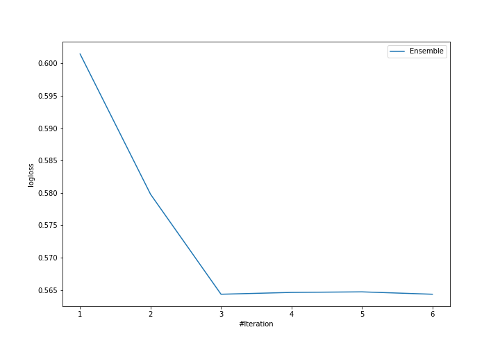
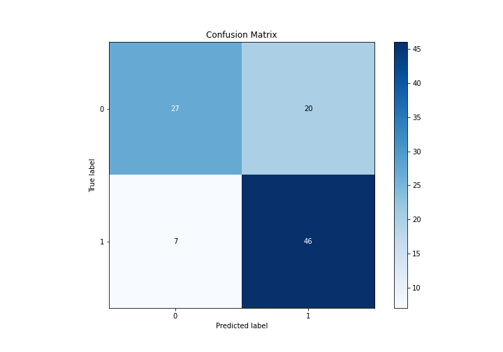
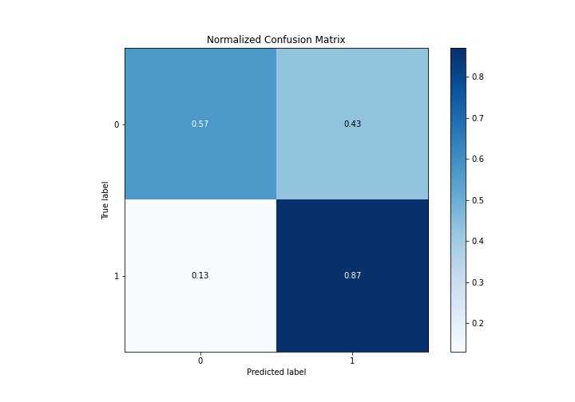
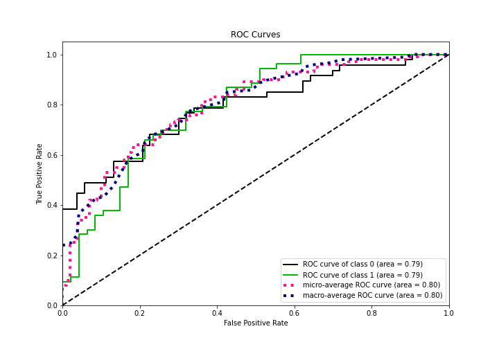
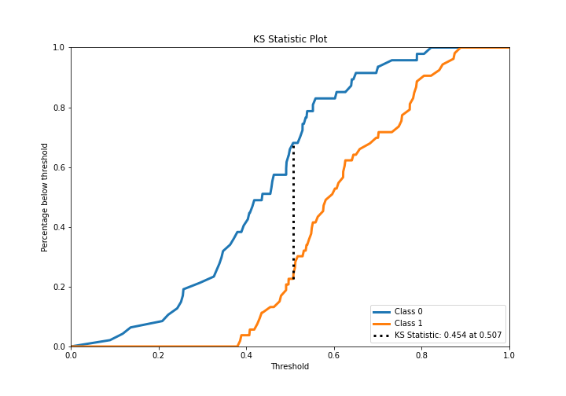
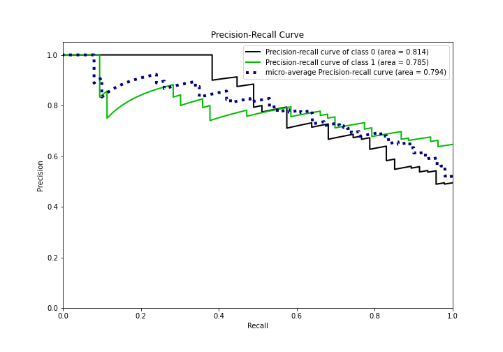
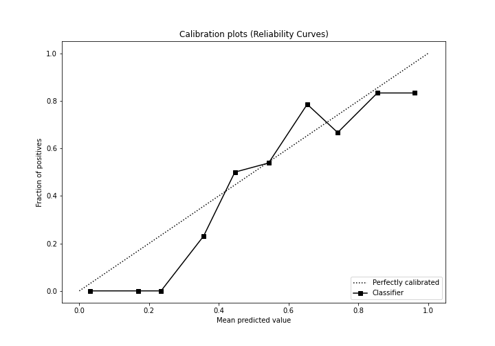
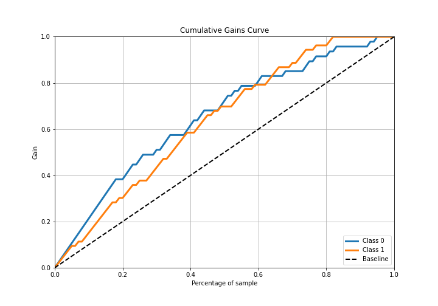
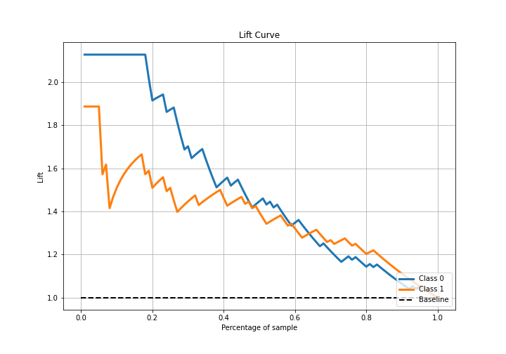

# Summary of Ensemble

[<< Go back](../README.md)

## Ensemble structure
| Model             |   Weight |
|:------------------|---------:|
| 2_DecisionTree    |        1 |
| 3_Linear          |        1 |
| 4_Default_Xgboost |        1 |

## Metric details
|           |    score |   threshold |
|:----------|---------:|------------:|
| logloss   | 0.564346 | nan         |
| auc       | 0.790847 | nan         |
| f1        | 0.787402 |   0.419714  |
| accuracy  | 0.73     |   0.471308  |
| precision | 1        |   0.822666  |
| recall    | 1        |   0.0805118 |
| mcc       | 0.497529 |   0.383374  |

## Confusion matrix (at threshold=0.471308)
|              |   Predicted as 0 |   Predicted as 1 |
|:-------------|-----------------:|-----------------:|
| Labeled as 0 |               27 |               20 |
| Labeled as 1 |                7 |               46 |

## Learning curves

## Confusion Matrix

## Normalized Confusion Matrix

## ROC Curve

## Kolmogorov-Smirnov Statistic

## Precision-Recall Curve

## Calibration Curve

## Cumulative Gains Curve

## Lift Curve

[<< Go back](../README.md)
