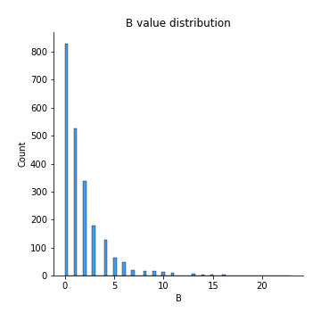
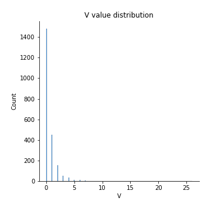

# Exploratory Data Analysis

[<< Go back](../README.md)
## Feature : target
- **Feature type** : discrete
- **Missing** : 0.0%
- **Unique** : 2
- **Count** :2200.0
- **Mean** :0.49772727272727274
- **Std** :0.5001085086277249
- **Min** :0.0
- **25%th Percentile** : 0.0
- **50%th Percentile** : 0.0
- **75%th Percentile** : 1.0
- **Max** :1.0

## Feature : I
- **Feature type** : continous
- **Missing** : 0.0%
- **Unique** : 33
- **Count** :2200.0
- **Mean** :5.192272727272727
- **Std** :4.826864560026363
- **Min** :0.0
- **25%th Percentile** : 2.0
- **50%th Percentile** : 4.0
- **75%th Percentile** : 7.0
- **Max** :47.0

## Feature :  
- **Feature type** : continous
- **Missing** : 0.0%
- **Unique** : 558
- **Count** :2200.0
- **Mean** :227.02772727272728
- **Std** :165.8213990536209
- **Min** :21.0
- **25%th Percentile** : 125.75
- **50%th Percentile** : 171.0
- **75%th Percentile** : 275.0
- **Max** :1056.0

## Feature : t
- **Feature type** : continous
- **Missing** : 0.0%
- **Unique** : 300
- **Count** :2200.0
- **Mean** :89.90272727272728
- **Std** :67.28472884409683
- **Min** :3.0
- **25%th Percentile** : 49.0
- **50%th Percentile** : 68.0
- **75%th Percentile** : 107.0
- **Max** :459.0

## Feature : h
- **Feature type** : continous
- **Missing** : 0.0%
- **Unique** : 203
- **Count** :2200.0
- **Mean** :53.13
- **Std** :41.24111832669844
- **Min** :1.0
- **25%th Percentile** : 28.0
- **50%th Percentile** : 40.0
- **75%th Percentile** : 64.0
- **Max** :335.0

## Feature : o
- **Feature type** : continous
- **Missing** : 0.0%
- **Unique** : 248
- **Count** :2200.0
- **Mean** :74.22227272727272
- **Std** :55.18795990050051
- **Min** :6.0
- **25%th Percentile** : 40.0
- **50%th Percentile** : 56.0
- **75%th Percentile** : 89.0
- **Max** :379.0

## Feature : u
- **Feature type** : continous
- **Missing** : 0.0%
- **Unique** : 120
- **Count** :2200.0
- **Mean** :26.71090909090909
- **Std** :20.635538229205746
- **Min** :0.0
- **25%th Percentile** : 14.0
- **50%th Percentile** : 20.0
- **75%th Percentile** : 33.0
- **Max** :155.0

## Feature : g
- **Feature type** : continous
- **Missing** : 0.0%
- **Unique** : 96
- **Count** :2200.0
- **Mean** :20.044545454545453
- **Std** :16.01198440643309
- **Min** :0.0
- **25%th Percentile** : 10.0
- **50%th Percentile** : 15.0
- **75%th Percentile** : 25.0
- **Max** :123.0

## Feature : i
- **Feature type** : continous
- **Missing** : 0.0%
- **Unique** : 250
- **Count** :2200.0
- **Mean** :71.86318181818181
- **Std** :54.4215595808837
- **Min** :6.0
- **25%th Percentile** : 38.0
- **50%th Percentile** : 54.0
- **75%th Percentile** : 87.0
- **Max** :408.0

## Feature : s
- **Feature type** : continous
- **Missing** : 0.0%
- **Unique** : 240
- **Count** :2200.0
- **Mean** :66.11363636363636
- **Std** :50.53181290949742
- **Min** :7.0
- **25%th Percentile** : 34.0
- **50%th Percentile** : 50.0
- **75%th Percentile** : 79.0
- **Max** :368.0

## Feature : w
- **Feature type** : continous
- **Missing** : 0.0%
- **Unique** : 86
- **Count** :2200.0
- **Mean** :18.352272727272727
- **Std** :13.986968349144975
- **Min** :0.0
- **25%th Percentile** : 9.0
- **50%th Percentile** : 14.0
- **75%th Percentile** : 23.0
- **Max** :106.0

## Feature : a
- **Feature type** : continous
- **Missing** : 0.0%
- **Unique** : 270
- **Count** :2200.0
- **Mean** :78.34681818181818
- **Std** :59.95500199009446
- **Min** :4.0
- **25%th Percentile** : 41.0
- **50%th Percentile** : 59.0
- **75%th Percentile** : 95.0
- **Max** :420.0

## Feature : n
- **Feature type** : continous
- **Missing** : 0.0%
- **Unique** : 235
- **Count** :2200.0
- **Mean** :65.1
- **Std** :50.60715492052079
- **Min** :0.0
- **25%th Percentile** : 33.75
- **50%th Percentile** : 49.0
- **75%th Percentile** : 80.0
- **Max** :384.0

## Feature : d
- **Feature type** : continous
- **Missing** : 0.0%
- **Unique** : 141
- **Count** :2200.0
- **Mean** :33.90409090909091
- **Std** :25.979709814530494
- **Min** :1.0
- **25%th Percentile** : 18.0
- **50%th Percentile** : 26.0
- **75%th Percentile** : 41.0
- **Max** :174.0

## Feature : e
- **Feature type** : continous
- **Missing** : 0.0%
- **Unique** : 366
- **Count** :2200.0
- **Mean** :118.57909090909091
- **Std** :90.15774725338514
- **Min** :8.0
- **25%th Percentile** : 62.0
- **50%th Percentile** : 89.0
- **75%th Percentile** : 145.0
- **Max** :590.0

## Feature : r
- **Feature type** : continous
- **Missing** : 0.0%
- **Unique** : 231
- **Count** :2200.0
- **Mean** :59.266363636363636
- **Std** :47.274415439221436
- **Min** :1.0
- **25%th Percentile** : 29.0
- **50%th Percentile** : 44.0
- **75%th Percentile** : 71.0
- **Max** :329.0

## Feature : f
- **Feature type** : continous
- **Missing** : 0.0%
- **Unique** : 105
- **Count** :2200.0
- **Mean** :21.513636363636362
- **Std** :17.63437451623792
- **Min** :0.0
- **25%th Percentile** : 10.0
- **50%th Percentile** : 16.0
- **75%th Percentile** : 27.0
- **Max** :157.0

## Feature : l
- **Feature type** : continous
- **Missing** : 0.0%
- **Unique** : 173
- **Count** :2200.0
- **Mean** :43.16045454545455
- **Std** :33.2524372594712
- **Min** :2.0
- **25%th Percentile** : 22.0
- **50%th Percentile** : 32.5
- **75%th Percentile** : 52.0
- **Max** :225.0

## Feature : y
- **Feature type** : continous
- **Missing** : 0.0%
- **Unique** : 85
- **Count** :2200.0
- **Mean** :20.331818181818182
- **Std** :15.364182533533034
- **Min** :1.0
- **25%th Percentile** : 10.0
- **50%th Percentile** : 16.0
- **75%th Percentile** : 25.0
- **Max** :117.0

## Feature : p
- **Feature type** : continous
- **Missing** : 0.0%
- **Unique** : 87
- **Count** :2200.0
- **Mean** :16.353636363636365
- **Std** :13.793792075503905
- **Min** :0.0
- **25%th Percentile** : 8.0
- **50%th Percentile** : 12.0
- **75%th Percentile** : 20.0
- **Max** :110.0

## Feature : m
- **Feature type** : continous
- **Missing** : 0.0%
- **Unique** : 115
- **Count** :2200.0
- **Mean** :25.89409090909091
- **Std** :19.850261689034596
- **Min** :1.0
- **25%th Percentile** : 13.0
- **50%th Percentile** : 20.0
- **75%th Percentile** : 32.0
- **Max** :153.0

## Feature : k
- **Feature type** : continous
- **Missing** : 0.0%
- **Unique** : 49
- **Count** :2200.0
- **Mean** :8.186818181818182
- **Std** :7.144077508064534
- **Min** :0.0
- **25%th Percentile** : 3.0
- **50%th Percentile** : 6.0
- **75%th Percentile** : 11.0
- **Max** :58.0

## Feature : ,
- **Feature type** : continous
- **Missing** : 0.0%
- **Unique** : 64
- **Count** :2200.0
- **Mean** :10.64090909090909
- **Std** :10.292058824352731
- **Min** :0.0
- **25%th Percentile** : 4.0
- **50%th Percentile** : 8.0
- **75%th Percentile** : 14.0
- **Max** :90.0

## Feature : c
- **Feature type** : continous
- **Missing** : 0.0%
- **Unique** : 122
- **Count** :2200.0
- **Mean** :26.227272727272727
- **Std** :21.395285396910815
- **Min** :0.0
- **25%th Percentile** : 13.0
- **50%th Percentile** : 20.0
- **75%th Percentile** : 32.0
- **Max** :181.0

## Feature : -
- **Feature type** : continous
- **Missing** : 0.0%
- **Unique** : 31
- **Count** :2200.0
- **Mean** :2.707272727272727
- **Std** :4.572267652422172
- **Min** :0.0
- **25%th Percentile** : 0.0
- **50%th Percentile** : 1.0
- **75%th Percentile** : 4.0
- **Max** :88.0

## Feature : .
- **Feature type** : continous
- **Missing** : 0.0%
- **Unique** : 64
- **Count** :2200.0
- **Mean** :12.896818181818182
- **Std** :9.752917911510567
- **Min** :0.0
- **25%th Percentile** : 7.0
- **50%th Percentile** : 10.0
- **75%th Percentile** : 16.0
- **Max** :93.0

## Feature : T
- **Feature type** : continous
- **Missing** : 0.0%
- **Unique** : 31
- **Count** :2200.0
- **Mean** :4.361363636363636
- **Std** :4.041379639457143
- **Min** :0.0
- **25%th Percentile** : 2.0
- **50%th Percentile** : 3.0
- **75%th Percentile** : 6.0
- **Max** :45.0

## Feature : b
- **Feature type** : continous
- **Missing** : 0.0%
- **Unique** : 91
- **Count** :2200.0
- **Mean** :18.351363636363637
- **Std** :14.964675640048645
- **Min** :0.0
- **25%th Percentile** : 8.0
- **50%th Percentile** : 14.0
- **75%th Percentile** : 23.0
- **Max** :121.0

## Feature : (
- **Feature type** : continous
- **Missing** : 0.0%
- **Unique** : 19
- **Count** :2200.0
- **Mean** :1.3595454545454546
- **Std** :2.146159947862112
- **Min** :0.0
- **25%th Percentile** : 0.0
- **50%th Percentile** : 1.0
- **75%th Percentile** : 2.0
- **Max** :25.0

## Feature : v
- **Feature type** : continous
- **Missing** : 0.0%
- **Unique** : 59
- **Count** :2200.0
- **Mean** :12.118636363636364
- **Std** :8.907488659021192
- **Min** :0.0
- **25%th Percentile** : 6.0
- **50%th Percentile** : 10.0
- **75%th Percentile** : 15.0
- **Max** :75.0

## Feature : )
- **Feature type** : continous
- **Missing** : 0.0%
- **Unique** : 19
- **Count** :2200.0
- **Mean** :1.4036363636363636
- **Std** :2.250922796879753
- **Min** :0.0
- **25%th Percentile** : 0.0
- **50%th Percentile** : 1.0
- **75%th Percentile** : 2.0
- **Max** :25.0

.png)
## Feature : W
- **Feature type** : continous
- **Missing** : 0.0%
- **Unique** : 19
- **Count** :2200.0
- **Mean** :1.3681818181818182
- **Std** :1.9745737939363577
- **Min** :0.0
- **25%th Percentile** : 0.0
- **50%th Percentile** : 1.0
- **75%th Percentile** : 2.0
- **Max** :26.0

## Feature : z
- **Feature type** : continous
- **Missing** : 0.0%
- **Unique** : 15
- **Count** :2200.0
- **Mean** :0.8345454545454546
- **Std** :1.5201802365338954
- **Min** :0.0
- **25%th Percentile** : 0.0
- **50%th Percentile** : 0.0
- **75%th Percentile** : 1.0
- **Max** :14.0

## Feature : M
- **Feature type** : continous
- **Missing** : 0.0%
- **Unique** : 22
- **Count** :2200.0
- **Mean** :1.66
- **Std** :2.5678319260348594
- **Min** :0.0
- **25%th Percentile** : 0.0
- **50%th Percentile** : 1.0
- **75%th Percentile** : 2.0
- **Max** :24.0

## Feature : P
- **Feature type** : continous
- **Missing** : 0.0%
- **Unique** : 19
- **Count** :2200.0
- **Mean** :0.9731818181818181
- **Std** :1.7189283715071715
- **Min** :0.0
- **25%th Percentile** : 0.0
- **50%th Percentile** : 0.0
- **75%th Percentile** : 1.0
- **Max** :19.0

## Feature : 2
- **Feature type** : continous
- **Missing** : 0.0%
- **Unique** : 8
- **Count** :2200.0
- **Mean** :0.3145454545454546
- **Std** :0.7498171811302042
- **Min** :0.0
- **25%th Percentile** : 0.0
- **50%th Percentile** : 0.0
- **75%th Percentile** : 0.0
- **Max** :7.0

## Feature : :
- **Feature type** : continous
- **Missing** : 0.0%
- **Unique** : 12
- **Count** :2200.0
- **Mean** :0.37545454545454543
- **Std** :1.0137469265250085
- **Min** :0.0
- **25%th Percentile** : 0.0
- **50%th Percentile** : 0.0
- **75%th Percentile** : 0.0
- **Max** :18.0

## Feature : R
- **Feature type** : continous
- **Missing** : 0.0%
- **Unique** : 20
- **Count** :2200.0
- **Mean** :1.1286363636363637
- **Std** :2.021777288842736
- **Min** :0.0
- **25%th Percentile** : 0.0
- **50%th Percentile** : 0.0
- **75%th Percentile** : 1.0
- **Max** :26.0

## Feature : A
- **Feature type** : continous
- **Missing** : 0.0%
- **Unique** : 26
- **Count** :2200.0
- **Mean** :2.5322727272727272
- **Std** :3.2811080657789202
- **Min** :0.0
- **25%th Percentile** : 1.0
- **50%th Percentile** : 2.0
- **75%th Percentile** : 3.0
- **Max** :46.0

## Feature : <
- **Feature type** : continous
- **Missing** : 0.0%
- **Unique** : 23
- **Count** :2200.0
- **Mean** :4.0
- **Std** :5.396847815932941
- **Min** :0.0
- **25%th Percentile** : 0.0
- **50%th Percentile** : 2.0
- **75%th Percentile** : 6.0
- **Max** :86.0

## Feature : /
- **Feature type** : continous
- **Missing** : 0.0%
- **Unique** : 37
- **Count** :2200.0
- **Mean** :4.26
- **Std** :5.573408573637372
- **Min** :0.0
- **25%th Percentile** : 0.0
- **50%th Percentile** : 2.0
- **75%th Percentile** : 6.0
- **Max** :86.0

## Feature : >
- **Feature type** : continous
- **Missing** : 0.0%
- **Unique** : 26
- **Count** :2200.0
- **Mean** :4.001363636363636
- **Std** :5.397142554455104
- **Min** :0.0
- **25%th Percentile** : 0.0
- **50%th Percentile** : 2.0
- **75%th Percentile** : 6.0
- **Max** :86.0

## Feature : '
- **Feature type** : continous
- **Missing** : 0.0%
- **Unique** : 34
- **Count** :2200.0
- **Mean** :4.954545454545454
- **Std** :5.064003926162623
- **Min** :0.0
- **25%th Percentile** : 1.0
- **50%th Percentile** : 3.0
- **75%th Percentile** : 7.0
- **Max** :55.0

## Feature : ?
- **Feature type** : continous
- **Missing** : 0.0%
- **Unique** : 13
- **Count** :2200.0
- **Mean** :0.6068181818181818
- **Std** :1.3318940151904668
- **Min** :0.0
- **25%th Percentile** : 0.0
- **50%th Percentile** : 0.0
- **75%th Percentile** : 1.0
- **Max** :14.0

## Feature : S
- **Feature type** : continous
- **Missing** : 0.0%
- **Unique** : 26
- **Count** :2200.0
- **Mean** :2.4813636363636364
- **Std** :3.318971053445825
- **Min** :0.0
- **25%th Percentile** : 0.0
- **50%th Percentile** : 1.0
- **75%th Percentile** : 3.0
- **Max** :40.0

## Feature : J
- **Feature type** : continous
- **Missing** : 0.0%
- **Unique** : 16
- **Count** :2200.0
- **Mean** :0.7522727272727273
- **Std** :1.503972099662669
- **Min** :0.0
- **25%th Percentile** : 0.0
- **50%th Percentile** : 0.0
- **75%th Percentile** : 1.0
- **Max** :19.0

## Feature : "
- **Feature type** : continous
- **Missing** : 0.0%
- **Unique** : 26
- **Count** :2200.0
- **Mean** :2.629090909090909
- **Std** :4.3820159456561845
- **Min** :0.0
- **25%th Percentile** : 0.0
- **50%th Percentile** : 0.0
- **75%th Percentile** : 4.0
- **Max** :36.0

## Feature : x
- **Feature type** : continous
- **Missing** : 0.0%
- **Unique** : 19
- **Count** :2200.0
- **Mean** :1.6995454545454545
- **Std** :2.0974875662807633
- **Min** :0.0
- **25%th Percentile** : 0.0
- **50%th Percentile** : 1.0
- **75%th Percentile** : 2.0
- **Max** :20.0

## Feature : j
- **Feature type** : continous
- **Missing** : 0.0%
- **Unique** : 14
- **Count** :2200.0
- **Mean** :1.5022727272727272
- **Std** :1.7884970020421058
- **Min** :0.0
- **25%th Percentile** : 0.0
- **50%th Percentile** : 1.0
- **75%th Percentile** : 2.0
- **Max** :15.0

## Feature : D
- **Feature type** : continous
- **Missing** : 0.0%
- **Unique** : 20
- **Count** :2200.0
- **Mean** :1.4845454545454546
- **Std** :2.288976941074059
- **Min** :0.0
- **25%th Percentile** : 0.0
- **50%th Percentile** : 1.0
- **75%th Percentile** : 2.0
- **Max** :29.0

## Feature : 1
- **Feature type** : continous
- **Missing** : 0.0%
- **Unique** : 16
- **Count** :2200.0
- **Mean** :0.735909090909091
- **Std** :1.5500683113375135
- **Min** :0.0
- **25%th Percentile** : 0.0
- **50%th Percentile** : 0.0
- **75%th Percentile** : 1.0
- **Max** :30.0

## Feature : 5
- **Feature type** : continous
- **Missing** : 0.0%
- **Unique** : 8
- **Count** :2200.0
- **Mean** :0.2309090909090909
- **Std** :1.0272986474530255
- **Min** :0.0
- **25%th Percentile** : 0.0
- **50%th Percentile** : 0.0
- **75%th Percentile** : 0.0
- **Max** :39.0

## Feature : L
- **Feature type** : continous
- **Missing** : 0.0%
- **Unique** : 17
- **Count** :2200.0
- **Mean** :1.0745454545454545
- **Std** :2.0597900688024695
- **Min** :0.0
- **25%th Percentile** : 0.0
- **50%th Percentile** : 0.0
- **75%th Percentile** : 1.0
- **Max** :26.0

## Feature : B
- **Feature type** : continous
- **Missing** : 0.0%
- **Unique** : 20
- **Count** :2200.0
- **Mean** :1.6981818181818182
- **Std** :2.341044174090786
- **Min** :0.0
- **25%th Percentile** : 0.0
- **50%th Percentile** : 1.0
- **75%th Percentile** : 2.0
- **Max** :23.0

## Feature : V
- **Feature type** : continous
- **Missing** : 0.0%
- **Unique** : 13
- **Count** :2200.0
- **Mean** :0.5831818181818181
- **Std** :1.282473190355361
- **Min** :0.0
- **25%th Percentile** : 0.0
- **50%th Percentile** : 0.0
- **75%th Percentile** : 1.0
- **Max** :26.0

## Feature : G
- **Feature type** : continous
- **Missing** : 0.0%
- **Unique** : 16
- **Count** :2200.0
- **Mean** :0.9277272727272727
- **Std** :1.6901271019962112
- **Min** :0.0
- **25%th Percentile** : 0.0
- **50%th Percentile** : 0.0
- **75%th Percentile** : 1.0
- **Max** :17.0

## Feature : Y
- **Feature type** : continous
- **Missing** : 0.0%
- **Unique** : 12
- **Count** :2200.0
- **Mean** :0.4618181818181818
- **Std** :1.164659364697058
- **Min** :0.0
- **25%th Percentile** : 0.0
- **50%th Percentile** : 0.0
- **75%th Percentile** : 1.0
- **Max** :24.0

## Feature : O
- **Feature type** : continous
- **Missing** : 0.0%
- **Unique** : 20
- **Count** :2200.0
- **Mean** :1.0990909090909091
- **Std** :2.0392240744330286
- **Min** :0.0
- **25%th Percentile** : 0.0
- **50%th Percentile** : 0.0
- **75%th Percentile** : 1.0
- **Max** :36.0

## Feature : 0
- **Feature type** : continous
- **Missing** : 0.0%
- **Unique** : 15
- **Count** :2200.0
- **Mean** :0.7790909090909091
- **Std** :1.5481712108626369
- **Min** :0.0
- **25%th Percentile** : 0.0
- **50%th Percentile** : 0.0
- **75%th Percentile** : 1.0
- **Max** :23.0

## Feature : q
- **Feature type** : continous
- **Missing** : 0.0%
- **Unique** : 10
- **Count** :2200.0
- **Mean** :0.7040909090909091
- **Std** :1.1329058890488766
- **Min** :0.0
- **25%th Percentile** : 0.0
- **50%th Percentile** : 0.0
- **75%th Percentile** : 1.0
- **Max** :10.0

## Feature : &
- **Feature type** : continous
- **Missing** : 0.0%
- **Unique** : 18
- **Count** :2200.0
- **Mean** :0.1968181818181818
- **Std** :1.62570553155853
- **Min** :0.0
- **25%th Percentile** : 0.0
- **50%th Percentile** : 0.0
- **75%th Percentile** : 0.0
- **Max** :41.0

## Feature : 7
- **Feature type** : continous
- **Missing** : 0.0%
- **Unique** : 9
- **Count** :2200.0
- **Mean** :0.17454545454545456
- **Std** :0.6065335291550876
- **Min** :0.0
- **25%th Percentile** : 0.0
- **50%th Percentile** : 0.0
- **75%th Percentile** : 0.0
- **Max** :9.0

## Feature : 8
- **Feature type** : continous
- **Missing** : 0.0%
- **Unique** : 10
- **Count** :2200.0
- **Mean** :0.19227272727272726
- **Std** :0.6509057726417815
- **Min** :0.0
- **25%th Percentile** : 0.0
- **50%th Percentile** : 0.0
- **75%th Percentile** : 0.0
- **Max** :10.0

## Feature : 9
- **Feature type** : continous
- **Missing** : 0.0%
- **Unique** : 14
- **Count** :2200.0
- **Mean** :0.4290909090909091
- **Std** :1.3939612146825215
- **Min** :0.0
- **25%th Percentile** : 0.0
- **50%th Percentile** : 0.0
- **75%th Percentile** : 0.0
- **Max** :31.0

## Feature : H
- **Feature type** : continous
- **Missing** : 0.0%
- **Unique** : 21
- **Count** :2200.0
- **Mean** :1.56
- **Std** :2.3249130209101763
- **Min** :0.0
- **25%th Percentile** : 0.0
- **50%th Percentile** : 1.0
- **75%th Percentile** : 2.0
- **Max** :23.0

## Feature : E
- **Feature type** : continous
- **Missing** : 0.0%
- **Unique** : 21
- **Count** :2200.0
- **Mean** :1.229090909090909
- **Std** :2.5255887504748173
- **Min** :0.0
- **25%th Percentile** : 0.0
- **50%th Percentile** : 0.0
- **75%th Percentile** : 1.0
- **Max** :51.0

## Feature : +
- **Feature type** : continous
- **Missing** : 0.0%
- **Unique** : 3
- **Count** :2200.0
- **Mean** :0.007727272727272728
- **Std** :0.09263127519359332
- **Min** :0.0
- **25%th Percentile** : 0.0
- **50%th Percentile** : 0.0
- **75%th Percentile** : 0.0
- **Max** :2.0

## Feature : K
- **Feature type** : continous
- **Missing** : 0.0%
- **Unique** : 14
- **Count** :2200.0
- **Mean** :0.5713636363636364
- **Std** :1.275721431237487
- **Min** :0.0
- **25%th Percentile** : 0.0
- **50%th Percentile** : 0.0
- **75%th Percentile** : 1.0
- **Max** :18.0

## Feature : F
- **Feature type** : continous
- **Missing** : 0.0%
- **Unique** : 16
- **Count** :2200.0
- **Mean** :0.9340909090909091
- **Std** :1.5945911277992124
- **Min** :0.0
- **25%th Percentile** : 0.0
- **50%th Percentile** : 0.0
- **75%th Percentile** : 1.0
- **Max** :19.0

## Feature : C
- **Feature type** : continous
- **Missing** : 0.0%
- **Unique** : 19
- **Count** :2200.0
- **Mean** :1.4831818181818182
- **Std** :2.3346041229222
- **Min** :0.0
- **25%th Percentile** : 0.0
- **50%th Percentile** : 1.0
- **75%th Percentile** : 2.0
- **Max** :23.0

## Feature : U
- **Feature type** : continous
- **Missing** : 0.0%
- **Unique** : 12
- **Count** :2200.0
- **Mean** :0.3563636363636364
- **Std** :0.934073045991713
- **Min** :0.0
- **25%th Percentile** : 0.0
- **50%th Percentile** : 0.0
- **75%th Percentile** : 0.0
- **Max** :19.0

## Feature : !
- **Feature type** : continous
- **Missing** : 0.0%
- **Unique** : 25
- **Count** :2200.0
- **Mean** :1.104090909090909
- **Std** :6.482184743267424
- **Min** :0.0
- **25%th Percentile** : 0.0
- **50%th Percentile** : 0.0
- **75%th Percentile** : 1.0
- **Max** :282.0

## Feature : *
- **Feature type** : continous
- **Missing** : 0.0%
- **Unique** : 18
- **Count** :2200.0
- **Mean** :0.28863636363636364
- **Std** :1.8336598050410648
- **Min** :0.0
- **25%th Percentile** : 0.0
- **50%th Percentile** : 0.0
- **75%th Percentile** : 0.0
- **Max** :45.0

## Feature : N
- **Feature type** : continous
- **Missing** : 0.0%
- **Unique** : 19
- **Count** :2200.0
- **Mean** :1.0754545454545454
- **Std** :1.9805184122340664
- **Min** :0.0
- **25%th Percentile** : 0.0
- **50%th Percentile** : 0.0
- **75%th Percentile** : 1.0
- **Max** :26.0

## Feature : ;
- **Feature type** : continous
- **Missing** : 0.0%
- **Unique** : 11
- **Count** :2200.0
- **Mean** :0.25227272727272726
- **Std** :0.8500564773692735
- **Min** :0.0
- **25%th Percentile** : 0.0
- **50%th Percentile** : 0.0
- **75%th Percentile** : 0.0
- **Max** :12.0

## Feature : 4
- **Feature type** : continous
- **Missing** : 0.0%
- **Unique** : 6
- **Count** :2200.0
- **Mean** :0.17772727272727273
- **Std** :0.5459798241077446
- **Min** :0.0
- **25%th Percentile** : 0.0
- **50%th Percentile** : 0.0
- **75%th Percentile** : 0.0
- **Max** :5.0

## Feature : à
- **Feature type** : continous
- **Missing** : 0.0%
- **Unique** : 2
- **Count** :2200.0
- **Mean** :0.0018181818181818182
- **Std** :0.04261104729825455
- **Min** :0.0
- **25%th Percentile** : 0.0
- **50%th Percentile** : 0.0
- **75%th Percentile** : 0.0
- **Max** :1.0

## Feature : è
- **Feature type** : continous
- **Missing** : 0.0%
- **Unique** : 3
- **Count** :2200.0
- **Mean** :0.0022727272727272726
- **Std** :0.05637461735858272
- **Min** :0.0
- **25%th Percentile** : 0.0
- **50%th Percentile** : 0.0
- **75%th Percentile** : 0.0
- **Max** :2.0

## Feature : $
- **Feature type** : continous
- **Missing** : 0.0%
- **Unique** : 4
- **Count** :2200.0
- **Mean** :0.026363636363636363
- **Std** :0.18153870786014023
- **Min** :0.0
- **25%th Percentile** : 0.0
- **50%th Percentile** : 0.0
- **75%th Percentile** : 0.0
- **Max** :3.0

## Feature : 3
- **Feature type** : continous
- **Missing** : 0.0%
- **Unique** : 8
- **Count** :2200.0
- **Mean** :0.21
- **Std** :0.5797005703383056
- **Min** :0.0
- **25%th Percentile** : 0.0
- **50%th Percentile** : 0.0
- **75%th Percentile** : 0.0
- **Max** :8.0

## Feature : %
- **Feature type** : continous
- **Missing** : 0.0%
- **Unique** : 4
- **Count** :2200.0
- **Mean** :0.019090909090909092
- **Std** :0.16952731253249465
- **Min** :0.0
- **25%th Percentile** : 0.0
- **50%th Percentile** : 0.0
- **75%th Percentile** : 0.0
- **Max** :4.0

## Feature : Z
- **Feature type** : continous
- **Missing** : 0.0%
- **Unique** : 8
- **Count** :2200.0
- **Mean** :0.07954545454545454
- **Std** :0.48585238966689875
- **Min** :0.0
- **25%th Percentile** : 0.0
- **50%th Percentile** : 0.0
- **75%th Percentile** : 0.0
- **Max** :12.0

## Feature : é
- **Feature type** : continous
- **Missing** : 0.0%
- **Unique** : 6
- **Count** :2200.0
- **Mean** :0.056818181818181816
- **Std** :0.29540803304975266
- **Min** :0.0
- **25%th Percentile** : 0.0
- **50%th Percentile** : 0.0
- **75%th Percentile** : 0.0
- **Max** :5.0

## Feature : =
- **Feature type** : continous
- **Missing** : 0.0%
- **Unique** : 3
- **Count** :2200.0
- **Mean** :0.004545454545454545
- **Std** :0.08517842454773104
- **Min** :0.0
- **25%th Percentile** : 0.0
- **50%th Percentile** : 0.0
- **75%th Percentile** : 0.0
- **Max** :3.0

## Feature : X
- **Feature type** : continous
- **Missing** : 0.0%
- **Unique** : 7
- **Count** :2200.0
- **Mean** :0.05590909090909091
- **Std** :0.3594518474824729
- **Min** :0.0
- **25%th Percentile** : 0.0
- **50%th Percentile** : 0.0
- **75%th Percentile** : 0.0
- **Max** :7.0

## Feature : 6
- **Feature type** : continous
- **Missing** : 0.0%
- **Unique** : 7
- **Count** :2200.0
- **Mean** :0.14181818181818182
- **Std** :0.5402207317012758
- **Min** :0.0
- **25%th Percentile** : 0.0
- **50%th Percentile** : 0.0
- **75%th Percentile** : 0.0
- **Max** :13.0

## Feature : Q
- **Feature type** : continous
- **Missing** : 0.0%
- **Unique** : 5
- **Count** :2200.0
- **Mean** :0.04363636363636364
- **Std** :0.2644727644802845
- **Min** :0.0
- **25%th Percentile** : 0.0
- **50%th Percentile** : 0.0
- **75%th Percentile** : 0.0
- **Max** :4.0

## Feature : û
- **Feature type** : continous
- **Missing** : 0.0%
- **Unique** : 1
- **Count** :2200.0
- **Mean** :0.0
- **Std** :0.0
- **Min** :0.0
- **25%th Percentile** : 0.0
- **50%th Percentile** : 0.0
- **75%th Percentile** : 0.0
- **Max** :0.0

## Feature : `
- **Feature type** : continous
- **Missing** : 0.0%
- **Unique** : 6
- **Count** :2200.0
- **Mean** :0.015454545454545455
- **Std** :0.3159217048992245
- **Min** :0.0
- **25%th Percentile** : 0.0
- **50%th Percentile** : 0.0
- **75%th Percentile** : 0.0
- **Max** :13.0

## Feature : ü
- **Feature type** : continous
- **Missing** : 0.0%
- **Unique** : 2
- **Count** :2200.0
- **Mean** :0.00045454545454545455
- **Std** :0.021320071635562054
- **Min** :0.0
- **25%th Percentile** : 0.0
- **50%th Percentile** : 0.0
- **75%th Percentile** : 0.0
- **Max** :1.0

