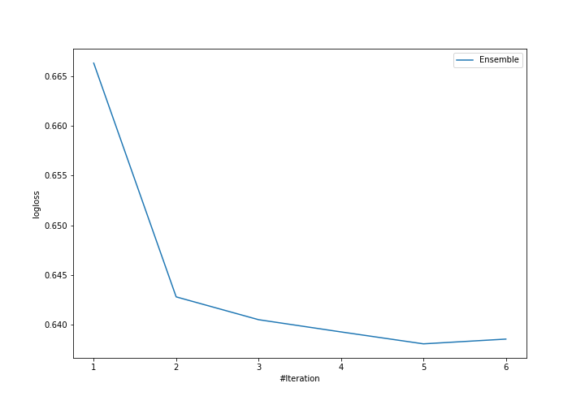
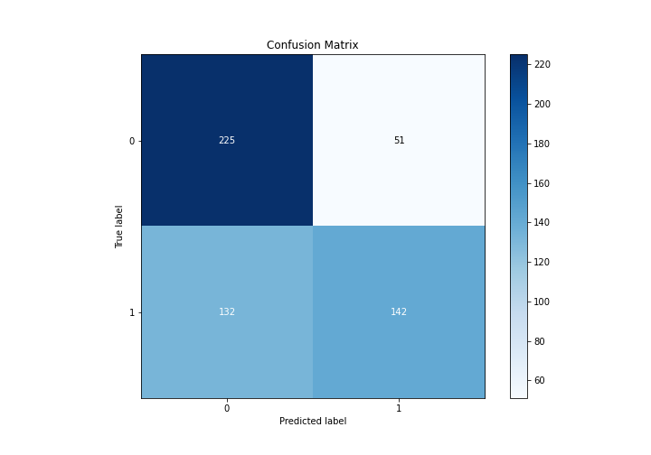
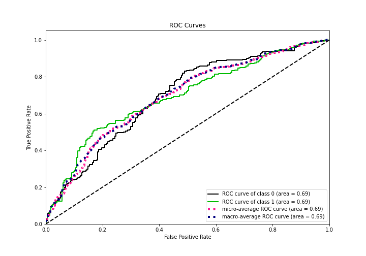
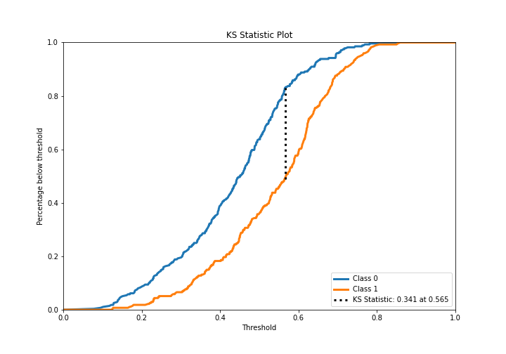
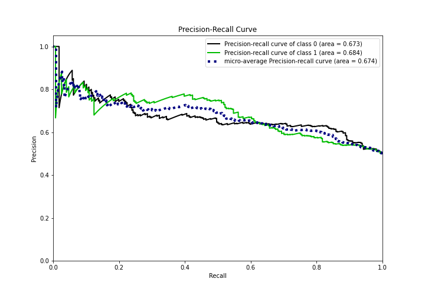
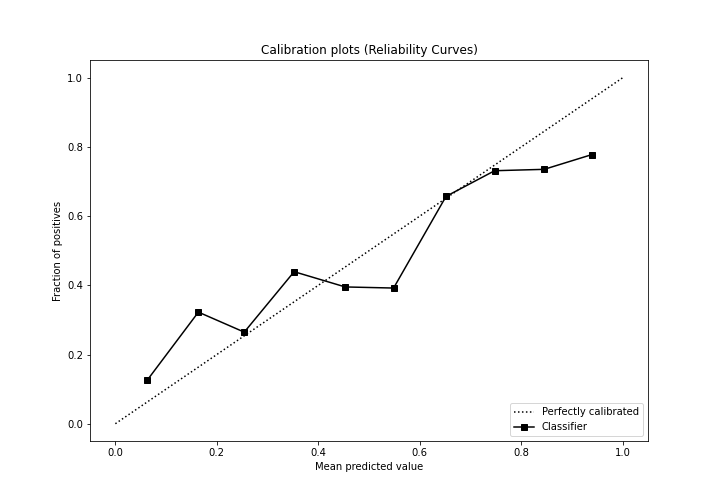
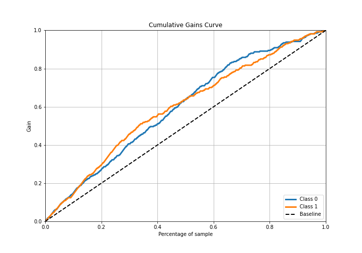
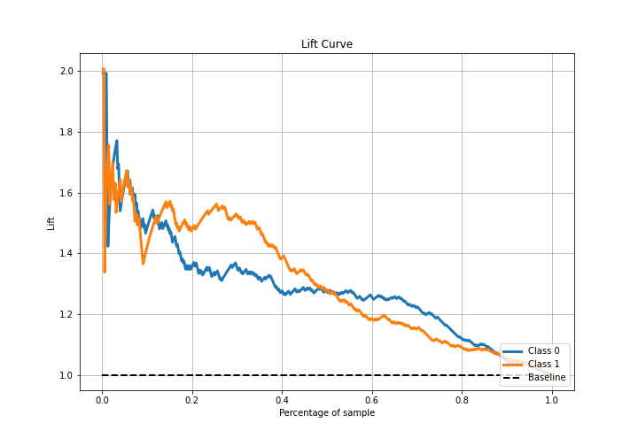

# Summary of Ensemble

[<< Go back](../README.md)

## Ensemble structure
| Model                   |   Weight |
|:------------------------|---------:|
| 3_Linear                |        2 |
| 5_Default_NeuralNetwork |        1 |
| 6_Default_RandomForest  |        2 |

## Metric details
|           |    score |   threshold |
|:----------|---------:|------------:|
| logloss   | 0.638066 | nan         |
| auc       | 0.691804 | nan         |
| f1        | 0.680908 |   0.304829  |
| accuracy  | 0.667273 |   0.56309   |
| precision | 0.807692 |   0.738793  |
| recall    | 1        |   0.0699329 |
| mcc       | 0.350322 |   0.569713  |

## Confusion matrix (at threshold=0.56309)
|              |   Predicted as 0 |   Predicted as 1 |
|:-------------|-----------------:|-----------------:|
| Labeled as 0 |              225 |               51 |
| Labeled as 1 |              132 |              142 |

## Learning curves

## Confusion Matrix

## Normalized Confusion Matrix

## ROC Curve

## Kolmogorov-Smirnov Statistic

## Precision-Recall Curve

## Calibration Curve

## Cumulative Gains Curve

## Lift Curve

[<< Go back](../README.md)
