# Exploratory Data Analysis

[<< Go back](../README.md)
## Feature : target
- **Feature type** : discrete
- **Missing** : 0.0%
- **Unique** : 2
- **Count** :23000.0
- **Mean** :0.5018695652173913
- **Std** :0.5000073745573524
- **Min** :0.0
- **25%th Percentile** : 0.0
- **50%th Percentile** : 1.0
- **75%th Percentile** : 1.0
- **Max** :1.0

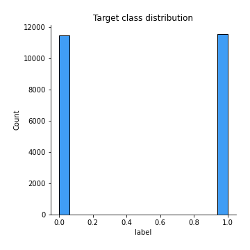
## Feature : I
- **Feature type** : continous
- **Missing** : 0.0%
- **Unique** : 45
- **Count** :23000.0
- **Mean** :5.299304347826087
- **Std** :4.795244851357162
- **Min** :0.0
- **25%th Percentile** : 2.0
- **50%th Percentile** : 4.0
- **75%th Percentile** : 7.0
- **Max** :52.0

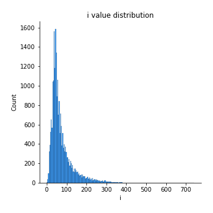
## Feature :  
- **Feature type** : continous
- **Missing** : 0.0%
- **Unique** : 978
- **Count** :23000.0
- **Mean** :229.95717391304348
- **Std** :170.3377741268918
- **Min** :7.0
- **25%th Percentile** : 125.75
- **50%th Percentile** : 172.0
- **75%th Percentile** : 278.0
- **Max** :2277.0

## Feature : t
- **Feature type** : continous
- **Missing** : 0.0%
- **Unique** : 454
- **Count** :23000.0
- **Mean** :91.17291304347826
- **Std** :69.11863484665795
- **Min** :0.0
- **25%th Percentile** : 48.0
- **50%th Percentile** : 69.0
- **75%th Percentile** : 110.0
- **Max** :954.0

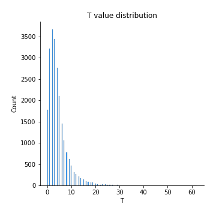
## Feature : h
- **Feature type** : continous
- **Missing** : 0.0%
- **Unique** : 290
- **Count** :23000.0
- **Mean** :53.95991304347826
- **Std** :42.63903045982776
- **Min** :0.0
- **25%th Percentile** : 28.0
- **50%th Percentile** : 40.0
- **75%th Percentile** : 66.0
- **Max** :652.0

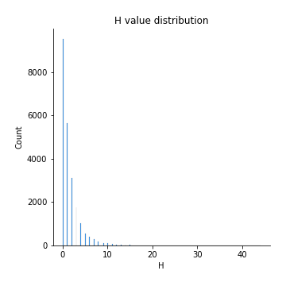
## Feature : o
- **Feature type** : continous
- **Missing** : 0.0%
- **Unique** : 372
- **Count** :23000.0
- **Mean** :75.0124347826087
- **Std** :56.37966296537302
- **Min** :0.0
- **25%th Percentile** : 40.0
- **50%th Percentile** : 57.0
- **75%th Percentile** : 91.0
- **Max** :632.0

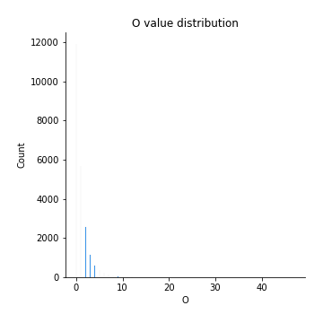
## Feature : u
- **Feature type** : continous
- **Missing** : 0.0%
- **Unique** : 156
- **Count** :23000.0
- **Mean** :26.861
- **Std** :20.8929498534934
- **Min** :0.0
- **25%th Percentile** : 14.0
- **50%th Percentile** : 20.0
- **75%th Percentile** : 33.0
- **Max** :239.0

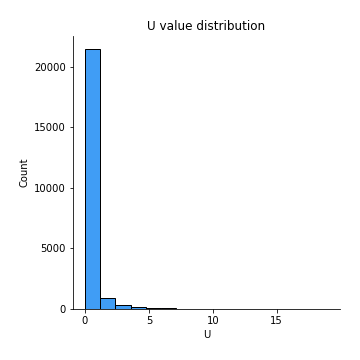
## Feature : g
- **Feature type** : continous
- **Missing** : 0.0%
- **Unique** : 126
- **Count** :23000.0
- **Mean** :20.29286956521739
- **Std** :16.238144716192874
- **Min** :0.0
- **25%th Percentile** : 10.0
- **50%th Percentile** : 15.0
- **75%th Percentile** : 25.0
- **Max** :193.0

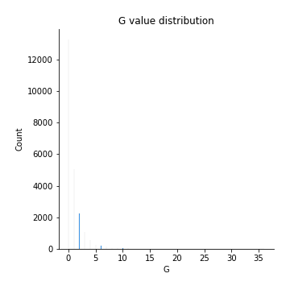
## Feature : i
- **Feature type** : continous
- **Missing** : 0.0%
- **Unique** : 390
- **Count** :23000.0
- **Mean** :73.024
- **Std** :56.047067186870414
- **Min** :0.0
- **25%th Percentile** : 38.0
- **50%th Percentile** : 54.0
- **75%th Percentile** : 89.0
- **Max** :740.0

## Feature : s
- **Feature type** : continous
- **Missing** : 0.0%
- **Unique** : 358
- **Count** :23000.0
- **Mean** :66.81017391304349
- **Std** :52.02355222032923
- **Min** :0.0
- **25%th Percentile** : 34.0
- **50%th Percentile** : 50.0
- **75%th Percentile** : 81.0
- **Max** :619.0

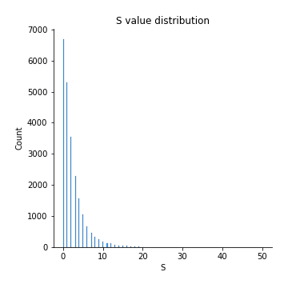
## Feature : w
- **Feature type** : continous
- **Missing** : 0.0%
- **Unique** : 117
- **Count** :23000.0
- **Mean** :18.755304347826087
- **Std** :14.623112569833834
- **Min** :0.0
- **25%th Percentile** : 9.0
- **50%th Percentile** : 15.0
- **75%th Percentile** : 23.0
- **Max** :179.0

## Feature : a
- **Feature type** : continous
- **Missing** : 0.0%
- **Unique** : 405
- **Count** :23000.0
- **Mean** :79.50104347826087
- **Std** :61.523105262924425
- **Min** :0.0
- **25%th Percentile** : 41.0
- **50%th Percentile** : 59.0
- **75%th Percentile** : 97.0
- **Max** :843.0

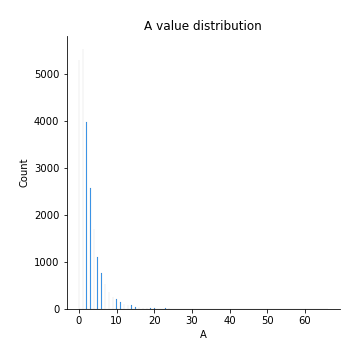
## Feature : n
- **Feature type** : continous
- **Missing** : 0.0%
- **Unique** : 357
- **Count** :23000.0
- **Mean** :66.3451304347826
- **Std** :52.58730950388891
- **Min** :0.0
- **25%th Percentile** : 34.0
- **50%th Percentile** : 49.0
- **75%th Percentile** : 81.0
- **Max** :648.0

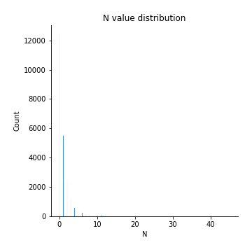
## Feature : d
- **Feature type** : continous
- **Missing** : 0.0%
- **Unique** : 190
- **Count** :23000.0
- **Mean** :34.349391304347826
- **Std** :26.644280085356694
- **Min** :0.0
- **25%th Percentile** : 18.0
- **50%th Percentile** : 26.0
- **75%th Percentile** : 42.0
- **Max** :273.0

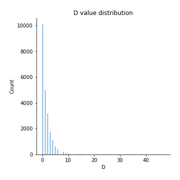
## Feature : e
- **Feature type** : continous
- **Missing** : 0.0%
- **Unique** : 591
- **Count** :23000.0
- **Mean** :120.61221739130434
- **Std** :93.24868286370643
- **Min** :0.0
- **25%th Percentile** : 63.0
- **50%th Percentile** : 89.0
- **75%th Percentile** : 147.0
- **Max** :1258.0

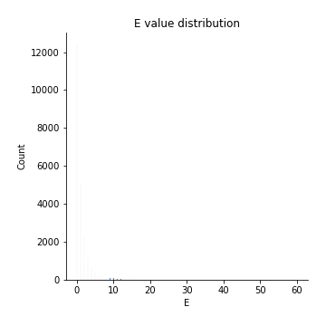
## Feature : r
- **Feature type** : continous
- **Missing** : 0.0%
- **Unique** : 327
- **Count** :23000.0
- **Mean** :59.99369565217391
- **Std** :48.35752652008723
- **Min** :0.0
- **25%th Percentile** : 30.0
- **50%th Percentile** : 44.0
- **75%th Percentile** : 74.0
- **Max** :636.0

## Feature : f
- **Feature type** : continous
- **Missing** : 0.0%
- **Unique** : 134
- **Count** :23000.0
- **Mean** :21.70595652173913
- **Std** :17.608442196106186
- **Min** :0.0
- **25%th Percentile** : 11.0
- **50%th Percentile** : 16.0
- **75%th Percentile** : 27.0
- **Max** :201.0

## Feature : l
- **Feature type** : continous
- **Missing** : 0.0%
- **Unique** : 238
- **Count** :23000.0
- **Mean** :43.89069565217391
- **Std** :34.45287153377614
- **Min** :0.0
- **25%th Percentile** : 22.0
- **50%th Percentile** : 33.0
- **75%th Percentile** : 54.0
- **Max** :400.0

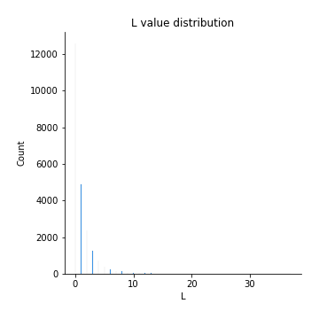
## Feature : y
- **Feature type** : continous
- **Missing** : 0.0%
- **Unique** : 118
- **Count** :23000.0
- **Mean** :20.60217391304348
- **Std** :15.662046608182738
- **Min** :0.0
- **25%th Percentile** : 10.0
- **50%th Percentile** : 16.0
- **75%th Percentile** : 25.0
- **Max** :181.0

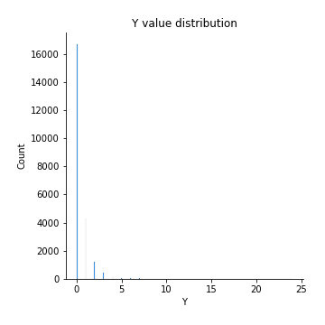
## Feature : p
- **Feature type** : continous
- **Missing** : 0.0%
- **Unique** : 113
- **Count** :23000.0
- **Mean** :16.457782608695652
- **Std** :14.065512626955291
- **Min** :0.0
- **25%th Percentile** : 7.0
- **50%th Percentile** : 12.0
- **75%th Percentile** : 21.0
- **Max** :179.0

## Feature : m
- **Feature type** : continous
- **Missing** : 0.0%
- **Unique** : 147
- **Count** :23000.0
- **Mean** :26.30482608695652
- **Std** :20.088527347972406
- **Min** :0.0
- **25%th Percentile** : 13.0
- **50%th Percentile** : 20.0
- **75%th Percentile** : 32.0
- **Max** :261.0

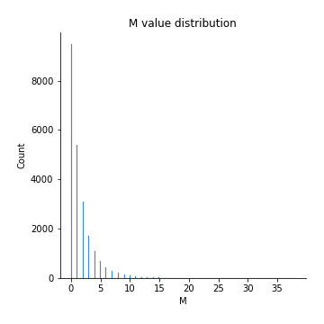
## Feature : k
- **Feature type** : continous
- **Missing** : 0.0%
- **Unique** : 68
- **Count** :23000.0
- **Mean** :8.274
- **Std** :7.302836207275478
- **Min** :0.0
- **25%th Percentile** : 4.0
- **50%th Percentile** : 6.0
- **75%th Percentile** : 11.0
- **Max** :78.0

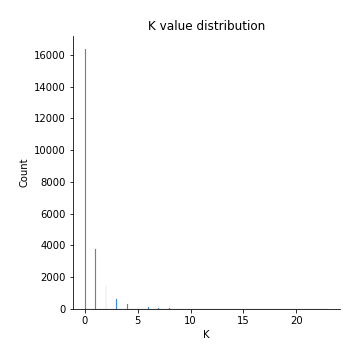
## Feature : ,
- **Feature type** : continous
- **Missing** : 0.0%
- **Unique** : 91
- **Count** :23000.0
- **Mean** :10.846478260869565
- **Std** :10.621036797752536
- **Min** :0.0
- **25%th Percentile** : 4.0
- **50%th Percentile** : 8.0
- **75%th Percentile** : 14.0
- **Max** :113.0

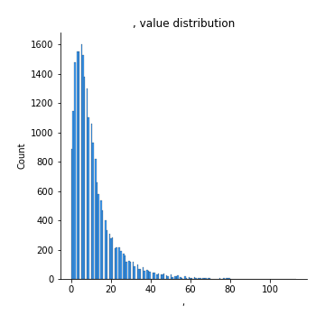
## Feature : c
- **Feature type** : continous
- **Missing** : 0.0%
- **Unique** : 169
- **Count** :23000.0
- **Mean** :26.969
- **Std** :22.258149774888466
- **Min** :0.0
- **25%th Percentile** : 13.0
- **50%th Percentile** : 20.0
- **75%th Percentile** : 33.0
- **Max** :286.0

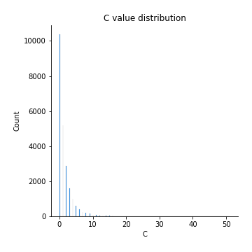
## Feature : -
- **Feature type** : continous
- **Missing** : 0.0%
- **Unique** : 54
- **Count** :23000.0
- **Mean** :2.6357826086956524
- **Std** :4.229224603891723
- **Min** :0.0
- **25%th Percentile** : 0.0
- **50%th Percentile** : 1.0
- **75%th Percentile** : 3.0
- **Max** :145.0

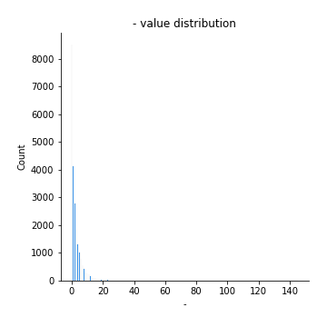
## Feature : .
- **Feature type** : continous
- **Missing** : 0.0%
- **Unique** : 98
- **Count** :23000.0
- **Mean** :13.030869565217392
- **Std** :9.869208778229803
- **Min** :0.0
- **25%th Percentile** : 7.0
- **50%th Percentile** : 10.0
- **75%th Percentile** : 16.0
- **Max** :175.0

## Feature : T
- **Feature type** : continous
- **Missing** : 0.0%
- **Unique** : 47
- **Count** :23000.0
- **Mean** :4.36495652173913
- **Std** :4.124906163925328
- **Min** :0.0
- **25%th Percentile** : 2.0
- **50%th Percentile** : 3.0
- **75%th Percentile** : 6.0
- **Max** :62.0

## Feature : b
- **Feature type** : continous
- **Missing** : 0.0%
- **Unique** : 118
- **Count** :23000.0
- **Mean** :18.554391304347828
- **Std** :15.125001936272891
- **Min** :0.0
- **25%th Percentile** : 9.0
- **50%th Percentile** : 14.0
- **75%th Percentile** : 24.0
- **Max** :193.0

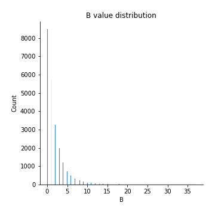
## Feature : (
- **Feature type** : continous
- **Missing** : 0.0%
- **Unique** : 26
- **Count** :23000.0
- **Mean** :1.3877391304347826
- **Std** :2.181851058050021
- **Min** :0.0
- **25%th Percentile** : 0.0
- **50%th Percentile** : 1.0
- **75%th Percentile** : 2.0
- **Max** :33.0

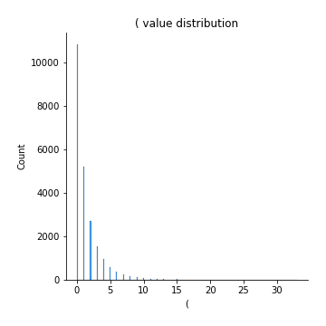
## Feature : v
- **Feature type** : continous
- **Missing** : 0.0%
- **Unique** : 80
- **Count** :23000.0
- **Mean** :12.360652173913044
- **Std** :9.473645687723211
- **Min** :0.0
- **25%th Percentile** : 6.0
- **50%th Percentile** : 10.0
- **75%th Percentile** : 16.0
- **Max** :123.0

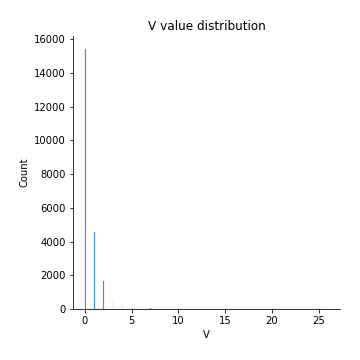
## Feature : )
- **Feature type** : continous
- **Missing** : 0.0%
- **Unique** : 29
- **Count** :23000.0
- **Mean** :1.421913043478261
- **Std** :2.232611459606267
- **Min** :0.0
- **25%th Percentile** : 0.0
- **50%th Percentile** : 1.0
- **75%th Percentile** : 2.0
- **Max** :32.0

.png)
## Feature : W
- **Feature type** : continous
- **Missing** : 0.0%
- **Unique** : 30
- **Count** :23000.0
- **Mean** :1.403304347826087
- **Std** :2.0624510805691028
- **Min** :0.0
- **25%th Percentile** : 0.0
- **50%th Percentile** : 1.0
- **75%th Percentile** : 2.0
- **Max** :30.0

## Feature : z
- **Feature type** : continous
- **Missing** : 0.0%
- **Unique** : 27
- **Count** :23000.0
- **Mean** :0.8101304347826087
- **Std** :1.6131584181726173
- **Min** :0.0
- **25%th Percentile** : 0.0
- **50%th Percentile** : 0.0
- **75%th Percentile** : 1.0
- **Max** :90.0

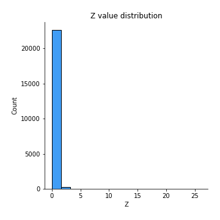
## Feature : M
- **Feature type** : continous
- **Missing** : 0.0%
- **Unique** : 33
- **Count** :23000.0
- **Mean** :1.654086956521739
- **Std** :2.5051789118395336
- **Min** :0.0
- **25%th Percentile** : 0.0
- **50%th Percentile** : 1.0
- **75%th Percentile** : 2.0
- **Max** :38.0

## Feature : P
- **Feature type** : continous
- **Missing** : 0.0%
- **Unique** : 27
- **Count** :23000.0
- **Mean** :0.9817391304347826
- **Std** :1.7915689038177465
- **Min** :0.0
- **25%th Percentile** : 0.0
- **50%th Percentile** : 0.0
- **75%th Percentile** : 1.0
- **Max** :30.0

## Feature : 2
- **Feature type** : continous
- **Missing** : 0.0%
- **Unique** : 15
- **Count** :23000.0
- **Mean** :0.3227826086956522
- **Std** :0.791539184322907
- **Min** :0.0
- **25%th Percentile** : 0.0
- **50%th Percentile** : 0.0
- **75%th Percentile** : 0.0
- **Max** :14.0

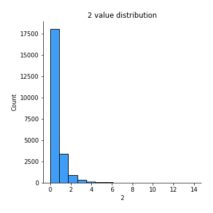
## Feature : :
- **Feature type** : continous
- **Missing** : 0.0%
- **Unique** : 20
- **Count** :23000.0
- **Mean** :0.389
- **Std** :1.0577608807222523
- **Min** :0.0
- **25%th Percentile** : 0.0
- **50%th Percentile** : 0.0
- **75%th Percentile** : 0.0
- **Max** :45.0

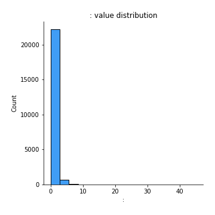
## Feature : R
- **Feature type** : continous
- **Missing** : 0.0%
- **Unique** : 32
- **Count** :23000.0
- **Mean** :1.1769130434782609
- **Std** :2.1826779015987343
- **Min** :0.0
- **25%th Percentile** : 0.0
- **50%th Percentile** : 0.0
- **75%th Percentile** : 1.0
- **Max** :39.0

## Feature : A
- **Feature type** : continous
- **Missing** : 0.0%
- **Unique** : 43
- **Count** :23000.0
- **Mean** :2.594521739130435
- **Std** :3.3207224000364537
- **Min** :0.0
- **25%th Percentile** : 1.0
- **50%th Percentile** : 2.0
- **75%th Percentile** : 3.0
- **Max** :66.0

## Feature : <
- **Feature type** : continous
- **Missing** : 0.0%
- **Unique** : 47
- **Count** :23000.0
- **Mean** :4.053782608695652
- **Std** :5.307298659197353
- **Min** :0.0
- **25%th Percentile** : 0.0
- **50%th Percentile** : 2.0
- **75%th Percentile** : 6.0
- **Max** :98.0

## Feature : /
- **Feature type** : continous
- **Missing** : 0.0%
- **Unique** : 62
- **Count** :23000.0
- **Mean** :4.3265652173913045
- **Std** :5.510221849858407
- **Min** :0.0
- **25%th Percentile** : 0.0
- **50%th Percentile** : 2.0
- **75%th Percentile** : 6.0
- **Max** :98.0

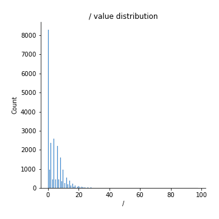
## Feature : >
- **Feature type** : continous
- **Missing** : 0.0%
- **Unique** : 47
- **Count** :23000.0
- **Mean** :4.056173913043478
- **Std** :5.311012472694565
- **Min** :0.0
- **25%th Percentile** : 0.0
- **50%th Percentile** : 2.0
- **75%th Percentile** : 6.0
- **Max** :98.0

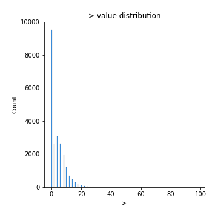
## Feature : '
- **Feature type** : continous
- **Missing** : 0.0%
- **Unique** : 62
- **Count** :23000.0
- **Mean** :5.237521739130435
- **Std** :5.680453465865019
- **Min** :0.0
- **25%th Percentile** : 2.0
- **50%th Percentile** : 4.0
- **75%th Percentile** : 7.0
- **Max** :78.0

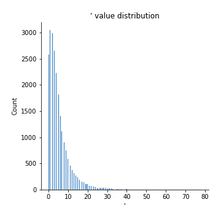
## Feature : ?
- **Feature type** : continous
- **Missing** : 0.0%
- **Unique** : 28
- **Count** :23000.0
- **Mean** :0.6523913043478261
- **Std** :1.5602717562377109
- **Min** :0.0
- **25%th Percentile** : 0.0
- **50%th Percentile** : 0.0
- **75%th Percentile** : 1.0
- **Max** :45.0

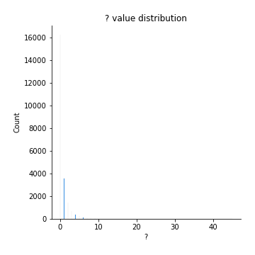
## Feature : S
- **Feature type** : continous
- **Missing** : 0.0%
- **Unique** : 45
- **Count** :23000.0
- **Mean** :2.3781739130434785
- **Std** :3.21288821680696
- **Min** :0.0
- **25%th Percentile** : 0.0
- **50%th Percentile** : 1.0
- **75%th Percentile** : 3.0
- **Max** :50.0

## Feature : J
- **Feature type** : continous
- **Missing** : 0.0%
- **Unique** : 28
- **Count** :23000.0
- **Mean** :0.821
- **Std** :1.6551736622380406
- **Min** :0.0
- **25%th Percentile** : 0.0
- **50%th Percentile** : 0.0
- **75%th Percentile** : 1.0
- **Max** :28.0

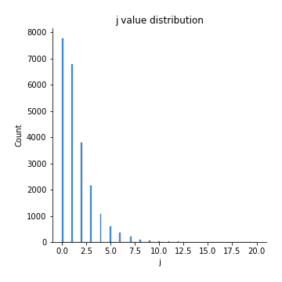
## Feature : "
- **Feature type** : continous
- **Missing** : 0.0%
- **Unique** : 50
- **Count** :23000.0
- **Mean** :2.636913043478261
- **Std** :4.798087854973872
- **Min** :0.0
- **25%th Percentile** : 0.0
- **50%th Percentile** : 0.0
- **75%th Percentile** : 4.0
- **Max** :96.0

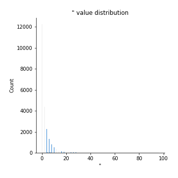
## Feature : x
- **Feature type** : continous
- **Missing** : 0.0%
- **Unique** : 23
- **Count** :23000.0
- **Mean** :1.6741304347826087
- **Std** :2.0689725265162586
- **Min** :0.0
- **25%th Percentile** : 0.0
- **50%th Percentile** : 1.0
- **75%th Percentile** : 2.0
- **Max** :23.0

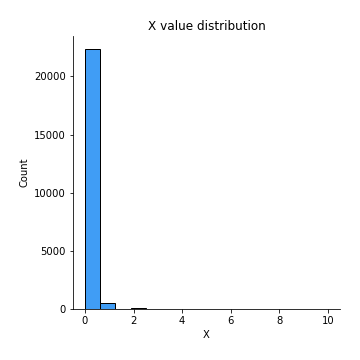
## Feature : j
- **Feature type** : continous
- **Missing** : 0.0%
- **Unique** : 20
- **Count** :23000.0
- **Mean** :1.495695652173913
- **Std** :1.7844102422328836
- **Min** :0.0
- **25%th Percentile** : 0.0
- **50%th Percentile** : 1.0
- **75%th Percentile** : 2.0
- **Max** :20.0

## Feature : D
- **Feature type** : continous
- **Missing** : 0.0%
- **Unique** : 31
- **Count** :23000.0
- **Mean** :1.5272608695652174
- **Std** :2.3364257942817135
- **Min** :0.0
- **25%th Percentile** : 0.0
- **50%th Percentile** : 1.0
- **75%th Percentile** : 2.0
- **Max** :47.0

## Feature : 1
- **Feature type** : continous
- **Missing** : 0.0%
- **Unique** : 24
- **Count** :23000.0
- **Mean** :0.7129565217391305
- **Std** :1.430034720706864
- **Min** :0.0
- **25%th Percentile** : 0.0
- **50%th Percentile** : 0.0
- **75%th Percentile** : 1.0
- **Max** :56.0

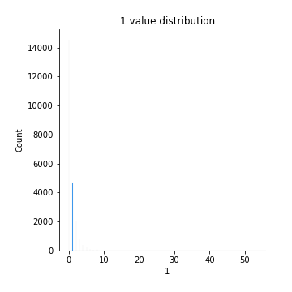
## Feature : 5
- **Feature type** : continous
- **Missing** : 0.0%
- **Unique** : 16
- **Count** :23000.0
- **Mean** :0.2132608695652174
- **Std** :0.6761596359825016
- **Min** :0.0
- **25%th Percentile** : 0.0
- **50%th Percentile** : 0.0
- **75%th Percentile** : 0.0
- **Max** :39.0

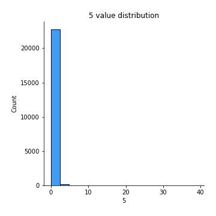
## Feature : L
- **Feature type** : continous
- **Missing** : 0.0%
- **Unique** : 27
- **Count** :23000.0
- **Mean** :1.0999565217391305
- **Std** :1.997598453318243
- **Min** :0.0
- **25%th Percentile** : 0.0
- **50%th Percentile** : 0.0
- **75%th Percentile** : 1.0
- **Max** :37.0

## Feature : B
- **Feature type** : continous
- **Missing** : 0.0%
- **Unique** : 32
- **Count** :23000.0
- **Mean** :1.7739565217391304
- **Std** :2.526263626681952
- **Min** :0.0
- **25%th Percentile** : 0.0
- **50%th Percentile** : 1.0
- **75%th Percentile** : 2.0
- **Max** :37.0

## Feature : V
- **Feature type** : continous
- **Missing** : 0.0%
- **Unique** : 20
- **Count** :23000.0
- **Mean** :0.5985217391304348
- **Std** :1.2298862152961372
- **Min** :0.0
- **25%th Percentile** : 0.0
- **50%th Percentile** : 0.0
- **75%th Percentile** : 1.0
- **Max** :26.0

## Feature : G
- **Feature type** : continous
- **Missing** : 0.0%
- **Unique** : 29
- **Count** :23000.0
- **Mean** :0.9312608695652174
- **Std** :1.7643749534183026
- **Min** :0.0
- **25%th Percentile** : 0.0
- **50%th Percentile** : 0.0
- **75%th Percentile** : 1.0
- **Max** :36.0

## Feature : Y
- **Feature type** : continous
- **Missing** : 0.0%
- **Unique** : 18
- **Count** :23000.0
- **Mean** :0.43673913043478263
- **Std** :0.967176321877754
- **Min** :0.0
- **25%th Percentile** : 0.0
- **50%th Percentile** : 0.0
- **75%th Percentile** : 1.0
- **Max** :24.0

## Feature : O
- **Feature type** : continous
- **Missing** : 0.0%
- **Unique** : 31
- **Count** :23000.0
- **Mean** :1.0926521739130435
- **Std** :1.9853320799965366
- **Min** :0.0
- **25%th Percentile** : 0.0
- **50%th Percentile** : 0.0
- **75%th Percentile** : 1.0
- **Max** :47.0

## Feature : 0
- **Feature type** : continous
- **Missing** : 0.0%
- **Unique** : 24
- **Count** :23000.0
- **Mean** :0.7497826086956522
- **Std** :1.4898383123715366
- **Min** :0.0
- **25%th Percentile** : 0.0
- **50%th Percentile** : 0.0
- **75%th Percentile** : 1.0
- **Max** :30.0

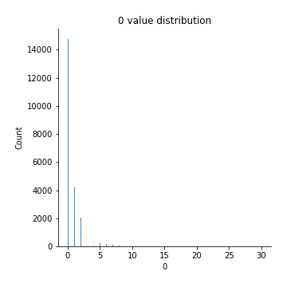
## Feature : q
- **Feature type** : continous
- **Missing** : 0.0%
- **Unique** : 17
- **Count** :23000.0
- **Mean** :0.7357391304347826
- **Std** :1.1827238508682159
- **Min** :0.0
- **25%th Percentile** : 0.0
- **50%th Percentile** : 0.0
- **75%th Percentile** : 1.0
- **Max** :16.0

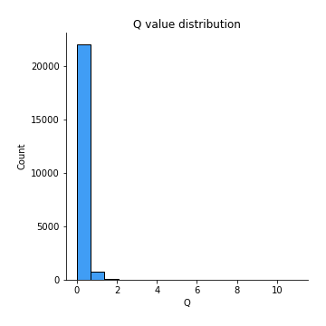
## Feature : &
- **Feature type** : continous
- **Missing** : 0.0%
- **Unique** : 35
- **Count** :23000.0
- **Mean** :0.15617391304347827
- **Std** :1.3436295530608828
- **Min** :0.0
- **25%th Percentile** : 0.0
- **50%th Percentile** : 0.0
- **75%th Percentile** : 0.0
- **Max** :43.0

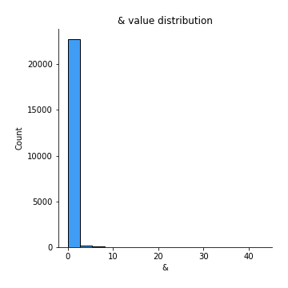
## Feature : 7
- **Feature type** : continous
- **Missing** : 0.0%
- **Unique** : 12
- **Count** :23000.0
- **Mean** :0.16791304347826086
- **Std** :0.5659098130639161
- **Min** :0.0
- **25%th Percentile** : 0.0
- **50%th Percentile** : 0.0
- **75%th Percentile** : 0.0
- **Max** :22.0

## Feature : 8
- **Feature type** : continous
- **Missing** : 0.0%
- **Unique** : 12
- **Count** :23000.0
- **Mean** :0.17308695652173914
- **Std** :0.5647723586775298
- **Min** :0.0
- **25%th Percentile** : 0.0
- **50%th Percentile** : 0.0
- **75%th Percentile** : 0.0
- **Max** :17.0

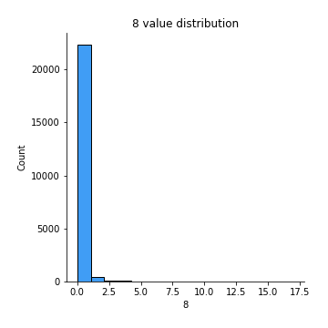
## Feature : 9
- **Feature type** : continous
- **Missing** : 0.0%
- **Unique** : 22
- **Count** :23000.0
- **Mean** :0.3838695652173913
- **Std** :1.1414163291798511
- **Min** :0.0
- **25%th Percentile** : 0.0
- **50%th Percentile** : 0.0
- **75%th Percentile** : 0.0
- **Max** :42.0

## Feature : H
- **Feature type** : continous
- **Missing** : 0.0%
- **Unique** : 36
- **Count** :23000.0
- **Mean** :1.5791304347826087
- **Std** :2.468902925613323
- **Min** :0.0
- **25%th Percentile** : 0.0
- **50%th Percentile** : 1.0
- **75%th Percentile** : 2.0
- **Max** :44.0

## Feature : E
- **Feature type** : continous
- **Missing** : 0.0%
- **Unique** : 42
- **Count** :23000.0
- **Mean** :1.2264347826086957
- **Std** :2.5569620706510126
- **Min** :0.0
- **25%th Percentile** : 0.0
- **50%th Percentile** : 0.0
- **75%th Percentile** : 1.0
- **Max** :60.0

## Feature : +
- **Feature type** : continous
- **Missing** : 0.0%
- **Unique** : 10
- **Count** :23000.0
- **Mean** :0.012217391304347826
- **Std** :0.19733064862865213
- **Min** :0.0
- **25%th Percentile** : 0.0
- **50%th Percentile** : 0.0
- **75%th Percentile** : 0.0
- **Max** :16.0

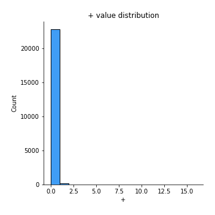
## Feature : K
- **Feature type** : continous
- **Missing** : 0.0%
- **Unique** : 23
- **Count** :23000.0
- **Mean** :0.5617826086956522
- **Std** :1.3027379869253273
- **Min** :0.0
- **25%th Percentile** : 0.0
- **50%th Percentile** : 0.0
- **75%th Percentile** : 1.0
- **Max** :23.0

## Feature : F
- **Feature type** : continous
- **Missing** : 0.0%
- **Unique** : 24
- **Count** :23000.0
- **Mean** :0.9452608695652174
- **Std** :1.6825047872163492
- **Min** :0.0
- **25%th Percentile** : 0.0
- **50%th Percentile** : 0.0
- **75%th Percentile** : 1.0
- **Max** :31.0

## Feature : C
- **Feature type** : continous
- **Missing** : 0.0%
- **Unique** : 33
- **Count** :23000.0
- **Mean** :1.525304347826087
- **Std** :2.475667690350852
- **Min** :0.0
- **25%th Percentile** : 0.0
- **50%th Percentile** : 1.0
- **75%th Percentile** : 2.0
- **Max** :51.0

## Feature : U
- **Feature type** : continous
- **Missing** : 0.0%
- **Unique** : 18
- **Count** :23000.0
- **Mean** :0.34708695652173915
- **Std** :0.9033036174899269
- **Min** :0.0
- **25%th Percentile** : 0.0
- **50%th Percentile** : 0.0
- **75%th Percentile** : 0.0
- **Max** :19.0

## Feature : !
- **Feature type** : continous
- **Missing** : 0.0%
- **Unique** : 47
- **Count** :23000.0
- **Mean** :1.017782608695652
- **Std** :3.76267645634004
- **Min** :0.0
- **25%th Percentile** : 0.0
- **50%th Percentile** : 0.0
- **75%th Percentile** : 1.0
- **Max** :282.0

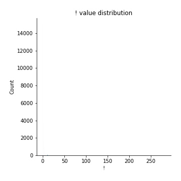
## Feature : *
- **Feature type** : continous
- **Missing** : 0.0%
- **Unique** : 34
- **Count** :23000.0
- **Mean** :0.2782608695652174
- **Std** :1.6357926711992399
- **Min** :0.0
- **25%th Percentile** : 0.0
- **50%th Percentile** : 0.0
- **75%th Percentile** : 0.0
- **Max** :53.0

## Feature : N
- **Feature type** : continous
- **Missing** : 0.0%
- **Unique** : 29
- **Count** :23000.0
- **Mean** :1.0225652173913042
- **Std** :1.8803194022524206
- **Min** :0.0
- **25%th Percentile** : 0.0
- **50%th Percentile** : 0.0
- **75%th Percentile** : 1.0
- **Max** :45.0

## Feature : ;
- **Feature type** : continous
- **Missing** : 0.0%
- **Unique** : 16
- **Count** :23000.0
- **Mean** :0.26721739130434785
- **Std** :0.9033872976950438
- **Min** :0.0
- **25%th Percentile** : 0.0
- **50%th Percentile** : 0.0
- **75%th Percentile** : 0.0
- **Max** :17.0

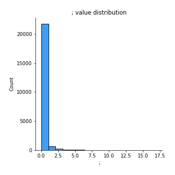
## Feature : 4
- **Feature type** : continous
- **Missing** : 0.0%
- **Unique** : 13
- **Count** :23000.0
- **Mean** :0.16630434782608697
- **Std** :0.5818719582944759
- **Min** :0.0
- **25%th Percentile** : 0.0
- **50%th Percentile** : 0.0
- **75%th Percentile** : 0.0
- **Max** :37.0

## Feature : à
- **Feature type** : continous
- **Missing** : 0.0%
- **Unique** : 3
- **Count** :23000.0
- **Mean** :0.001565217391304348
- **Std** :0.04270499201562786
- **Min** :0.0
- **25%th Percentile** : 0.0
- **50%th Percentile** : 0.0
- **75%th Percentile** : 0.0
- **Max** :2.0

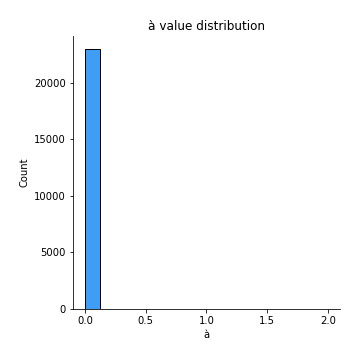
## Feature : è
- **Feature type** : continous
- **Missing** : 0.0%
- **Unique** : 5
- **Count** :23000.0
- **Mean** :0.0028695652173913043
- **Std** :0.0751277905162169
- **Min** :0.0
- **25%th Percentile** : 0.0
- **50%th Percentile** : 0.0
- **75%th Percentile** : 0.0
- **Max** :5.0

## Feature : $
- **Feature type** : continous
- **Missing** : 0.0%
- **Unique** : 10
- **Count** :23000.0
- **Mean** :0.03108695652173913
- **Std** :0.27810305936113905
- **Min** :0.0
- **25%th Percentile** : 0.0
- **50%th Percentile** : 0.0
- **75%th Percentile** : 0.0
- **Max** :17.0

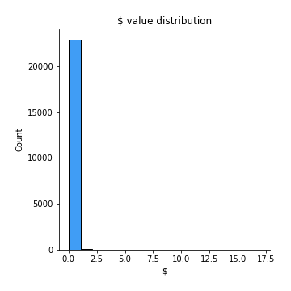
## Feature : 3
- **Feature type** : continous
- **Missing** : 0.0%
- **Unique** : 12
- **Count** :23000.0
- **Mean** :0.22156521739130436
- **Std** :0.6343536956339731
- **Min** :0.0
- **25%th Percentile** : 0.0
- **50%th Percentile** : 0.0
- **75%th Percentile** : 0.0
- **Max** :16.0

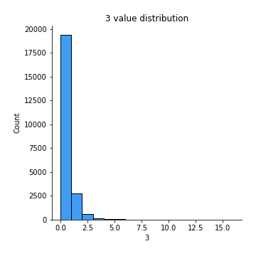
## Feature : %
- **Feature type** : continous
- **Missing** : 0.0%
- **Unique** : 5
- **Count** :23000.0
- **Mean** :0.016739130434782607
- **Std** :0.14782146781326408
- **Min** :0.0
- **25%th Percentile** : 0.0
- **50%th Percentile** : 0.0
- **75%th Percentile** : 0.0
- **Max** :4.0

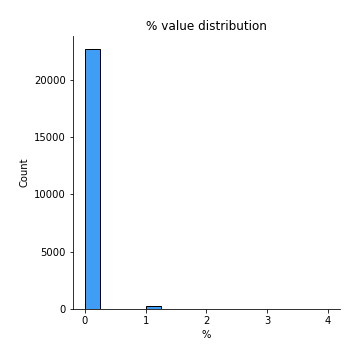
## Feature : Z
- **Feature type** : continous
- **Missing** : 0.0%
- **Unique** : 15
- **Count** :23000.0
- **Mean** :0.08730434782608695
- **Std** :0.5198228412830048
- **Min** :0.0
- **25%th Percentile** : 0.0
- **50%th Percentile** : 0.0
- **75%th Percentile** : 0.0
- **Max** :26.0

## Feature : é
- **Feature type** : continous
- **Missing** : 0.0%
- **Unique** : 12
- **Count** :23000.0
- **Mean** :0.06404347826086956
- **Std** :0.37894633994626203
- **Min** :0.0
- **25%th Percentile** : 0.0
- **50%th Percentile** : 0.0
- **75%th Percentile** : 0.0
- **Max** :14.0

## Feature : =
- **Feature type** : continous
- **Missing** : 0.0%
- **Unique** : 6
- **Count** :23000.0
- **Mean** :0.00791304347826087
- **Std** :0.312121579291757
- **Min** :0.0
- **25%th Percentile** : 0.0
- **50%th Percentile** : 0.0
- **75%th Percentile** : 0.0
- **Max** :45.0

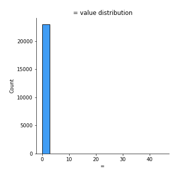
## Feature : X
- **Feature type** : continous
- **Missing** : 0.0%
- **Unique** : 10
- **Count** :23000.0
- **Mean** :0.03991304347826087
- **Std** :0.29513791414941437
- **Min** :0.0
- **25%th Percentile** : 0.0
- **50%th Percentile** : 0.0
- **75%th Percentile** : 0.0
- **Max** :10.0

## Feature : 6
- **Feature type** : continous
- **Missing** : 0.0%
- **Unique** : 11
- **Count** :23000.0
- **Mean** :0.13134782608695653
- **Std** :0.49740393995350435
- **Min** :0.0
- **25%th Percentile** : 0.0
- **50%th Percentile** : 0.0
- **75%th Percentile** : 0.0
- **Max** :24.0

## Feature : Q
- **Feature type** : continous
- **Missing** : 0.0%
- **Unique** : 8
- **Count** :23000.0
- **Mean** :0.05226086956521739
- **Std** :0.3002370496116365
- **Min** :0.0
- **25%th Percentile** : 0.0
- **50%th Percentile** : 0.0
- **75%th Percentile** : 0.0
- **Max** :11.0

## Feature : û
- **Feature type** : continous
- **Missing** : 0.0%
- **Unique** : 2
- **Count** :23000.0
- **Mean** :0.00013043478260869564
- **Std** :0.011420308225286408
- **Min** :0.0
- **25%th Percentile** : 0.0
- **50%th Percentile** : 0.0
- **75%th Percentile** : 0.0
- **Max** :1.0

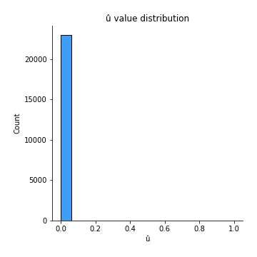
## Feature : `
- **Feature type** : continous
- **Missing** : 0.0%
- **Unique** : 20
- **Count** :23000.0
- **Mean** :0.043695652173913045
- **Std** :0.6324378590272303
- **Min** :0.0
- **25%th Percentile** : 0.0
- **50%th Percentile** : 0.0
- **75%th Percentile** : 0.0
- **Max** :24.0

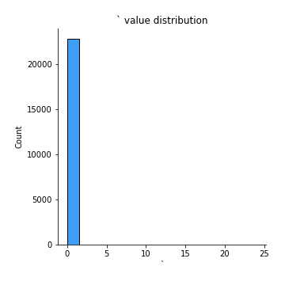
## Feature : ü
- **Feature type** : continous
- **Missing** : 0.0%
- **Unique** : 5
- **Count** :23000.0
- **Mean** :0.0023043478260869566
- **Std** :0.07485739288358165
- **Min** :0.0
- **25%th Percentile** : 0.0
- **50%th Percentile** : 0.0
- **75%th Percentile** : 0.0
- **Max** :8.0

