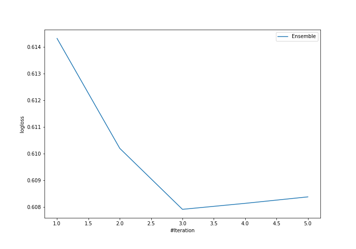
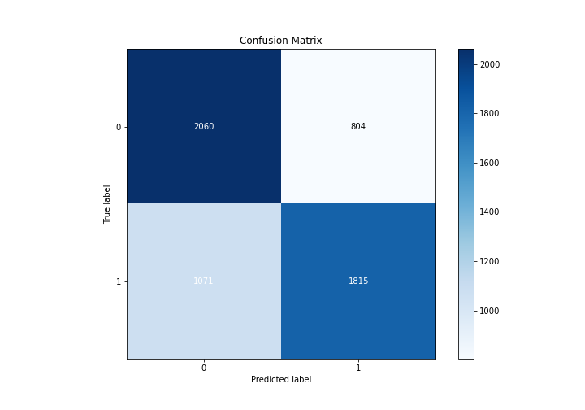
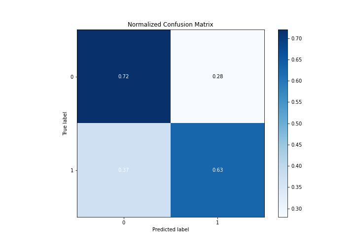
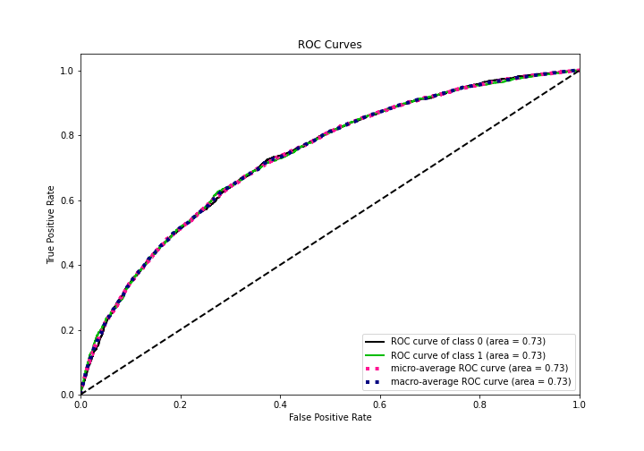
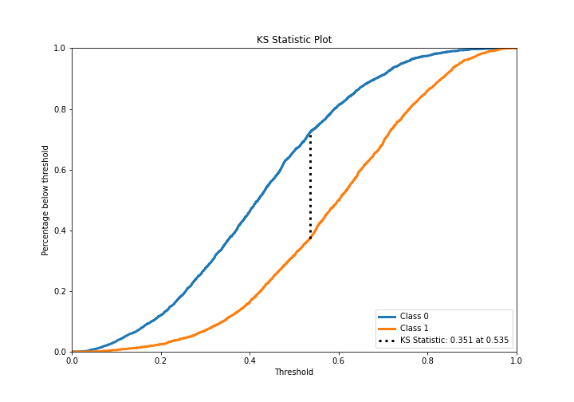
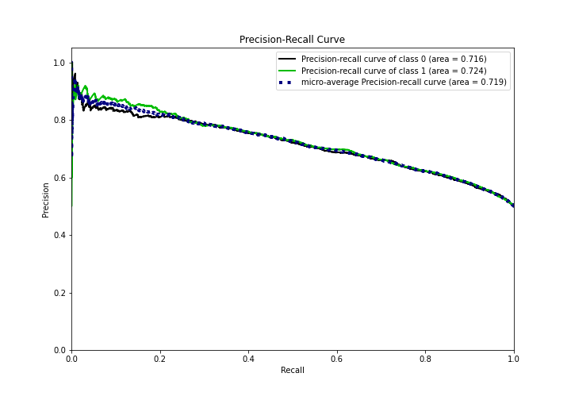
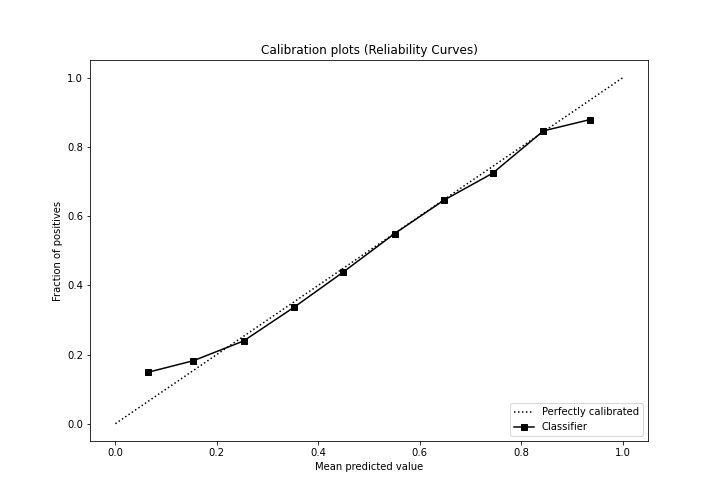
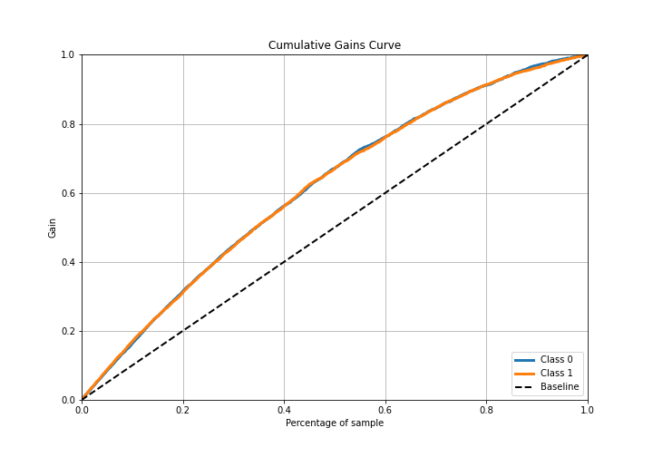
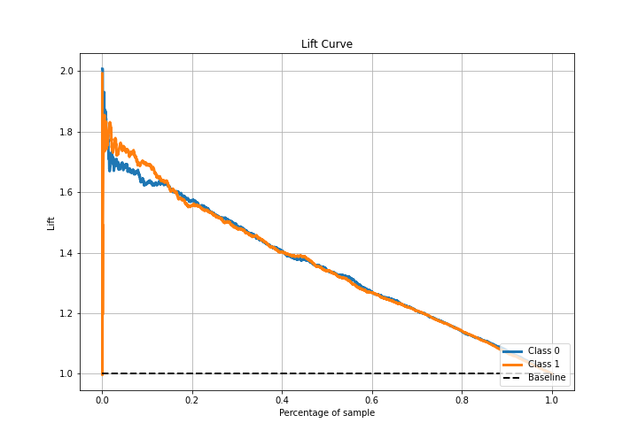

# Summary of Ensemble

[<< Go back](../README.md)

## Ensemble structure
| Model                   |   Weight |
|:------------------------|---------:|
| 3_Default_Xgboost       |        2 |
| 4_Default_NeuralNetwork |        1 |

## Metric details
|           |    score |   threshold |
|:----------|---------:|------------:|
| logloss   | 0.607905 |  nan        |
| auc       | 0.732011 |  nan        |
| f1        | 0.707547 |    0.38284  |
| accuracy  | 0.673913 |    0.533782 |
| precision | 0.842271 |    0.768309 |
| recall    | 1        |    0.011138 |
| mcc       | 0.349558 |    0.533782 |

## Confusion matrix (at threshold=0.533782)
|              |   Predicted as 0 |   Predicted as 1 |
|:-------------|-----------------:|-----------------:|
| Labeled as 0 |             2060 |              804 |
| Labeled as 1 |             1071 |             1815 |

## Learning curves

## Confusion Matrix

## Normalized Confusion Matrix

## ROC Curve

## Kolmogorov-Smirnov Statistic

## Precision-Recall Curve

## Calibration Curve

## Cumulative Gains Curve

## Lift Curve

[<< Go back](../README.md)
