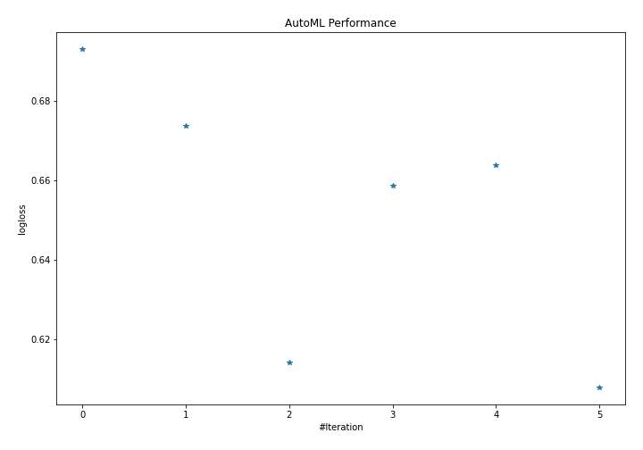
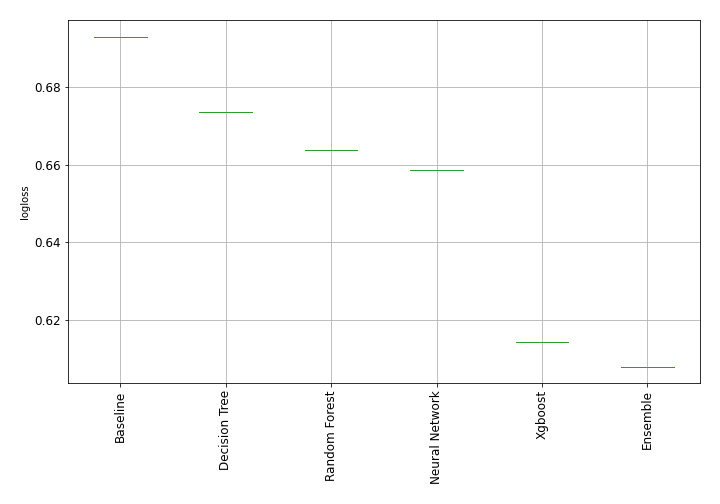
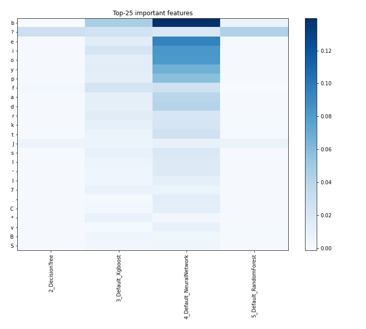
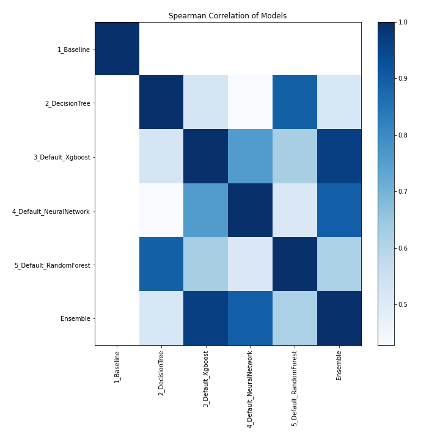

# AutoML Leaderboard

| Best model   | name                                                         | model_type     | metric_type   |   metric_value |   train_time |
|:-------------|:-------------------------------------------------------------|:---------------|:--------------|---------------:|-------------:|
|              | [1_Baseline](1_Baseline/README.md)                           | Baseline       | logloss       |       0.69314  |         4.39 |
|              | [2_DecisionTree](2_DecisionTree/README.md)                   | Decision Tree  | logloss       |       0.673754 |        28.22 |
|              | [3_Default_Xgboost](3_Default_Xgboost/README.md)             | Xgboost        | logloss       |       0.614322 |        65.35 |
|              | [4_Default_NeuralNetwork](4_Default_NeuralNetwork/README.md) | Neural Network | logloss       |       0.658715 |        22.78 |
|              | [5_Default_RandomForest](5_Default_RandomForest/README.md)   | Random Forest  | logloss       |       0.66394  |        47.5  |
| **the best** | [Ensemble](Ensemble/README.md)                               | Ensemble       | logloss       |       0.607905 |         2.86 |

### AutoML Performance

### AutoML Performance Boxplot

### Features Importance

### Spearman Correlation of Models

